## Fundamentals of encryption and authentication

PID\_00293489

Xavier Perramon Tornil

Recommended minimum reading time: 4 hours Xavier Perramon holds a PhD in Telecommunications Engineering from the Universitat Politècnica de Catalunya (UPC). He has worked as a security consultant in ICT systems. He is currently a professor of Information Systems at the UPC's Escola Superior d'Enginyeries Industrial, Aeroespacial i Audiovisual (ESEIAAT) in Terrassa.


Xavier Perramon Tornil


The review of this UOC Learning Resource has been coordinated by the lecturer: Victor Garcia Font

## How￿to￿cite￿this￿learning￿resource￿as￿per￿the￿Harvard￿style:

Perramon, X. (2023) Fundamentals of encryption and authentication. [Textual learning resource]. 1st ed. Barcelona: Fundació Universitat Oberta de Catalunya (FUOC).

First edition: February 2023 Av. Tibidabo, 39-43, 08035 Barcelona Authorship: Xavier Perramon Tornil Production: FUOC

© of this edition, Fundació Universitat Oberta de Catalunya (FUOC)

Permission is granted to copy, distribute and/or modify this document under the terms of the GNU Free Documentation License, Version 1.3 or any later version published by the Free Software Foundation; with no Invariant Sections, no Front-Cover Texts, and no Back-Cover Texts. The terms of the license can be consulted in http://www.gnu.org/licenses/fdl-1.3.html.

## Contents

| Introduction . . . . . . . . . . . . . . . . . . . . . . . . . . . . . . . . . . . . . . . . . . . . . . . . . . . . . . . . . . . . . . . . . . .   | Introduction . . . . . . . . . . . . . . . . . . . . . . . . . . . . . . . . . . . . . . . . . . . . . . . . . . . . . . . . . . . . . . . . . . .   | Introduction . . . . . . . . . . . . . . . . . . . . . . . . . . . . . . . . . . . . . . . . . . . . . . . . . . . . . . . . . . . . . . . . . . .   | Introduction . . . . . . . . . . . . . . . . . . . . . . . . . . . . . . . . . . . . . . . . . . . . . . . . . . . . . . . . . . . . . . . . . . .   |   5 |
|------------------------------------------------------------------------------------------------------------------------------------------------------|------------------------------------------------------------------------------------------------------------------------------------------------------|------------------------------------------------------------------------------------------------------------------------------------------------------|------------------------------------------------------------------------------------------------------------------------------------------------------|-----|
| Objectives . . . . . . . . . . . . . . . . . . . . . . . . . . . . . . . . . . . . . . . . . . . . . . . . . . . . . .                               | Objectives . . . . . . . . . . . . . . . . . . . . . . . . . . . . . . . . . . . . . . . . . . . . . . . . . . . . . .                               | Objectives . . . . . . . . . . . . . . . . . . . . . . . . . . . . . . . . . . . . . . . . . . . . . . . . . . . . . .                               | Objectives . . . . . . . . . . . . . . . . . . . . . . . . . . . . . . . . . . . . . . . . . . . . . . . . . . . . . .                               |   6 |
| 1.                                                                                                                                                   | Basic concepts of cryptography . . . .                                                                                                               | Basic concepts of cryptography . . . .                                                                                                               | . . . . . . . . . . . . . . . . . . . . . . . . .                                                                                                    |   7 |
|                                                                                                                                                      | 1.1                                                                                                                                                  | Symmetric-key cryptography. .                                                                                                                        | . . . . . . . . . . . . . . . . . . . . . . . . .                                                                                                    |   9 |
|                                                                                                                                                      |                                                                                                                                                      | 1.1.1                                                                                                                                                | Stream cipher algorithms . . . . . . . . . . . . . . . . . . . . . .                                                                                 |  10 |
|                                                                                                                                                      |                                                                                                                                                      | 1.1.2                                                                                                                                                | Block cipher algorithms . . . . . . . . . . . . . . . . . . . . . . .                                                                                |  13 |
|                                                                                                                                                      |                                                                                                                                                      | 1.1.3                                                                                                                                                | Using symmetric-key algorithms . . . . . . . . . . . . . . .                                                                                         |  15 |
|                                                                                                                                                      |                                                                                                                                                      | 1.1.4                                                                                                                                                | Secure hash functions . . . . . . . . . . . . . . . . . . . . . . . . .                                                                              |  18 |
|                                                                                                                                                      | 1.2                                                                                                                                                  | Public-key cryptography . . . .                                                                                                                      | . . . . . . . . . . . . . . . . . . . . . . . . . . .                                                                                                |  20 |
|                                                                                                                                                      |                                                                                                                                                      | 1.2.1                                                                                                                                                | Public-key algorithms . . . . . . . . . . . . . . . . . . . . . . . . .                                                                              |  20 |
|                                                                                                                                                      |                                                                                                                                                      | 1.2.2                                                                                                                                                | Use of public-key cryptography . . . . . . . . . . . . . . . .                                                                                       |  23 |
|                                                                                                                                                      | 1.3                                                                                                                                                  | Public-key Infrastructure (PKI).                                                                                                                     | . . . . . . . . . . . . . . . . . . . . . . . .                                                                                                      |  24 |
|                                                                                                                                                      |                                                                                                                                                      | 1.3.1                                                                                                                                                | Public-key certificates . . . . . . . . . . . . . . . . . . . . . . . . .                                                                            |  24 |
|                                                                                                                                                      |                                                                                                                                                      | 1.3.2                                                                                                                                                | Certificate chains and certification hierarchies. . .                                                                                                |  27 |
|                                                                                                                                                      |                                                                                                                                                      | 1.3.3                                                                                                                                                | Certificate Revocation List (CRL) . . . . . . . . . . . . . .                                                                                        |  28 |
| 2.                                                                                                                                                   | Authentication systems . . . . . . . . . . . . . . . . .                                                                                             | Authentication systems . . . . . . . . . . . . . . . . .                                                                                             | . . . . . . . . . . . . . . . . . . . . .                                                                                                            |  30 |
|                                                                                                                                                      | 2.1                                                                                                                                                  | Message authentication . .                                                                                                                           | . . . . . . . . . . . . . . . . . . . . . . . . . . . . . .                                                                                          |  30 |
|                                                                                                                                                      |                                                                                                                                                      | 2.1.1                                                                                                                                                | Message Authentication Code (MAC) . . . . . . . . . .                                                                                                |  30 |
|                                                                                                                                                      |                                                                                                                                                      | 2.1.2                                                                                                                                                | Digital signatures . . . . . . . . . . . . . . . . . . . . . . . . . . . . .                                                                         |  31 |
|                                                                                                                                                      | 2.2                                                                                                                                                  | Entity authentication . . .                                                                                                                          | . . . . . . . . . . . . . . . . . . . . . . . . . . . . . . . .                                                                                      |  31 |
|                                                                                                                                                      |                                                                                                                                                      | 2.2.1                                                                                                                                                | Passwords . . . . . . . . . . . . . . . . . . . . . . . . . . . . . . . . . . . .                                                                    |  32 |
|                                                                                                                                                      |                                                                                                                                                      | 2.2.2                                                                                                                                                | Challenge-response protocols . . . . . . . . . . . . . . . . . .                                                                                     |  39 |
| Summary . . . . . . . . . . . . . . . . . . . . . . . . . . . . . . . . . . . . . . . . . . . . . . . . . . . . . .                                  | Summary . . . . . . . . . . . . . . . . . . . . . . . . . . . . . . . . . . . . . . . . . . . . . . . . . . . . . .                                  | Summary . . . . . . . . . . . . . . . . . . . . . . . . . . . . . . . . . . . . . . . . . . . . . . . . . . . . . .                                  | .                                                                                                                                                    |  46 |
| Glossary . . . . . . . . . . . . . . . . . . . . . . . . . . . . . . . . . . . . . . . . . . . . . . . . . . . . . . . . . .                         | Glossary . . . . . . . . . . . . . . . . . . . . . . . . . . . . . . . . . . . . . . . . . . . . . . . . . . . . . . . . . .                         | Glossary . . . . . . . . . . . . . . . . . . . . . . . . . . . . . . . . . . . . . . . . . . . . . . . . . . . . . . . . . .                         | Glossary . . . . . . . . . . . . . . . . . . . . . . . . . . . . . . . . . . . . . . . . . . . . . . . . . . . . . . . . . .                         |  47 |
| Bibliography . . . . . . . . . . . . . . . . . . . . . . . . . . . . . . . . . . . . . . . . . . . . . .                                             | Bibliography . . . . . . . . . . . . . . . . . . . . . . . . . . . . . . . . . . . . . . . . . . . . . .                                             | Bibliography . . . . . . . . . . . . . . . . . . . . . . . . . . . . . . . . . . . . . . . . . . . . . .                                             | . . . . .                                                                                                                                            |  49 |

## Introduction

When protecting communications networks, cryptography is the key tool that allows us to prevent an outsider from intercepting, manipulating or falsifying the transmitted data. In the first part of this module, we introduce the concepts of cryptography necessary to understand how it applies to the protection of communications.

The basic purpose of cryptography is the transmission of secret information. If we apply a transformation, known as encryption , to the information we want to keep private, it will be unintelligible to an intruder even if they manage to eavesdrop the communication channel. Only the legitimate recipient will be able to reverse the transformation and retrieve the original data from the sent message.

But in addition to keeping information secret, other services may be just as necessary, such as authentication . We want to avoid that, after taking all the necessary measures so that only the intended recipient can read the information we have transmitted, the recipient receiving this information is an intruder who has somehow managed to impersonate the intended recipient. Hence, the second part of the module elaborates on the systems that enable us to guarantee the authenticity of communications. Most of these systems are based on cryptographic techniques.

## Objectives

The materials for this module will enable the student to achieve the following objectives:

1. Know the functions that cryptography has to offer, namely symmetric-key and publickey techniques.
2. Know the different encryption, integrity and authentication algorithms available and their possible uses.
3. Combine public cryptography tools with symmetric cryptography tools to achieve an overall better performance.
4. Learn about the use of X.509 certificates and revocation lists, their structure and the usefulness of the different fields.
5. Recognize the need for authentication systems, the specific techniques they use and how these techniques help counter spoofing attacks.

## 1. Basic concepts of cryptography

Throughout history, different techniques have been designed to hide the meaning of information that wasn't meant to be known by outsiders. Some of these techniques were already used in the times of ancient Greece or Rome. For example, Julius Caesar is credited with inventing a code to send encrypted messages that could not be interpreted by the enemy.

.

Cryptography studies methods to protect information using mathematical means. Cryptanalysis studies the techniques that exist to counter cryptographic methods, and is very useful in helping to make them more robust and difficult to attack. Cryptology is a science that consists of these two disciplines (cryptography and cryptanalysis).

When we want to ensure secrecy of information transmitted across a communication channel, that is, confidentiality, we use a cryptographic method known as encryption .

If M is the message we want to protect ( plaintext ), we encrypt it by applying an encryption algorithm f that transforms it into another message called ciphertext , C . We can express this as:

<!-- formula-not-decoded -->

For this encryption to be useful, there must be another transformation, or decryption algorithm f -1 , which allows the original message to be recovered from the ciphertext:

<!-- formula-not-decoded -->

## Caesar cipher

For example, let's briefly examine Julius Caesar's 'Caesar cipher' mentioned above. This technique consists in replacing each letter of the message with the one that is 3 positions further in the alphabet (starting again with the letter A if Z is reached). Thus, if we apply this encryption algorithm to the plaintext 'ALEA JACTA EST' (using the current Latin alphabet, because in Caesar's time letters such as 'W' did not exist), we get the cipher 'DOHD MDFWD HVW'. The decryption in this case is very simple: you only need to replace each letter with the one that is 3 positions earlier in the alphabet.

Ascheme such as Caesar cipher has the drawback that if an adversary learns the encryption algorithm (and is then able to run it in reverse), they will be able to interpret all the encrypted messages they can access. In that particular case, all the 'communications officers' in the army would have to be trained to learn a new algorithm, which could be too complex

## Cryptography

The terms cryptography , cryptology , etc. are derived from the Greek krypt´ os , which means 'hidden'.

## Use of encryption

Encryption is based on the premise that trying to prevent information from being intercepted by an intruder is very costly. Sending encrypted messages is easier, so even if an outsider can access them, they won't be able to interpret the information they contain.

a task. Instead, today we use as an algorithm a function that has a parameter called key .


Then, we have an encryption function e with an encryption key k , and a decryption function d with a decryption key x :

<!-- formula-not-decoded -->

Thus, a possible solution to the problem of the adversary who learns how to decrypt messages might be to continue using the same algorithm, but with a different key.

.

A fundamental premise in modern cryptography is the so-called Kerckhoffs's assumption : algorithms must be publicly known, and their security must only depend on the key. Instead of trying to hide the operation of algorithms, it is much more secure and efficient to keep only the keys secret.

An algorithm is thought to be secure if an adversary can't obtain the plaintext M even if they learn the algorithm e and the ciphertext C . That is, it is impossible to decrypt the message without knowing what the decryption key is. The word 'impossible', however, has several nuances. A cryptographic algorithm is computationally secure if, applying the best-known method, the number of resources required (computing time, number of processors, etc.) to decrypt the message without knowing the key is much larger (several orders of magnitude) than is available to anyone. An algorithm is unconditionally secure if it cannot be reversed even with unlimited computational power. The algorithms used in practice are (or try to be) computationally secure.

An 'attack' is when an outsider tries to decrypt a message without knowing the decryption key. When the attack succeeds, we often use the colloquial expression 'breaking' or 'cracking' the algorithm. An attack can be carried out in two ways:

- Through cryptanalysis , that is, using mathematics to deduce the plaintext given a ciphertext.
- Through brute-force attack , that is, trying all possible values of the decryption key x until stumbling across one that produces a meaningful plaintext.

## Attacks on Caesar cipher

Going back to the example of the generalized Caesar algorithm (with key), a cryptanalytical attack would consist of analyzing the statistical properties of the ciphertext. Thus, the most repeated encrypted letters probably correspond to the most frequent vowels or consonants; the most repeated combinations of two (or three) letters in a row probably correspond to the digraphs (or trigraphs) that typically appear the most times in a text, etc.

## Example of using a key

Julius Caesar's algorithm can be generalized by defining a key k that indicates the number of positions each letter has been moved down the alphabet. Caesar's cipher, then, uses k = 3 . The same algorithm can be used for decryption, but with the inverted key ( d ≡ e , x = -k ).

## Security through obscurity

Throughout history, we have seen the dangers of basing protection on keeping algorithms secret (known as 'security through obscurity'). If an algorithm is known by many people, it is easier to detect weaknesses or vulnerabilities and quickly correct them. Otherwise, an expert could deduce the algorithm by reverse engineering and find out that it has weak spots to attack it, as happened with the A5/1 algorithm used in GSM mobile phones.

On the other hand, a brute-force attack would consist in running through each of the 25 possible values of the key (1 ≤ x ≤ 25, if the alphabet has 26 letters) and see which one gives an intelligible result. In this case, the number of resources required is so modest that the attack can even be done by hand. Therefore, this encryption would be an example of an insecure or weak algorithm.

Next, we discuss the characteristics of the main cryptographic systems used in the protection of communications. From this point on, we will consider plaintext messages, ciphertext messages, and keys as sequences of bits.

## 1.1 Symmetric-key cryptography

.

Symmetric-key cryptographic algorithms are characterized by the fact that the decryption key x is identical to the encryption key k , or can be directly deduced from it.

For simplicity, we assume that in this type of system the decryption key is equal to the encryption key: x = k (if not, we can always say that the first step in the decryption algorithm is to calculate the key x from k ). That is why these cryptographic techniques are called symmetric key, or also shared key . Thus, we have:

<!-- formula-not-decoded -->

Therefore, the system's security relies on keeping the key k secret. When the participants in a communication want to exchange confidential messages, they must choose a secret key and use it to encrypt the messages. Then, they can send these messages through any communication channel, being confident that even if the channel is insecure and likely to be eavesdropped by third parties, no outsider Z will succeed in interpreting them. (From here onwards, we will assume a sender/claimant Alice referred to as A , and a receiver/recipient/verifier Bob referred to as B ).

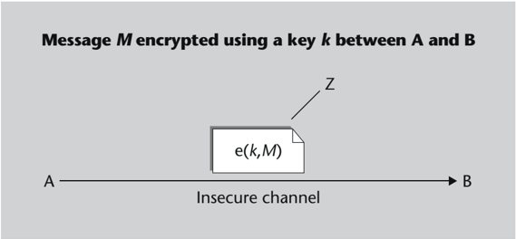

If the system uses shared key encryption, the value of the secret key k used by A and B must be the same. Now, how can you ensure that this is the case? Clearly, they cannot send the chosen key through the communication channel they have because the initial assumption is that this channel is insecure and therefore compromised and anyone could gain access to the information transmitted across it. A possible solution is to use a separate channel, which could be considered sufficiently secure:

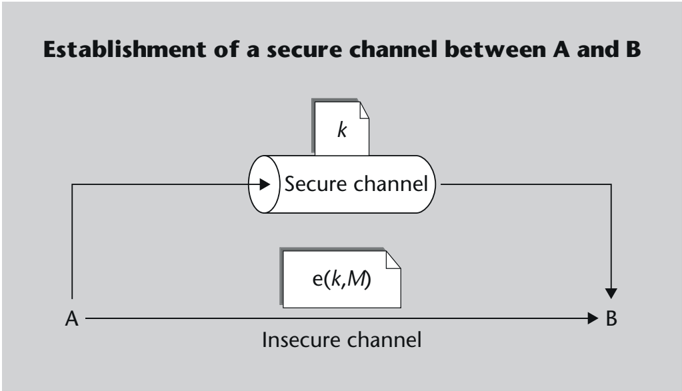

This solution, however, has some drawbacks. For one thing, the secure channel is not supposed to be as easy to use as the insecure channel (if it were, it would be much better to send all unencrypted confidential messages over the secure channel, and forget about the insecure channel!). Therefore, it can be difficult to keep changing the key. On the other hand, this scheme is not general enough: we may need to send encrypted information to someone we cannot contact in any other way. As will be discussed later, problems related to key exchange are solved through asymmetric cryptography.

Next, we review the basic characteristics of the main symmetric-key cryptographic algorithms, which we group into two categories: stream algorithms and block algorithms.

## 1.1.1 Stream cipher algorithms

.

Astream cipher is a method in which the plaintext M is combined with a keystream S that is obtained from the symmetric key k . For decryption, the operation is run in reverse using the encrypted text and the same keystream S .

The combination operation that is typically used is addition, so the inverse operation is subtraction. If the text consists of characters, this algorithm would be like a Caesar cipher in which the key changes from one letter to another. The key that corresponds each time is given by the keystream S .

If we consider text formed by bits, addition and subtraction are equivalent. Indeed, when applied bit by bit, both operations are identical to the logical operation 'exclusive OR',

## Secure channels

The following are examples of 'secure channels': traditional (non-electronic) mail or a 'physical' messaging service, telephone or face-to-face conversations, etc.

## Binary addition and subtraction

When we work with binary arithmetic or arithmetic modulo 2, it holds that:

0

+

0

=

0

0

-

0

=

0

0

1

1

+

+

+

1

0

1

=

=

1

1

0

1

-

-

=

0

1

-

0 ⊕ 0 = 0

0 ⊕ 1 = 1

1 ⊕ 0 = 1

1

⊕

1

=

0

1

0

1

=

=

=

1

1

0

denoted by the XOR operator ( 'eXclusive OR' ) or the symbol ⊕ . Hence:

C = M ⊕ S ( k )

M = C ⊕ S ( k )

In stream cipher schemes, the plaintext M can be of any length, and the keystream S must be at least as long. In fact, we do not need to have the entire message before starting to encrypt or decrypt it, since the algorithm can be implemented to work with an incoming 'data stream' (the plaintext or the encrypted text) and another 'data stream' that is generated from the key (the keystream). This is where the name of this type of algorithm comes from. The following figure illustrates the basic mechanism of its implementation.

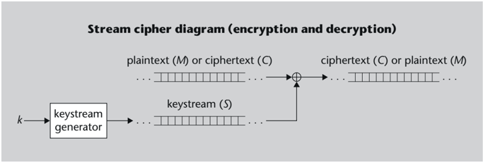

There are different ways of obtaining the keystream S depending on the key k :

- If a sequence k shorter than the message M is chosen, one option would be to repeat it cyclically as many times as necessary to add it to the plaintext.

The drawback of this method is that it can be easily broken, especially the shorter the key (in the minimal case, the algorithm would be equivalent to Caesar cipher).

- At the other end, S ( k ) = k could be done directly. This means that the key itself must be as long as the message to be encrypted. This is the principle of the so-called Vernam cipher . If k is a completely random sequence that does not repeat cyclically, we are dealing with an example of unconditionally secure encryption, as defined previously. This method of encryption is called one-time pad .

The problem in this case is that the recipient must have the same random sequence to be able to decrypt it, and if it must reach them through a secure channel, this begs the question: why not sending the confidential message M , which is the same length as the key k , directly over the same secure channel? It is clear, then, that this algorithm is generally very secure but not very practical.

## Use of Vernam cipher

Communications between aircraft carriers and aircraft often use Vernam cipher. In this case, it takes advantage of the fact that at a given moment (before take-off) both the plane and the aircraft carrier are in the same place, and exchanging, for example, a 20 GB hard drive with a random sequence is not a problem. Later, when the plane takes off, it can establish secure communication with the aircraft carrier using a Vernam cipher with the random key shared by both parties.

- What is done in practice is to use functions that generate pseudorandom sequences from a seed (i.e. a number that acts as a generator parameter), and what is exchanged as the secret key k is only this seed value.

Pseudorandom sequences are so called because they try to look random although they are algorithmically generated. At each step, the algorithm will be in a certain state that will be determined by its internal variables. Since the variables will be finite, there will be a maximum number of different possible states. This means that, after a certain period, the generated data will be repeated again. For the algorithm to be secure, the repetition period must be as long as possible (in relation to the message to be encrypted) to make cryptanalysis more difficult. Pseudorandom sequences must also have other statistical properties equivalent to those of pure random sequences.

## Synchronous and asynchronous stream ciphers

If the keystream S depends exclusively on the key k , the stream cipher is said to be synchronous. This encryption has the problem that if some bits are lost (or repeated) due to a transmission error, the recipient will desynchronize and add bits of the keystream S to bits of the ciphertext C that do not match, so the decryption obtained thereafter will be incorrect.

This can be avoided with asynchronous (or 'self-synchronizing') stream ciphers, in which the keystream S is computed given the key k and the same ciphertext C . That is, instead of being fed back with its own state bits, the generator is fed back with the last n encrypted bits transmitted. Thus, if m consecutive bits are lost in the communication, the error will affect the decryption of at most m + n bits of the original message.

## Examples of stream cipher algorithms

Stream cipher algorithms currently in use are inexpensive to implement. Hardware implementations are relatively simple and therefore efficient in performance (in terms of encrypted bits per second). But software implementations can also be very efficient.

The characteristics of stream cipher make it suitable for environments where high performance is needed and resources (calculation capacity, consumption of energy) are limited. That is why they are usually used in mobile communications such as wireless local networks or mobile telephony.

An example of a stream cipher algorithm is RC4 (Ron's Code 4) . Designed by Ronald Rivest in 1987, it was published on the Internet by an anonymous sender in 1994. It has been the most widely used stream cipher algorithm in many applications due to its simplicity and speed. For example, the WEP protection system (Wired Equivalent Privacy) that originally incorporated the standard IEEE 802.11 for wireless LAN technology uses this stream cipher cryptosystem.

## Pseudorandom functions

Examples of pseudorandom functions are those based on feedback shift registers (FSR). The initial value of the register is the seed value. To obtain each pseudorandom bit, all the bits in the register are shifted one position, and the one that is thrown out of the register is selected. The bit that is vacated at the other end is filled with a value that is a function of the rest of the bits.

## 1.1.2 Block cipher algorithms

.

In a block cipher, the encryption or decryption algorithm is applied separately to input blocks of fixed length b , and each of them yields an output block of the same length.

To encrypt a plaintext of L bits, we must divide it into blocks of b bits each and encrypt these blocks one by one. If L is not a multiple of b , additional bits can be added until an integer number of blocks is reached, but then it may be necessary to somehow indicate how many bits were actually in the original message. Decryption must also be performed block by block.

The figure below shows the basic scheme of the block cipher:

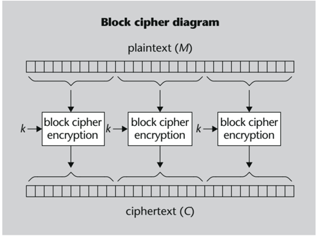

Many block cipher algorithms are based on the combination of two basic operations: substitution and transposition.

- Substitution consists in replacing each group of bits in the input with another group, following a certain permutation.

The Caesar cipher would be a simple example of substitution, where each group of bits would correspond to a letter. In fact, this is a particular case of alphabetical substitution . In the most general case, the letters of the ciphertext do not have to be at a constant distance from the letters of the plaintext (the letter k of the algorithm, as we have previously defined it). The key can be expressed as the correlative sequence of letters that correspond to A, B, C, etc. For example:

A B C D E F G H I J K L M N O P Q R S T U V W X Y Z Key: Q W E R T Y U I O P A S D F G H J K L Z X C V B N M

Plaintext: A L E A J A C T A E S T

Ciphertext:

Q S T Q P Q E Z Q T L Z

Alphabet substitution key

It is clear that the key must be a permutation of the alphabet, meaning there can be no repeated or missing letters. Otherwise, in general the transformation would not be invertible.

- Transposition consists of rearranging the information in the plaintext according to a certain pattern. An example might be to form groups of 5 letters, including spaces, and rewrite each group ( 1 , 2 , 3 , 4 , 5 ) in the order ( 3 , 1 , 5 , 4 , 2 ) :

Plaintext: A L E A J A C T A E S T

Ciphertext:

E A A L C J A T A S T E

Transposition alone does not make cryptanalysis extraordinarily difficult, but it can be combined with other operations to add complexity to cipher algorithms.

Product ciphers , or cascaded arrangement of several cryptographic transformations, is a very effective technique for implementing fairly secure algorithms in a simple way. For example, many block cipher algorithms are based on a series of iterations of substitutiontransposition products.

## Confusion and diffusion

Two desirable properties in a cryptographic algorithm are 'confusion', whose purpose is to hide the relationship between the key and the statistical properties of the ciphertext, and 'diffusion', which diffuses the redundancy of the plaintext across the ciphertext so that it is not easily recognizable.

Confusion means that changing a single bit of the key changes many bits of the ciphertext, and diffusion means that changing a single bit of the plaintext also affects many bits of the ciphertext.

In a product loop of basic ciphers, substitution contributes to confusion, while transposition contributes to diffusion. The combination of these simple transformations, repeated several times, causes changes in the input to propagate throughout the output by an 'avalanche effect'.

## Examples of block cipher algorithms

Data Encryption Standard (DES). It has been the most studied and used algorithm for years. Developed by IBM in the 1970s, it was adopted by the American NIST (back then known as NBS) as a standard for data encryption in 1977.

The algorithm supports a 64-bit key, but only 7 out of 8 are involved in encryption, so the effective key length is 56 bits. The text blocks to which DES is applied must be 64 bits each.

The central part of the algorithm consists of dividing the input into groups of bits, performing a different substitution on each group, and then a transposition of all the bits. This transformation is repeated 16 times: in each iteration, the input is a different transposition of the key bits added bit by bit (XOR) with the output of the previous iteration. As the algorithm is designed, decryption is performed in the same way as encryption but performing the transpositions of the key in reverse order (starting with the last one).

## NBS and NIST

NBS stands for National Bureau of Standards , and NIST stands for National Institute of Standards and Technology .

## Additional DES key bits

One possible use of the DES key bits that do not influence the algorithm is as parity bits.

Triple DES. Although the DES algorithm has proven to be very resistant to cryptanalysis over the years, the main problem today is its vulnerability to brute-force attacks due to a key length of only 56 bits. Although performing a search among the 2 56 possible combinations was computationally very costly, today's technology allows the algorithm to be broken in an increasingly shorter time.

Therefore, in 1999 NIST changed the DES algorithm to 'Triple DES' as the official standard until a new AES standard was available. As its name suggests, triple DES consists of applying DES three consecutive times. This can be done using three keys ( k 1 , k 2 , k 3 ) or only two ( k 1 , k 2, and again k 1). The total length of the key with the second option is 112 bits (two 56-bit keys), which was already considered sufficiently secure at the time; the first option provides more security, but at the cost of using in total a 168-bit key (three 56-bit keys), which can be a bit more difficult to manage and exchange.

To make the system adaptable to the old standard, in Triple DES an encryption-decryptionencryption (E-D-E) sequence is applied instead of three ciphers:

<!-- formula-not-decoded -->

<!-- formula-not-decoded -->

<!-- formula-not-decoded -->

Thus, with k 2 = k 1 we have a system equivalent to simple DES.

AES (Advanced Encryption Standard). As the DES standard was beginning to become outdated, mainly due to the short length of its keys, and Triple DES is not overly efficient when implemented in software, in 1997 NIST asked the crypto community to submit proposals for a new standard, AES, to replace DES. Five out of fifteen contenders were chosen as finalists, and the winner was announced in October 2000: the Rijndael algorithm, proposed by Belgian cryptographers Joan Daemen and Vincent Rijmen.

Rijndael handles blocks of 128, 192 or 256 bits (although the AES standard only handles data in 128-bit blocks), and supports key sizes of 128, 192 or 256 bits. Depending on this last length, the number of iterations of the algorithm is 10, 12 or 14, respectively. Each iteration includes a fixed byte-to-byte substitution, a transposition, a transformation consisting of bit shifts and XORs, and a binary addition (XOR) with bits obtained from the key.

## 1.1.3 Using symmetric-key algorithms

When symmetric encryption is used to protect communications, we can choose the algorithm that is most suitable to the needs of each application. Often times, more security means less encryption speed and vice versa.

## DES challenges

In the link below you can find information about the so-called 'DES challenges': it was already possible to break a DES key in less than 24 hours by 1999. http:// cryptography.fandom.com /wiki/DES Challenges

## Repetition of DES

The operation of applying DES encryption with one key and re-encrypting the result with another key, is not equivalent to a single DES encryption (there is no unique key that gives the same result as the other two together). Otherwise, repeating DES would be no more secure than simple DES.

## Double DES

The reason why the DES algorithm is applied three times, and not twice, is because an attacker with enough resources could break the 'double DES' by brute force through a known plaintext attack, with less than 2 57 encryption operations compared to the 2 112 operations that should be expected.

One thing to keep in mind is that while encryption can prevent an attacker from directly learning the transmitted data, at times the information can be deduced indirectly. For example, in a protocol that uses messages with a fixed header, if the same data is encrypted multiple times in one transmission, it may indicate where the messages begin.

This does not happen with a stream cipher if its period is long enough. However, with a block cipher, if two plaintext blocks are equal and the same key is used, the encrypted blocks will also be identical. To counter this property, different modes of operation can be applied to the block cipher.

- Electronic Codebook ( ECB ) mode is the simplest application. The message is divided into blocks and each encrypted separately. A disadvantage of this mode is that identical plaintext blocks are encrypted into identical ciphertext blocks.
- In Cipher Block Chaining (CBC) mode, each block of plaintext is XORed with the previous ciphertext block before being encrypted. An initialization vector (IV) is used in the first block, which is a set of random bits the same length as a block. By choosing different vectors each time, even though the plaintext is the same, the encrypted data will be different. The recipient must know the value of the vector before starting to decrypt, but this value does not need to be kept secret, as it is usually transmitted as the ciphertext header.
- In Cipher Feedback (CFB) mode, the encryption algorithm is not applied directly to the plaintext but to an auxiliary vector (initially identical to the IV). n bits are taken from the result of the encryption and added to n bits of the plaintext to get n bits of ciphertext. These encrypted bits are also used to update the auxiliary vector. The number n of bits generated in each iteration can be less than or equal to the block length b . For example,

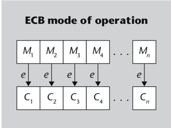

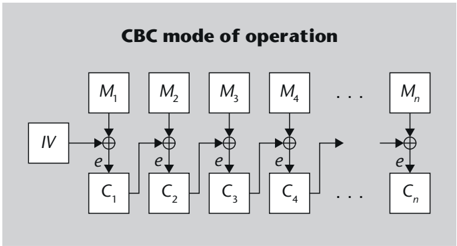

## ECB mode

The name Electronic Codebook (ECB) mode implies that it can be thought of as a simple block-by-block substitution based on a code or dictionary (with many entries indeed) that is given by the key.

CFB mode as a stream cipher

It is easy to see that CFB mode (and also the OFB mode) can be considered as a stream cipher that uses a block cipher as a generator function.

if n = 8, then the encryption generates one byte at a time without having to wait to get a whole block to be able to encrypt it.

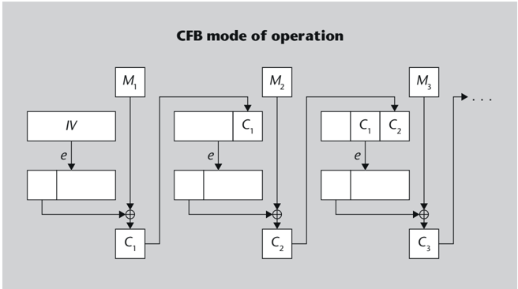

- The Output Feedback (OFB) mode is very much like the CFB mode, but instead of updating the auxiliary vector with the ciphertext, it is updated with the result from the encryption algorithm. The distinctive property of this mode is that an error in the retrieval of an encrypted bit affects only the decryption of this particular bit.
- Several variants can be defined from the previous modes. For example, Counter (CTR) mode is like OFB, but the auxiliary vector is not fed back with the previous cipher, it is simply an incrementing counter.

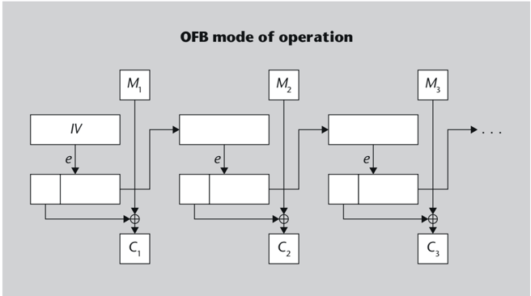

There is another technique to prevent identical input texts from producing identical ciphertexts, which can also be applied to ciphers that do not use initialization vector (including stream ciphers). This technique consists of modifying the secret key with random bits before using it in the encryption (or decryption) algorithm. Because these random bits give a different 'flavour' to the key, they are often called bits of salt . Like the initialization vector, bits of salt are sent as plaintext before the ciphertext.

## 1.1.4 Secure hash functions

Apart from encrypting data, some algorithms are based on cryptographic techniques that are used to ensure the authenticity of messages. One type of algorithms with such characteristics are secure hash functions , also known as message digest functions.

In general, we can say that a hash function allows us to obtain a relatively short, fixedlength string of bits from a message of arbitrary length:

<!-- formula-not-decoded -->

For identical M messages, the h function must return equal H digests. But if two messages give the same hash H , they do not necessarily have to be identical. This is so because there is only a limited set of possible H values, since its length is fixed, and instead there can be many more messages M (if it can be just any length, there will be infinite messages).

To be able to apply it to an authentication system, the h function must be a secure hash function.


.

Ahash or message digest function is thought to be secure if it satisfies the following conditions:

- It is a one-way function, that is, given H = h ( M ) , it is computationally infeasible to find M from the digest message H .
- It is a collision-resistant function, that is, given any message M , it is computationally infeasible to find a message M ′ = M such that h ( M ′ ) = h ( M ) .

/negationslash

These properties allow the use of secure hash functions to provide an authenticity service based on a secret key s shared between two parties A and B . Taking advantage of unidirectionality, when A wants to send a message M to B , they can prepare another message Ms : for example, concatenating the original message using the key: Ms =( M , s ) . Then she sends B the message M and the digest of message Ms :


To check the authenticity of the received message, B verifies that the digest actually corresponds to Ms . If so, it means that it was generated by someone who knows the secret key s (which should be A ), and also that no one has modified the message.

## Secret of algorithms

Notice that hash functions must be publicly known, since everyone should be able to calculate message digests in the same way.

Another technique would be to compute the message digest M and encrypt it using s as the encryption key: .

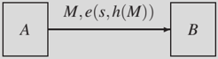

To verify the authenticity of the message, you must retrieve the digest sent, by decrypting it with the secret key s and then compare it with the digest of message M . An attacker who wants to modify the message without knowing the key could try to replace it with another one that returned the same digest. This way, B would not be able to detect the forgery. But if the digest function is collision-resistant, this will prove impossible for the attacker.

To make attacks against message digest functions more difficult, the algorithms must define a complex relationship between the input bits and each output bit. On the other hand, brute-force attacks are countered by making the digest length long enough. For example, currently used algorithms generate 128- or 160-bit message digests. This means that an attacker may have to try around 2 128 or 2 160 input messages to find a collision (i.e. a different message returning the same message digest).

But there is an attack known as birthday attack that is more advantageous for the attacker. Such an attack assumes that the attacker can choose the message that will be authenticated. The victim reads the message and, if they accept it, they authenticate it with their secret key. But the attacker has used this message because they have found another one that returns the same message digest and, therefore, they can fool the recipient into believing that the authentic message is this other one. This can be done by performing a brute-force search with much fewer operations, around 2 64 or 2 80 , if the message digest is 128 or 160 bits, respectively.

## Birthday paradox

The name of this type of attack refers to a popular probability problem called the 'birthday paradox'. The problem is to find the minimum number of people that can be in a room so that the chance of at least two people sharing the same birthday exceeds 50%. An intuitive answer may be that the solution is around 200 people, but it's not the correct one. This might be correct if we wanted to find the number of people needed to get a 50% chance of matching a given person. However, if we allow the match to be between any pair of people, then the solution is a much smaller number: 23.

To conclude, if a message digest function can return N different values, in order to attain a 50% probability of finding two messages that hash to the same value the number of messages that must be calculated is around √ N .

## Examples of secure hash functions

The scheme of most hash functions used today is similar to that of block cipher algorithms: the input message is divided into blocks of the same length, each of which is subjected to a series of operations along with the result obtained in the previous block. The result that remains after processing the last block is the message digest.

## Authenticity and confidentiality

Encrypting only the message digest, rather than the entire message, is more efficient because fewer bits need to be encrypted. This, obviously, assuming that only authenticity is required, and not confidentiality. If you also want the message to be confidential, then it needs to be fully encrypted.

## Strong collision resistance

As mentioned before, the resistance of message digest algorithms to collisions is sometimes called weak collision resistance , while the property of being resistant to birthday attacks is known as strong resistance .

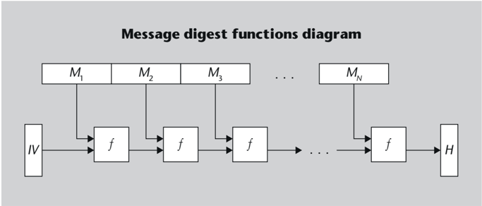

The goal of these algorithms is for each output bit to depend on all input bits. This is achieved with different iterations of operations that 'shuffle' the bits together, similar to how the succession of transpositions in block ciphers causes an 'avalanche effect' that ensures diffusion of the bits.

Until recently, the most widely used hash algorithm was Message Digest 5 (MD5) . But since it only outputs a 128-bit message digest, and several ways have been found to generate partial collisions in the algorithm, it is currently recommended to use more secure algorithms, such as Secure Hash Algorithm-1 (SHA-1) . The SHA-1 algorithm, published in 1995 in a NIST standard (as a revision of an earlier algorithm called SHA), outputs 160-bit message digests. In 2002, NIST published variants of this algorithm that generate digests of 256, 384, and 512 bits.

## 1.2 Public-key cryptography

## 1.2.1 Public-key algorithms

As we have seen in the previous subsection, one of the problems of symmetric-key cryptography is that of key distribution. This problem can be solved if we use public-key algorithms, also called asymmetric-key algorithms.

.

In a public-key cryptographic algorithm, different keys are used for encryption and decryption. While the public key can be easily obtained from the private key , it is computationally very difficult to obtain the private key from the public key.

Typical public-key algorithms allow encryption with the public key ( k pub) and decryption with the private key ( k pr ):

<!-- formula-not-decoded -->

<!-- formula-not-decoded -->

<!-- formula-not-decoded -->

## MD5 digest length

Since MD5 digest length is 128 bits, the number of operations for a birthday attack is around 2 64 . Compare this magnitude to a brute-force attack against DES (less than 2 56 ops), which is not too far off.

But some algorithms may also allow encryption with the private key and decryption with the public key (later we discuss how this property can be used):

<!-- formula-not-decoded -->

<!-- formula-not-decoded -->

Public-key algorithms are based on mathematical problems that are 'easy' to pose from the solution, but 'difficult' to solve. In this context, a problem is thought to be easy if the time to solve it, as a function of the length n of the data, can be expressed in polynomial form as, for example, n 2 + 2 n (in complexity theory, these problems are said to be 'class P' problems). If solving time grows faster, such as with 2 n , the problem is said to be hard. Thus, a value of n can be chosen such that the approach is feasible but the resolution is computationally intractable.

An example of an easy problem to pose but difficult to solve is that of discrete logarithms. If we work with arithmetic modulo m , it is easy to calculate this expression:

<!-- formula-not-decoded -->

The value x is called the discrete logarithm of y to base b modulo m . By conveniently choosing b and m , it can be difficult to compute the discrete logarithm of any integer y . One option is to try all the values of x : if m is a number of n bits, the time to find the solution increases proportionally to 2 n . There are other, more efficient methods for calculating discrete logarithms, but the best-known algorithm also takes more time than can be expressed polynomially.

## Example of modulo m operations

To obtain 14 11 mod 19, we can multiply the number 14 11 times, divide the result by 19 and take the remainder of the division, which is equal to 13. But we can also take advantage of the fact that the exponent 11 is 1011 in binary (11 = 1 · 2 3 + 0 · 2 2 + 1 · 2 1 + 1 · 2 0 ), and then 14 11 = 14 8 · 14 2 · 14 1 , to get the result with fewer multiplications:

<!-- formula-not-decoded -->

Thus, we know that log 14 13 = 11 (mod 19). But if we were to calculate the logarithm of any other integer y , we would have to try the exponents one by one until we find one that results in y . And, if instead of dealing with 4- or 5-bit numbers like these ones, they were numbers with more than 1000 bits, the problem would be intractable.

Thus, the public key algorithms must be designed in such a way that it is infeasible to calculate the private key from the public one. Of course, reversing them without knowing the private key must also be unfeasible, but encryption and decryption must be done in a relatively short time.

## Adaptation of hard problems

If advances in technology reduce the solving time, the length n can be increased, which means that a few more operations will be required for the formulation. However, the complexity of the solution will grow exponentially.

## Speed of public-key cryptography

Encryption and decryption with public-key algorithms can be two to three orders of magnitude slower than with symmetric cryptography.

In practice, the used algorithms allow easy encryption and decryption, but they are all considerably slower than their symmetric cryptographic counterparts. That is why publickey cryptography is often used only for problems that cannot be solved using symmetric cryptography: key-exchange and non-repudiation authentication (digital signatures).


- Key-exchange mechanisms allow two parties to agree on the symmetric keys they will use to communicate, without a third party eavesdropping and being able to figure out these keys.

For example, A can choose a symmetric key k , encrypt it with the public key of B , and send the result to B . Then B will decrypt the received value with their private key, and they will know which key k has been chosen by A . The rest of the communication will be encrypted using a symmetric algorithm, which is much faster, and will use this k key. Since the attackers will not know B 's private key, they won't be able to deduce the value of k .

- Public-key authentication can be used if the algorithm allows the keys to be used in reverse: the private key for encryption, and the public key for decryption. If A sends a message encrypted with their private key, everyone will be able to decrypt it using A 's public key, and at the same time everyone will know that the message could only have been generated by someone who knows the associated private key (who should be A ). This is the basis of digital signatures .

## Examples of public-key algorithms

Diffie-Hellman key exchange. This mechanism allows two parties to securely agree on a secret key. The algorithm is based on the difficulty of calculating discrete logarithms. Proposed by Whitfield Diffie and Martin Hellman in 1976, the mechanism works like this: two participants choose their private keys a and b and make the values α a and α b public in arithmetic modulo n . The two of them can compute α a · b by exponentiating the public key of the other party to their private key, and they can use this value as their secret key. Given the difficulty of calculating discrete logarithms, no one else can deduce this value.

RSA. It's the most widely used algorithm in the history of public-key cryptography. RSA stands for Ronald Rivest, Adi Shamir and Leonard Adleman, who described the algorithm in 1977. The public key is formed by a number n , calculated as the product of two very large prime factors ( n = p · q ) and an exponent e . The private key is another exponent d computed from p , q , and e , such that encryption and decryption can be done as follows:

Encryption:

C = M e mod n

Decryption:

M = C d mod n

As you can see, the public and private keys are interchangeable: if either one is used for encryption, the other must be used for decryption.

## Values used in RSA

Currently, the problem of factoring 512-bit numbers is very complex, although it can be tackled if enough resources are available. Therefore, it is recommended to use public keys with a value of n starting at 1,024 bits. Simple values such as 3 or 65,537 ( 2 16 + 1 ) are typically used as the public exponent e because they make encryption faster.

The strength of the RSA algorithm is based on, on the one hand, the difficulty of finding M given C without knowing d (discrete logarithm problem), and on the other, the difficulty of finding p and q (and therefore d ) given n (problem of factoring large numbers, which is another hard problem).

ElGamal. Another encryption scheme, in this case based on the Diffie-Hellman problem.

Digital Signature Algorithm (DSA). Published by NIST in different versions of the Digital Signature Standard (DSS), the first one in 1991. It is a variant of the ElGamal signature algorithm, which in turn follows the ElGamal encryption scheme. DSA is not an encryption algorithm; it only allows to generate and verify signatures.

Elliptic curves. While the previous algorithms basically work with products of very large numbers in modular arithmetic, this new branch of public-key cryptography uses operations defined on elliptic curve points in a two-dimensional integer coordinate space. The advantage of this technique is that it provides a security equivalent to that of the other algorithms with much fewer key bits, and with a much shorter computation time.

## 1.2.2 Use of public-key cryptography

As we have seen before, the main applications of public-key cryptography are key-exchange to provide confidentiality, and digital signature to provide authenticity and not repudiation.

- The problem of confidentiality between two parties that can only communicate through an insecure channel is solved by using public-key cryptography. When A wants to send a secret message M to B , it is not necessary to encrypt the entire message with a publickey algorithm (as this could be very slow). Instead, we choose a symmetric key ks , sometimes called session key or transport key , and the message is encrypted with a symmetric algorithm using this key. The only thing that needs to be encrypted with the public key of B ( k pub B ) is the session key. On reception, B uses their private key ( k pr B ) to retrieve the session key ks , and then they can already decrypt the encrypted message.

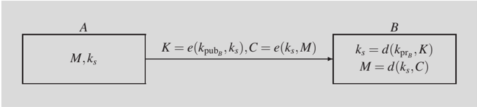

Since the session key is a relatively short message (for example, if it is a DES key, it will only have 56 bits), an attacker could try to break the encryption by brute force, but not by trying to decrypt the message with the possible values of the private key k pr B , but by encrypting the possible values of the session key ks with the public key k pub B . In the case of a DES session key, and irrespective of the number of bits in the public key, the attacker would only need to run about 2 56 operations.

## Security with elliptic curves

The security provided by a 1024-bit RSA key can be achieved with less than 170 key bits when elliptic curve cryptography is used.

## Digital envelope

As will be discussed later, the technique of providing confidentiality with public-key cryptography is often called a 'digital envelope' in the context of secure email.

To prevent such an attack, the information that is actually encrypted with the public key is not directly the secret value (in this case ks ), but rather the secret value together with a more or less long string of random bits. The recipient only has to discard these random bits from the result of the decryption.

- A digital signature is basically a message encrypted with the private key of the signer. However, for efficiency reasons, what is encrypted is not directly the message to be signed; it's only its hash computed with a secure hash function.

When A wants to send a signed message, they will have to get its hash and encrypt it with the private key k pr A . To verify the signature, the recipient must decrypt it using the public key k pub A and compare the result with the message digest: if they are the same, it means that the message was generated by A and nobody has modified it. Since the hash function is supposed to be collision-resistant, an attacker will not be able to modify the message without rendering the signature invalid.

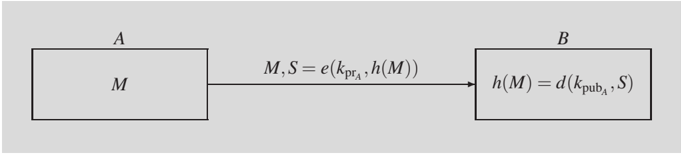

## 1.3 Public-key Infrastructure (PKI)

As we have seen so far, public-key cryptography allows solving the problem of exchanging keys by using the public keys of the participants. But another problem arises: spoofing or impersonation. If an outsider claims to be A and their public key is k pub, how can we know that k pub is really the public key of A ? Because it is perfectly possible for attacker Z to generate the pair of keys ( k ′ pr , k ′ pub ) and claim 'I am A , and my public key is k ′ pub '.

Apossible solution to this problem is to use a trusted entity that assures us that, in fact, the public keys belong to their presumed owners. This entity can sign a document that states 'the public key of A is k pub A '.

## 1.3.1 Public-key certificates

.

A public-key certificate or digital certificate consists of three basic parts:

- A user identification, e.g. the user's name.
- The value of this user's public key.
- The signature of the two previous parts.

If we trust the signer, the certificate serves as a guarantee that the public key belongs to the user identified in the certificate. The person who signs the certificate can be a competent authority responsible for verifying the authenticity of the public keys. In this case, the certificate is said to have been generated by a certification authority (CA).

There can be different certificate formats, but the most widely used is the X.509 certificate , specified in the definition of the X.500 directory service .

The X.500 directory allows storing and retrieving information, expressed as attributes , of a set of objects . X.500 objects can represent, for example, countries, cities, or else companies, universities (in general, organizations), departments, faculties (in general, organizational units), people, etc. All these objects are organized hierarchically in the form of a tree (there is an object at each node of the tree) and, within each level, objects are identified by a distinguished attribute . At a global level, each object is identified with a Distinguished Name (DN), which is nothing more than the concatenation of distinguished attributes between the root of the tree and the object in question. The name system is, then, similar to Internet DNS, except that the components of a DNS name are simple strings of characters, and those of an X.500 DN are attributes, each with a type and a value.

Some examples of attribute types that can be used as distinguished attributes in a DN are: countryName (typically denoted by the abbreviation ' c '), stateOrProvinceName (' st '), localityName (' l '), organizationName (' o '), organizationalUnitName (' ou '), commonName (' cn '), surname (' sn '), etc.

An example of a DN is ' c=ES , st=Barcelona , l=Barcelona , o=Universitat Oberta de Catalonia , ou=SI , cn=cv.uoc.edu '.

X.500 defines a service access protocol that allows query operations, as well as object information alteration operations. These latter operations are normally only allowed to certain authorized users, and therefore user authentication mechanisms are needed (these mechanisms are defined in Recommendation X.509). There is a basic mechanism that uses passwords, and a more advanced mechanism that uses certificates.

Below you can see the structure of an X.509 certificate, with its fields and subfields. In the notation used here, 'rep.' means that the field can be repeated one or more times, and 'opt.' means that the field is optional (and thus 'opt. rep.' means that the field can be repeated zero or more times).

## X.500 directory

The X.500 directory specification is published in the ITU-T X.500 Series of Recommendations, one of which is Recommendation X.509.

.

## Field

toBeSigned

```
version (opt.) integer serialNumber integer signature algorithm unique identifier parameters (depends on algorithm) issuer DN validity notBefore date and time notAfter date and time subject DN subjectPublicKeyInfo algorithm algorithm unique identifier parameters (depends on algorithm) subjectPublicKey bit string issuerUniqueIdentifier (opt.) bit string subjectUniqueIdentifier (opt.) bit string extensions (opt. rep.) extnId unique identifier critical (opt.) boolean extnValue (depends on extension) algorithmIdentifier algorithm unique identifier parameters (depends on algorithm) encrypted bit string
```

The certificate body (' toBeSigned ' in the table above) consists of the following fields:

- The version fi eld is the format version number: it can be 1, 2, or 3. Although this is an optional field, it is required if the version is 2 or 3 (thus, the absence of this field indicates that the version is 1).
- The serialNumber fi eld is the serial number of the certificate, and serves to distinguish it from all the others that the same CA has generated.
- The signature fi eld indicates the algorithm used by the CA to sign the certificate.
- The issuer fi eld is the distinguished name (DN) of the signer or issuer of the certificate, that is, that of the CA that generated it.
- The validity fi eld indicates the period of validity of the certificate, between an initial time and an expiration time. When we discuss revocation lists later, we'll see how certificate expiration dates can be useful.

## Type

## Serial numbers

The serial numbers of the certificates generated by a CA do not have to be consecutive: it suffices that each one is different from all the previous ones.

- The subject fi eld is the distinguished name (DN) of the subject to whom the certificate is issued, that is, the holder of the public key that appears in the certificate.
- The subjectPublicKeyInfo fi eld contains the public key of the subject: which algorithm it corresponds to, and its value.
- The issuerUniqueIdentifier and subjectUniqueIdentifier fi elds were introduced in version 2, but are not commonly used because they are unnecessary with the extensions fi eld.
- The extensions fi eld is a list of additional certificate attributes that was introduced in version 3. The extnId subfield indicates what type of extension it is. The critical subfield indicates whether the extension is critical or not: if it is, applications that do not recognize the extension type should treat the certificate as invalid (this subfield is optional because extensions are not critical by default). The extnValue subfield is the actual value of the extension.

Apart from the certificate body, there is the algorithmIdentifier fi eld (which is actually redundant with the signature fi eld), and the encrypted fi eld, which is the signature of the certificate, i.e. the result of encrypting the hash of the certificate body using the CA's private key.

To calculate the message digest, the certificate body has to be represented as a sequence of bytes using unambiguous encoding as this ensures that anyone who wants to verify the signature can reconstruct the exact same sequence of bytes. The rules for obtaining this encoding are called DER, and they are part of the ASN.1 notation, which is the notation in which the X.509 certificate format is defined.

## 1.3.2 Certificate chains and certification hierarchies

A certificate solves the problem of the authenticity of the public key if it is signed by a trusted CA. But what happens if we communicate with a user who has a certificate issued by a CA that we do not know?

One option is that the CA has a certificate that guarantees the authenticity of their public key, as signed by another CA. This other CA may be known to us, or it may in turn have a certificate signed by a third CA, and so on. This way, a hierarchy of certification authorities can be established, where the lowest level CAs issue user certificates, and the CAs of each level are certified by a higher level one.

In an ideal world, there could be a root CA certificate at the top of the hierarchy being the highest authority. In practice, this global root CA does not exist, and probably will never exist (it would be difficult for it to be accepted by everyone). Instead of having a single tree that includes all CAs in the world, in reality we have independent trees (some, possibly with only one CA), each with its root CA certificate.

## Type of extensions

There are a number of standard extensions, but new ones can be defined depending on the needs of the applications and as long as each is identified with an unambiguous value of the extnId subfield.

## ASN.1 and DER

ASN.1 stands for Abstract Syntax Notation One , and DER stands for Distinguished Encoding Rules .

If we want to verify the authenticity of their public key, a user can send us their certificate, plus the certificate of the CA that has issued it, plus that of the CA that has issued this other certificate, and so on, until reaching the certificate of a root CA. This is called a certificate chain . Root CA certificates have the property of being self-signed, that is, they are created by a user and validated on their own.

A possible type of extension for X.509 certificates is basicConstraints , and a field of its value indicates whether the certificate belongs to a CA (its key can be used to issue other certificates) or not. If it is, another subfield ( pathLenConstraint ) allows you to indicate the maximum number of hierarchy levels below this CA.

## 1.3.3 Certificate Revocation List (CRL)

In addition to defining the format of certificates, recommendation X.509 also defines another structure called Certificate Revocation List or CRL. Such a list is used to publish the certificates that have ceased to be valid before its expiration date due to a number of reasons: another certificate has been issued to replace the revoked one, the holder's DN has changed (for example, they no longer work in the company), its private key has been stolen, etc.

This way, if we want to be completely sure of the validity of a certificate, it is not enough to check its signature. Rather, we must obtain the current version of the CRL (published by the CA that issued the certificate) and check that the certificate does not appear in this list.

A CA will normally update its CRL periodically, each time adding certificates that have been revoked. When the expiration date stated on the certificate arrives, it will no longer need to be re-included in the CRL. This allows CRLs to not grow indefinitely.

Below are the fields of a CRL:

```
. Field toBeSigned
```

## Type

```
version (opt.) signature algorithm parameters issuer thisUpdate nextUpdate (opt.) revokedCertificates (opt. rep.) userCertificate revocationDate crlEntryExtensions extnId critical (opt.) extnValue crlExtensions (opt. rep.) extnId critical (opt.) extnValue algorithmIdentifier algorithm parameters encrypted
```

```
integer unique identifier (depends on algorithm) DN date and time date and time integer date and time (opt. rep.) unique identifier boolean (depends on extension) unique identifier boolean (depends on extension) unique identifier (depends on algorithm) bit string
```

The issuer fi eld identifies the CA issuing the CRL, and the revokedCertificates field contains the list of revoked certificates (each identified by its serial number). The extensions of each element of the list can include, for example, the reason for the revocation.

## 2. Authentication systems

One of the security services that is required in many applications is authentication . This service allows us to guarantee that the communication has not been tampered with during transmission.

.

We can distinguish two types of authentication:

- Message authentication or data origin authentication allows us to confirm that the originator A of a message is authentic, that is, that the message has not been generated by a malicious third party ( Z ) who wants us to believe that it was generated by A .

As an added effect, message authentication implicitly provides the data integrity service, which allows us to confirm that no one has modified a message sent by A .

- Entity authentication allows us to confirm the identity of a given participant A in a communication, that is, that it is not a third party Z who claims to be A .

Next, we discuss how each of these two types of authentication can be achieved.

## 2.1 Message authentication

There are two groups of techniques to provide message authentication:

- The Message Authentication Code or MAC , based on symmetric keys.
- Digital signatures , which are based on public-key cryptography.

## 2.1.1 Message Authentication Code (MAC)

.

/negationslash

A Message Authentication Code or MAC is obtained with an algorithm a that has two inputs: a message M of arbitrary length, and a secret key k shared by the originator and recipient of the message. The result is a code C MAC = a ( k , M ) of fixed length. The MAC algorithm must guarantee that it is computationally infeasible to find a message M ′ = M that gives the same code as M , and also obtain the code of any message without knowing the key.

Thanks to the properties of MAC algorithms, given a pair ( M , C MAC ) , an attacker cannot obtain another pair ( M ′ , C MAC ) , nor generally any pair ( M ′ , C ′ MAC ) . Therefore, the MAC code serves as proof of authenticity of the message.

One possible MAC algorithm consists in using a block cipher in CBC mode to encrypt the message M using the key k and taking the last encrypted block as code C MAC. However, currently used MAC algorithms are usually based on a hash function. For example, the technique of calculating the hash from the concatenation of the message and the key, or that of calculating the hash of the message and encrypting it with the key, could serve as MACalgorithms. To improve security against certain attacks, many protocols use a slightly more sophisticated message authentication technique known as HMAC.

## 2.1.2 Digital signatures

Since MAC codes rely on a secret key, they have meaning only to those who know that key. If A sends messages to B authenticated with a shared key, only B will be able to verify the authenticity of these messages.

Moreover, in the event of a dispute where A denies having authenticated a message, B would not be able to prove to an impartial third party (for example, an arbitrator or a judge) that the message was generated by A . Revealing the secret key would not be sufficient proof since, due to the fact that it is known by both parties, there would always be the possibility that the disputed message and its authentication code had been generated by B .

However, if A authenticates the messages by attaching the digital signature calculated with their private key, then everyone can verify them with their public key. An additional effect of this authentication technique is that it provides non-repudiation . This means that a recipient B can reliably demonstrate to a third party that a message has been generated by A .

As we have seen in subsection 1.2, the digital signature algorithms that are typically used rely on the calculation of a hash and encryption using a private key. Examples of signature algorithms are RSA, ElGamal and the DSA standard (Digital Signature Algorithm).

## 2.2 Entity authentication

Entity authentication is used when one of the parties in a communication wants to ensure the identity of the other. Typically, this authentication is required to allow access to a restricted resource, such as a user account on a computer, cash in an ATM, access to a room, etc.

In general, the techniques used to identify a given user A may be based on:

- Something A knows , such as a password or private key.
- Something A has , such as a swipe card or chip card.

## HMAC code

To calculate the HMAC code, the message is prefixed with a bit string derived from the key, its hash is computed, the result is prefixed with another bit string derived from the key, and the hash is recalculated. (Although the hash function will have to be called twice, the second time will be much faster since the data to be hashed will be shorter.)

- Something A is , or, in other words, some inherent property of A , such as their biometric characteristics.

Biometrics is a relatively modern discipline that is likely to take hold in the near future. This said, in this module we focus on techniques based on the exchange of information by electronic means.

One difference between message authentication and entity authentication is that the former provides no timeliness guarantees with respect to when a message was created (it is possible to verify the authenticity of a document signed, say, ten years ago) while the latter is usually done in real time. This means that, for entity authentication, an interactive protocol can be carried out in which both parties exchange messages until the identity in question is confirmed.

Next, we describe two groups of techniques that can be used for entity authentication:

- Those based on passwords , also called weak authentication techniques.
- Those based on challenge-response protocols , also called strong authentication techniques.

## 2.2.1 Passwords

The basic idea of password-based authentication is that claimant A declares their identity (their user id, login name, etc.) followed by a secret password xA (a word or combination of characters that the user can memorize). Verifier B verifies that the password is valid, and if it is, he corroborates A 's identity.

There are different ways of performing this authentication, and there are also different ways of trying to attack it. Next, we discuss some variants of password authentication that try to prevent certain types of attacks.

## List of passwords in plaintext

The simplest way to check a password is for the verifier to have a list of the passwords associated with the users, that is, a list of pairs ( A , xA ) . When A sends their password, the verifier directly compares the received value x ′ A with the one in the list, xA .

## Biometric techniques

Biometric techniques make use of physiological characteristics (e.g. fingerprint, iris, retina, face or hand) or characteristics of human behaviour (e.g. speech, hand signature or keystroke).

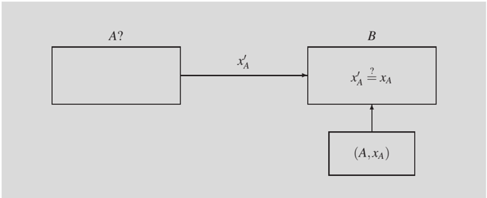

If the passwords correspond to users of a computer system, it is clear that they cannot be stored in a publicly accessible file: the list must be read-protected. But if someone finds a way to bypass this protection (which sometimes happens in multi-user systems), they will automatically gain access to the passwords of all users.

In addition, in these systems there is usually an administrator user or 'super-user' who has access to all files and therefore to user passwords. A super-user could be malicious and misuse this privilege, or someone might take advantage of them for being too careless an administrator.

## List of encrypted passwords

A second option is that, instead of storing the passwords in plaintext by pairs ( A , xA ) , each one is encrypted with some transformation C so that its actual value cannot be deduced. Thus, the list must contain pairs ( A , C ( xA )) .

This transformation of C could be, for example, an encryption, but then precautions should be taken with the decryption key (anyone gaining access to this key could obtain all the passwords). Encryption most often consists of using a one-way function, such as a hash function.

For verification, B must calculate the transformed value C ( x ′ A ) from the received password, and compare it with the one in the list.

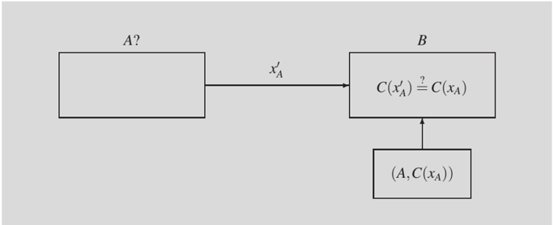

## Unix password encryption

A well-known case is password management in the Unix operating system, since most Unix variants known today are very similar versions based on original Unix editions.

In Unix, a file stores the users' passwords encrypted with a one-way function. But instead of a hash function, a symmetric cipher is used: the plaintext is fixed (a string of bits all equal to 0), the password is used as encryption key, and the encrypted text is saved in the list. This way, the property of cryptographic algorithms that does not allow the deduction of the key given the encrypted text or knowledge of the plaintext is used.

Since password encryption is one-way, no one (not even the super-user) can know what each user's password is even if they have access to the list. This would render read protection of the file containing the list unnecessary.

But even if the encryption is not reversible, it can still be vulnerable to another type of attack: brute force. If the attacker knows the encrypted password C ( xA ) and knows the encryption algorithm C , they can try encrypting possible passwords until they find a result that matches C ( xA ) .

In this case, the attacker has some kind of advantage: if users can choose their passwords, they will not normally use arbitrary combinations of characters, but easy-to-remember words. This means that the search space is considerably reduced. The attacker can thus simply try words from a dictionary or combinations derived from these words. That is why this type of attack is known as a dictionary attack .

## Password-cracking programs

Password crackers have been around for years. Such a program is given a list of encrypted passwords and a dictionary, and it tries each word, both directly and with different variations: all lowercase, all uppercase, first letter uppercase, letters spelt backwards, adding a numerical figure, adding two, changing certain letters by figures, etc. It can also resort to combinations using additional data such as user IDs, their names, surnames, etc.

It's amazing how many passwords these programs can find in just a few hours.

## Techniques to hinder dictionary attacks

Next, we examine some techniques used to prevent dictionary attacks.

## 1) Hiding the list of encrypted passwords

A first solution to restrict access to the password list is making it read-protected. Even though the passwords in the list are encrypted, gaining access to the list allows the attacker to conveniently perform a dictionary attack.

## List of Unix encrypted passwords

In older versions of the Unix system, the encrypted passwords were kept in the /etc/passwd fi le. The same file was used to store other data about each user's account: their home directory, shell, username, etc. Since this information is publicly accessible, the /etc/passwd fi le was readable by all users.

In modern versions of Unix, there is still a publicly readable /etc/passwd fi le with information about user accounts, but encrypted passwords are no longer stored in this file. Instead, they are stored in /etc/shadow , a file that is not readable by any user (except for the super-user).

If the attacker does not have access to the password list, they will no longer be able to carry out an offline attack, that is, an attack on a computer chosen by the attacker at their own

## Password space

If we consider the possible combinations of, say, 8 characters (assuming each character between ASCII codes 32 and 126, that is, 95 different characters), there are 95 8 (approx. 6 . 6 · 10 15 ) possible combinations. Instead, studies indicate that a large portion of the passwords users choose can be found in a 150,000-word dictionary, a space 10 10 times smaller.

convenience (for example, a powerful computer, where no one can see what the attacker is doing). So, the attacker will have no choice but to do the attack online, that is, directly with the real verifier (for example, the login program of the system they want to attack), sending passwords to see if they get accepted or not.

If the verifier sees that someone is performing failed authentication tests, this is a clear indication of a possible online attack. Then the verifier can take certain measures to counter this attack. For example, when a certain number of consecutive invalid passwords are entered, the associated resource is locked.

## Protection against PIN card attacks

The locking mechanism is typically used in authentication methods based on physical devices, such as bank cards or SIM modules (Subscriber Identity Module) of mobile phones. These devices require the user to enter a PIN (Personal Identification Number), which functions as a password.

For historical reasons and for the convenience of users, this PIN is a short-length number (for example, four digits). In this case, to prevent brute-force attacks (which would only need 10,000 attempts at most), the device locks itself out, for example, on the third failed attempt.

This type of protection can be inconvenient for the legitimate user who cannot be blamed if someone else tried to crack their password. To avoid this issue, one option is for each user to have an unlock password associated with it which is much more difficult to guess (for example, an eight-digit PIN to unlock the four-digit PIN).

Another alternative is to allow multiple authentication attempts, but instead of returning the failure status immediately, there's a delay before an additional attempt is allowed, and this delay will increase as more wrong passwords are entered by the same user. This would slow down an attack so much that it would make it unfeasible after just a few attempts. And when the legitimate user uses the correct password, the response time will go back to normal.

## 2) Rules to avoid using easy passwords

Hiding the list of encrypted passwords is almost as secure as using a list of passwords in plaintext. If an adversary learns the list (bypassing the read protection), they can easily do a dictionary attack.

Another way of mitigating this attack is to force users to choose passwords that meet certain rules so that they are not easy to guess. For example:

- The password must have a minimum length.
- The password must combine letters and numbers.
- The letters do not match any dictionary words or trivial combinations of the words (such as writing the letters backwards, etc.).
- The password is not derived from the user's ID, their name, surname, etc.
- etc.

By using these rules, the password space where the search is made is larger than usual, and this slows down dictionary attacks.

It is also true that the longer a user keeps their password unchanged, the greater the chance that an attacker can learn it. That's why it is highly recommended that users renew their passwords periodically. Some systems implement a forced password change policy. The password expires after a certain period (for example, 90 days), and the user must change it for a new one.

## 3) Adding complexity to password encryption

Another solution to mitigate dictionary attacks is to slow them down by making each password more difficult to encrypt. For example, if the encryption algorithm is not directly a hash function but a loop of N hash function calls, trying each password tales N more times.

The N value can be set as large as desired. However, keep in mind that if it is too large, legitimate users may also notice that normal authentication is slower.

## Complexity of Unix password encryption

The solution that Unix adopted for solving this issue was to repeat the encryption N times to get the encrypted password, and the value that was chosen was N = 25.

Therefore, even if the attacker has a fast implementation of the encryption algorithm, the expected time to crack a password is multiplied by 25.

## 4) Adding salt to password encryption

In subsection 1.1 we have seen that to modify the result of the encryption even if the same key is used with the same plaintext, we can salt a password to modify the key. Likewise, it is possible to define an encryption algorithm Cs that, in addition to the password, uses bits of salt as input.

This way, each time user A changes their password xA , the bits of salt sA are randomly generated and stored together with the encrypted password Cs ( sA , xA ) . When verifying, this value is recalculated from the same bits of salt and compared to the value saved.

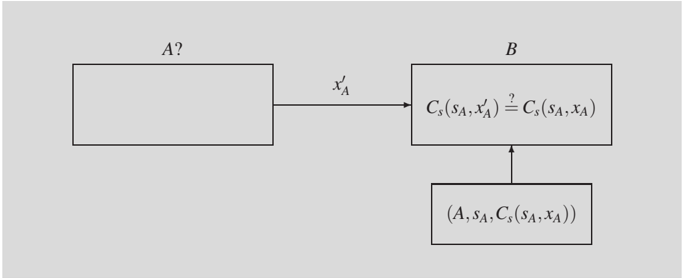

This technique does not complicate the verification of a particular user's password or a dictionary attack against this specific password. But if the dictionary attack is simultaneously performed on a large set of passwords (for example, on the entire list of all users, as password cracking programs usually do), the calculation time is multiplied by the total number of passwords, assuming they are all encrypted with different bits of salt.

## Password expiration

A password expiration time that is too short could also be counterproductive, because if users have to come up with many passwords within a short time, they may end up forgetting the last one they used, or writing it down on a piece of paper, making the password much more vulnerable.

This is so because, without bits of salt, you can take each word in the dictionary, encrypt it, and compare the result with all encrypted passwords. But if there are bits of salt, a separate encryption must be done for each password, each with its corresponding bits of salt.

Salting also prevents a more efficient form of the dictionary attack, in which the attacker does not try words one by one, but instead uses a pre-constructed list of already encrypted words from the dictionary. If, for example, the dictionary contains 150,000 words, when salting is not used the attacker only needs to look up the encrypted password in a list of 150,000 encrypted words. But if 12 bits of salt are used, the list size would be multiplied by more than 4,000 (2 12 = 4,096), and the attacker would have to work with a list of more than six hundred million encrypted words.

Another advantage of salting is that if, by chance, two users choose the same password, the encrypted values of their passwords will be different (if the bits of salt are different, too), and even if the users saw the list of passwords, they would not know that they share the same one.

## Bits of salt in Unix passwords

In Unix, exactly 12 random bits of salt are used (obtained from the least significant bits of the time the user changed their password). This means that there are 4,096 possible values for these bits. A complete list of encrypted passwords from a 150,000-word dictionary would thus have to contain more than six hundred million entries. Back then, at the time when the Unix system was developed, this must have felt like a colossal amount, but today such a list fits perfectly on the hard drive of any personal computer.

Moreover, the encryption algorithm that Unix uses for password encryption is DES. As we have seen before, to encrypt a password, an encryption is applied to a text consisting of all 0-bits, and the password is used as the encryption key (this explains why standard versions of Unix only use passwords up to 8 characters). In this case, salting is not used to modify the key, but to permute certain bits of the intermediate results that are obtained in each iteration of the DES algorithm.

By doing that, another goal is accomplished: an attacker cannot directly use an efficient implementation of the DES algorithm (the most efficient are DES chips, that is, hardware implementations) and must make modifications instead (if it is a DES chip, certain resources are necessary that are not always available to everyone).

## 5) Use of passphrases

The property exploited by dictionary attacks is that the set of passwords that users typically use is a very small subset of the entire space of possible passwords.

To expand this space, you can make the user not use relatively short words, about 8 characters long, but longer phrases called passphrases. The encryption of these passphrases can still be a one-way function, such as a hash function (with the same length as passwords). The difference is that if the encrypted password list previously contained values out of a total of about 150,000 different ones, by using passphrases it will contain many more possible values, and the exhaustive search of the dictionary attack will take much longer.

## One-time passwords

Apart from dictionary attacks, all the password authentication schemes we've seen so far are vulnerable to replay attacks. To carry out this attack, the attacker must intercept the communication between A and B during an authentication event, for example using a snif- fer, and see what the sent value xA is. Then attacker Z only needs to perform an authentication against B by sending the same value xA to B , so that B thinks it really is the real user A .

This type of attack is prevented by using strong authentication protocols, as we will see next. But there is another technique that, although it can be considered password-based, it shares some properties with strong authentication, including resistance to replay attacks. This technique is called one-time passwords .

As the name suggests, one-time passwords are passwords that are only valid once, and the next time you need to use a different one. So, even if the attacker sees what value is being sent for authentication, they won't be able to use it anymore.

Authentication using one-time passwords can be implemented in several ways. For example, let's consider the following:

- Shared password list: A and B agree on a list of N passwords. This agreement is done securely (i.e. not through a channel that can be intercepted). If it is an ordered list, each time A is to be authenticated to B , they will use the next password in the list. Alternatively, passwords can have an identifier associated with them: at each authentication, B chooses a password from those that have not yet been used, sends A its identifier, and A must respond with the corresponding password.
- Passwords based on a one-way function (usually a hash function): A picks a secret value x 0 and uses a one-way function h to calculate the following values:

<!-- formula-not-decoded -->

and sends the value xN to B ( B must ensure that they have received this value from the real user A ).

Then A initializes a counter y to N . Each time they need to authenticate themself, A will send the value xy -1 and B will apply the one-way function to this value, compare it with their stored one, and check if h ( xy -1 ) = xy . If this equation is satisfied, the password is valid. As for the next time, B replaces the value they had saved, xy , with the one they have just received, xy -1, and A updates the counter y by decrementing it by 1.

Given that the function h is one-way, no one seeing the value xy -1 will know the corresponding value the next time ( xy -2), since A got xy -1 as h ( xy -2 ) , and performing the reverse computation (i.e. getting xy -2 from xy -1) must be computationally infeasible.

The password technique based on a hash function is more efficient than the one based on a shared list because B only has to remember the last received xy value.

## One-time password implementations

There are several password implementations based on a hash function, such as S/KEY or OPIE . With these programs, when user A is securely connected (for example, locally, i.e. in front of the console) to the server system they are to be authenticated to, they can generate a list of N passwords, print it, and have it handy every time they are to authenticate themself from a remote system. To make it easier to enter passwords, the program converts the bits into a sequence of short words. For example:

```
. . . 90: BAND RISE LOWE OVEN ADEN CURB 91: JUTE WONT MEEK GIFT OWL PEG 92: KNOB QUOD PAW SEAM FEUD LANE . . .
```

The translation is made from a list of 2048 words of up to 4 characters, and each one is assigned a combination of 11 bits.

User A does not need to remember the value of counter y , since this value is stored on the server. At each authentication, the server sends the current value of the counter, the user uses it to consult their list, and responds with the corresponding password. As for the next time, the server will update the counter by decrementing it by 1.

## 2.2.2 Challenge-response protocols

The problem with password-based authentication schemes is that every time you want to perform the authentication, you have to send the same value to the verifier (except for onetime passwords, as we have just seen). Any attacker who manages to intercept this fixed value will be able to impersonate the user to whom the password corresponds.

There is another group of mechanisms where the value that is sent for authentication is not fixed and depends instead on another value that is generated by the verifier. This latter value is called a challenge and is to be submitted to user A as the first step for authentication. Then A uses a secret key to calculate a response from this challenge and returns it to verifier B . That's why these authentication mechanisms are called challenge-response protocols .

The algorithm to calculate the response must guarantee that it cannot be obtained without knowing the secret key. This allows the verifier to confirm that the response could only have been sent by A . If a different challenge is used each time, the attacker will not be able to gain an advantage by intercepting the communication.

Depending on the protocol, the verifier can generate the challenges in several ways:

- Sequentially: in this case, the challenge is simply a number that is incremented each time (typically one by one), and therefore it will never be repeated.
- Random: the challenge can be generated using a pseudorandom algorithm, but in this case it has the property that it cannot be predicted by the attackers.
- Chronologically: the challenge is generated from the current date and time (with whatever precision is appropriate for the protocol). This type of challenge is also called timestamp . The recipient, that is, the person who wants to validate the identity, can

use the timestamp to know if it is a new authentication or if someone wants to replay messages from another authentication to carry out a replay attack.

The advantage of chronological challenges is that only one clock is required to generate them, - which will surely be available in any system -, while with sequential and random challenges state information needs to be maintained (the sequence number or the input to calculate the next pseudorandom number) in order to avoid repetitions. The drawback is that a certain synchrony between the clocks is required. If we use a technique such as a time server returning the current time, then we must also verify that the time obtained is authentic, that is, that an attacker is not fooling us and it is returning the time that best suits them.

## Devices for calculating responses

The calculation of the response can be done using software designed for this purpose. Alternatively, a device similar to a small calculator that stores the secret key can also be used. The user enters the challenge using the keyboard of this calculator, and the response appears on the screen.

If the challenge is chronological, the device does not have a keyboard and the responses are instead displayed on the screen based on the current time (for example, every minute), in approximate synchrony with the verifier's clock.

For extra security, the device can also be PIN-protected.

Challenge-response protocols can be classified into two groups:

- Procotols based on symmetric-key techniques, in which the secret key is shared by user A and verifier B .
- Procotols based on public-key techniques, in which A uses a private key to calculate the response.

In the description of the protocols that follows, we use the notation { a , b , . . . } to represent a message that contains the components a , b , . . . , and if any of these components is optional, werepresent it in brackets, as for example { a , [ b ] } .

## Challenge-response by symmetric-key techniques

If the challenge-response protocol is based on a key kAB shared by A and B , there are several ways to get this key. For example, through direct agreement between A and B in a secure way, or by requesting it from a centralized key server.

## 1) Authentication using a timestamp

The simplest protocol is the one that uses the current time as an implicit challenge (the challenge does not need to be sent). User A obtains a timestamp tA and sends it to verifier B encrypted with the shared key.

## Clock synchronization

If the challenge is generated using a clock, depending on the protocol, it may be necessary for the sender and receiver to have their clocks synchronized, or for a certain tolerance between the time sent by the sender and the time indicated by the receiver's clock. The tolerance has to be such that it allows differences between the clocks, but does not give a third party time to perform a replay attack.

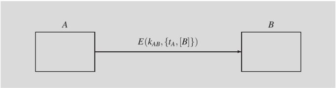

The verifier decrypts the received message and checks if the timestamp is acceptable, that is, if it is within the synchronization tolerance and is not repeated.

If the same key is used in both directions (from A to B , and from B to A ), the inclusion of the identity of verifier B prevents, in a mutual authentication process, an attacker from trying to impersonate B before A by repeating the message in the opposite direction.

## 2) Authentication using random numbers

In this case, it is necessary to explicitly send the challenge, which consists of a random number rB generated by B . The response is the encrypted challenge with the shared key.

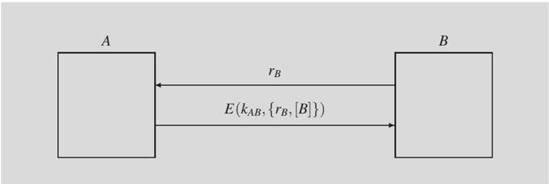

The verifier decrypts the message and checks that the random number it contains is equal to the challenge. The inclusion of verifier B 's identity prevents the message from being used in the opposite direction if A ever generates the same number rB as a challenge.

## 3) Mutual authentication using random numbers

The above protocol can be converted to a mutual authentication protocol using three messages, i.e. A before B and B before A . In this case, A must generate another random number rA , which will act as a challenge in the opposite direction and include it in their response.

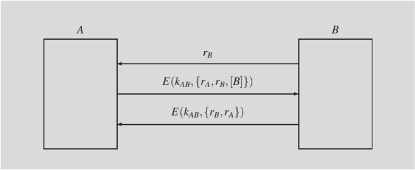

## Repetition detection

To know if a timestamp is being reused, the verifier needs to remember which timestamps have already been used, but only those within the tolerance interval. After this interval, the timestamp can be deleted from the list.

When B decrypts the response, in addition to checking that the value rB is as expected, they also get rA , which they must use to send their response to A . So A checks that the two random numbers rA and rB have the correct values.

As happened before, including B 's identifier in the second message prevents replay attacks in reverse.

## 4) Authentication using one-way functions

The above protocols make use of a symmetric encryption algorithm, but it is also possible to use a one-way function with a secret key, such as MAC algorithms. For verification, instead of decrypting, it is necessary to verify that the MAC is correct and, therefore, the values necessary to calculate it must be sent in the clear.

Below are variants of the above protocols when a MAC algorithm is used instead of an encryption algorithm.

- Authentication using a timestamp:
- Authentication using random numbers:
- Mutual authentication using random numbers:

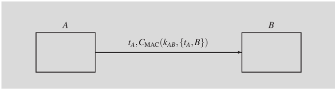

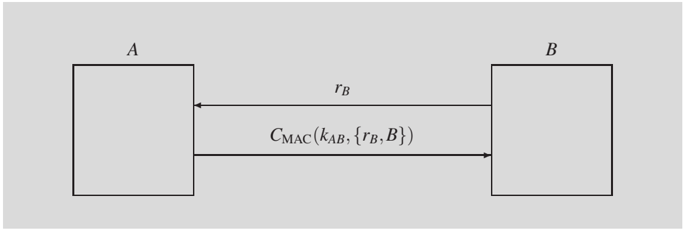

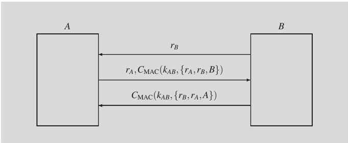

In this case, the identifier of recipient A should be included in the calculation of the last message to prevent replay attacks in the opposite direction, since attackers can now see the value rA .

## Challenge-response by public-key techniques

In challenge-response protocols, public-key techniques can be used in two different ways:

- The challenge is sent encrypted with a public key, and the response is the challenge decrypted with the corresponding private key.
- The challenge is sent in plaintext and the response is the signature of the challenge.

Since user A has to use their private key on a message that is sent to their, they have to take certain precautions to prevent the other party from making illegitimate use of the response (we will discuss this for each of the two types of public-key challenge-response protocols).

## 1) Challenge decryption

If A receives a challenge encrypted with their public key, before sending the response they must ensure that whoever sent the challenge knows its value. Otherwise, an attacker could send A an encrypted challenge, pretending that they generated it randomly, when in fact it was extracted from another confidential message that someone had sent to A encrypted with their public key. If A responds to this challenge, they are giving the attacker the decrypted confidential message.

One option is that A is sent, together with the encrypted r challenge, a message digest or hash of this challenge.

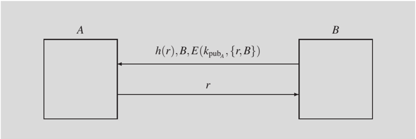

When A receives the message, they use their private key to get r and B , and checks that these values are correct. If the hash of challenge r matches the received value h ( r ) , this means that B knows this challenge. Therefore, B can be sent the decrypted value as a response. If not, nothing is sent to B , because they may be someone trying to illegitimately obtain this decrypted value.

Another option is that A can choose a part of the challenge. This is the principle behind the Needham-Schroeder modified public-key protocol, which also provides mutual authentication.

## Keys for different applications

To prevent a public key from being abused, it is highly recommended to use different public keys for different applications, e.g. a key to receive confidential messages and another key for authentication.

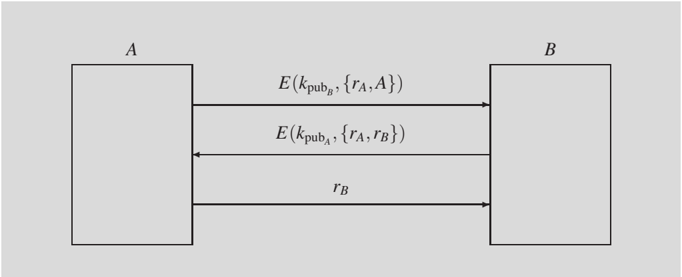

For A , the challenge is made up of rA and rB : the fact that the first part was generated by A prevents the challenge from being maliciously chosen by B . For B , the challenge includes A 's identifier, so it cannot be an encrypted message that a third party had sent to B and that A wants to decrypt illegitimately.

## 2) Challenge signature

Recommendation X.509 not only specifies the certificate formats and revocation lists that we have seen in subsection 1.3, but also defines strong authentication protocols based on digital signatures that use timestamps and random numbers. Protocols equivalent to the ones we have seen before based on symmetric keys are shown below.

As in the case of decryption with a private key, A must be careful with what they sign: they should never directly sign a challenge that has been sent to them. The signature must always involve at least a part of text that A themselves has chosen.

In the description of these protocols, SA ( M ) means 'digital signature of the message M using the private key of A '.

- Authentication using a timestamp:
- Authentication using random numbers:

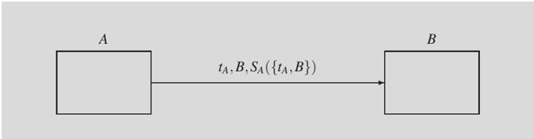

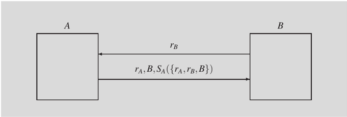

Here the inclusion of the value rA prevents B from maliciously choosing rB to make A sign a message without them realizing it.

- Mutual authentication using random numbers:

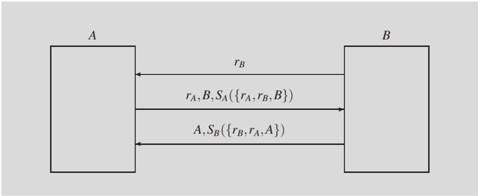

## Summary

In this module, we have seen that cryptographic techniques allow us to encrypt a text using an encryption key , and only someone who knows the corresponding decryption key will be able to obtain the original text.

Depending on the relationship between the two keys, cryptographic algorithms are classified into symmetric algorithms if the encryption and decryption keys are the same, or public-key algorithms if the keys are different. Symmetric algorithms, in turn, can be classified into stream cipher algorithms , if the encryption consists of adding to the text pseudorandom data calculated from the key, or block encryption algorithms , if the encryption is performed on blocks of fixed size of the original text.

The particularity of public-key cryptography is that it is practically impossible to deduce the private key from the public key . This allows anyone who knows a user's public key to use it to encrypt sensitive data, in the knowledge that only someone with the corresponding private key can decrypt it, and without the need to agree on any secret key through a secure channel. Digital signatures are based on the use of keys in reverse (private to encrypt, and public to decrypt).

Since public-key cryptography is computationally more costly than symmetric, it is never used directly for confidentiality, but always through a symmetric session key . Similarly, the signature of a text is not calculated directly from the text, but by using a secure hash function to it. The property of this type of function is that it is very difficult to find a message that yields the same hash as another message.

To ensure that public keys are authentic and belong to whoever they are supposed to belong, digital certificates or public-key certificates can be used, such as X.509 certificates. When a certification authority (CA) signs a certificate, it is attesting to the authenticity of the link between the corresponding public key and the user's identity. Certificates are a basic component of Public-Key Infrastructure (PKI), as are Certificate Revocation Lists (CRLs).

Digital signatures provide a service of message authentication . MACcodes also provide this service but using shared secret keys instead of public keys.

Another authentication service is entity authentication . This mechanism makes it possible to verify that the other party in the communication is who they say they are, and not an impostor. This can be done by using weak authentication techniques based on passwords or, if necessary, strong authentication techniques based on challenge-response protocols , which, unlike the previous ones, are resistant to many more attacks.

## Glossary

Attack action carried out by a third party, other than the sender and recipient of the protected information, to try to counter this protection.

Authentication protection of information against forgery.

Birthday attack attack to find collisions in hash functions. It consists of finding two messages that have the same message digest, instead of finding a message that has the same message digest as another specific one (which is something that requires many more operations).

Block cipher cryptographic transformation in which the plaintext is divided into blocks and an encryption algorithm is applied to each of these blocks.

Brute-force attack attack on cryptographic functions. It tries all the possible values of the key until the correct one is found.

Certificate chain list of certificates, each of which allows verification of authenticity of the public key of the CA that has issued the previous one, until reaching the certificate of a root CA.

Certificate Revocation List (CRL) list of certificates that have ceased to be valid before their expiration date, issued and signed by the same CA that issued these certificates.

Certification Authority (CA) entity that issues public-key certificates that are used to ensure that users who trust this authority are convinced of the authenticity of public keys.

Challenge-response entity authentication method based on a secret value that the entity to be authenticated must use to calculate a valid response to a challenge sent by the verifier.

Ciphertext result of applying a cipher to a plaintext.

Computational security security provided by a cryptographic technique whose cryptanalysis would require an amount of computational resources far greater than is available to anyone.

Confidentiality assurance that information is read-protected and not made available or disclosed to unauthorized third parties.

Cryptanalysis study of mathematical techniques to defeat the protection provided by cryptography.

Cryptography study of mathematical techniques for protecting information so that it cannot be interpreted nor modified by unauthorized parties.

Cryptology discipline that encompasses cryptography and cryptanalysis.

Data origin authentication another way of referring to message authentication.

Decryption inverse transformation to encryption to get the plaintext from the ciphertext and the decryption key.

Dictionary attack attack on password-based entity authentication methods. It tries words in a dictionary until the correct one is found.

Digest sometimes used to refer to a message digest or hash.

Digital certificate public-key certificate.

Digital signature value calculated from a text using a private key and that can be verified using the corresponding public key, which makes it possible to confirm that only the holder of the private key could have generated it.

Encryption transformation of a plaintext using an algorithm that has a key as a parameter into an encrypted text that is unintelligible for those who do not know the decryption key.

Entity authentication security service that allows confirming that a participant in a communication is genuine and not an impostor trying to impersonate them.

Hash a bit string, of fixed length, which is obtained from a sequence of bits of arbitrary length, as a 'message digest' of this sequence.

Key parameter of an encryption or decryption algorithm that allows us to define different cryptographic transformations without changing the algorithm.

Message authentication security service that allows confirming that the originator of a message is authentic and that the message has not been created or modified by a malicious party.

Message Authentication Code (MAC) value calculated from a text with a secret key that can be used by someone who knows the key to verify the authenticity of the message.

Message digest see Hash .

Non-repudiation protection against an originator who falsely denies having performed a certain action.

Passphrase secret string of characters, generally longer than a password, used by an entity to authenticate themselves.

Password word or secret string of characters, of relatively short length, used by an entity to authenticate themselves.

Plaintext intelligible information that can be read without the application of decryption.

Private key key that allows performing the inverse cryptographic transformation to that obtained with a public key. It is computationally unfeasible to obtain this key from the latter.

Public key key that allows performing the inverse cryptographic transformation to that obtained with a private key and that can be easily obtained from the latter.

Public-key certificate also known as a digital certificate, it is a data structure that contains a username and its public key and that is digitally signed by a certification authority attesting to this user-public key association.

Public-Key Infrastructure (PKI) set of data structures, procedures and agents that allow the use of publickey cryptography.

Root Certification Authority (CA) CA that does not have a higher CA that certifies the authenticity of its public key and therefore has a self-signed certificate.

Salt set of random bits that are generated ad hoc to modify an encryption key and that allow the same text to result in different ciphertexts despite being encrypted with the same key.

Session key symmetric key generated ad hoc to protect a certain exchange of information and that is known by both parties using public-key cryptography, so that it cannot be detected by an attacker.

Stream cipher cryptographic transformation in which the plaintext is combined with a pseudorandom sequence obtained from the key code.

Symmetric key key that allows performing both a cryptographic transformation and its inverse transformation, that is, encryption and decryption.

Unconditional security security provided by a cryptographic technique that does not allow any information about the plaintext to be obtained, regardless of the number of resources available for cryptanalysis.

## Bibliography

- [1] Menezes, A.J.; van Oorschot, P.C.; Vanstone, S.A. (1996). Handbook of Applied Cryptography. Boca Raton: CRC Press.
- [2] Stallings, W. (2020). Cryptography and Network Security, Principles and Practice, 8th ed. London: Pearson.