## Security in the communications layers

PID\_00293493

Xavier Perramon Tornil

Recommended minimum reading time: 7 hours Xavier Perramon holds a PhD in Telecommunications Engineering from the Universitat Politècnica de Catalunya (UPC). He has worked as a security consultant in ICT systems. He is currently a professor of Information Systems at the UPC's Escola Superior d'Enginyeries Industrial, Aeroespacial i Audiovisual (ESEIAAT) in Terrassa.

Xavier Perramon Tornil

The review of this UOC Learning Resource has been coordinated by the lecturer: Victor Garcia Font

## How￿to￿cite￿this￿learning￿resource￿as￿per￿the￿Harvard￿style:

Perramon, X. (2023) Security in the communications layers [Textual learning resource]. 1st ed. Barcelona: Fundació Universitat Oberta de Catalunya (FUOC).

First edition: February 2023 Av. Tibidabo, 39-43, 08035 Barcelona Authorship: Xavier Perramon Tornil Production: FUOC

© of this edition, Fundació Universitat Oberta de Catalunya (FUOC)

Permission is granted to copy, distribute and/or modify this document under the terms of the GNU Free Documentation License, Version 1.3 or any later version published by the Free Software Foundation; with no Invariant Sections, no Front-Cover Texts, and no Back-Cover Texts. The terms of the license can be consulted in http://www.gnu.org/licenses/fdl-1.3.html.

## Contents

| Introduction . . . . . . . . . . . . . . . . . . . . . . . . . . . . . . . . . . . . . . . . . . . . . . . . . . . . . . . . . .   | Introduction . . . . . . . . . . . . . . . . . . . . . . . . . . . . . . . . . . . . . . . . . . . . . . . . . . . . . . . . . .   | Introduction . . . . . . . . . . . . . . . . . . . . . . . . . . . . . . . . . . . . . . . . . . . . . . . . . . . . . . . . . .   | Introduction . . . . . . . . . . . . . . . . . . . . . . . . . . . . . . . . . . . . . . . . . . . . . . . . . . . . . . . . . .   |   5 |
|------------------------------------------------------------------------------------------------------------------------------------|------------------------------------------------------------------------------------------------------------------------------------|------------------------------------------------------------------------------------------------------------------------------------|------------------------------------------------------------------------------------------------------------------------------------|-----|
| Objectives . . . . . . . . . . . . . . . . . . . . . . . . . . . . . . . . . . . . . . . . . . . . . . . . . . . . . . . . . . .   | Objectives . . . . . . . . . . . . . . . . . . . . . . . . . . . . . . . . . . . . . . . . . . . . . . . . . . . . . . . . . . .   | Objectives . . . . . . . . . . . . . . . . . . . . . . . . . . . . . . . . . . . . . . . . . . . . . . . . . . . . . . . . . . .   | Objectives . . . . . . . . . . . . . . . . . . . . . . . . . . . . . . . . . . . . . . . . . . . . . . . . . . . . . . . . . . .   |   6 |
| 1.                                                                                                                                 | Data link layer security: wireless networks . . . . . . . . . . .                                                                  | Data link layer security: wireless networks . . . . . . . . . . .                                                                  | . . . . .                                                                                                                          |   7 |
|                                                                                                                                    | 1.1 Basic concepts of Wi-Fi networks . . . . . . . . . . .                                                                         | 1.1 Basic concepts of Wi-Fi networks . . . . . . . . . . .                                                                         | . . . . . . . . . .                                                                                                                |   8 |
|                                                                                                                                    | 1.2 Authentication methods of Wi-Fi stations . . . . . .                                                                           | 1.2 Authentication methods of Wi-Fi stations . . . . . .                                                                           | . . . . . . . .                                                                                                                    |  10 |
|                                                                                                                                    | 1.3 Frame protection using the old WEP system . . . . .                                                                            | 1.3 Frame protection using the old WEP system . . . . .                                                                            | . . . . . .                                                                                                                        |  11 |
|                                                                                                                                    |                                                                                                                                    | 1.3.1 .                                                                                                                            | WEP encryption. . . . . . . . . . . . . . . . . . . . . . . . . . . . .                                                            |  12 |
|                                                                                                                                    |                                                                                                                                    | 1.3.2                                                                                                                              | The RC4 algorithm . . . . . . . . . . . . . . . . . . . . . . . . . . .                                                            |  14 |
|                                                                                                                                    | 1.4 WEP protocol vulnerabilities .                                                                                                 | 1.4 WEP protocol vulnerabilities .                                                                                                 | . . . . . . . . . . . . . . . . . . . . . . . . .                                                                                  |  15 |
|                                                                                                                                    |                                                                                                                                    | 1.4.1                                                                                                                              | Vulnerabilities unrelated to the RC4 algorithm .                                                                                   |  15 |
|                                                                                                                                    |                                                                                                                                    | 1.4.2 Vulnerabilities                                                                                                              | related to the RC4 algorithm . . .                                                                                                 |  19 |
|                                                                                                                                    |                                                                                                                                    | 1.4.3                                                                                                                              | Tools to exploit WEP vulnerabilities. . . . . . . . . . .                                                                          |  26 |
|                                                                                                                                    | 1.5                                                                                                                                | Solutions to WEP                                                                                                                   | vulnerabilities . . . . . . . . . . . . . . . . . . . . . .                                                                        |  30 |
|                                                                                                                                    | 1.5.1                                                                                                                              | . . . . . . . . . . . . .                                                                                                          | WPA . . . . . . . . . . . . . . . . . . . . . . . . . . .                                                                          |  31 |
|                                                                                                                                    |                                                                                                                                    | 1.5.2 . . . . . . . . . .                                                                                                          | WPA2 . . . . . . . . . . . . . . . . . . . . . . . . . . . . .                                                                     |  40 |
|                                                                                                                                    |                                                                                                                                    | 1.5.3 . . . . . . . . . . . .                                                                                                      | WPA3 . . . . . . . . . . . . . . . . . . . . . . . . . . .                                                                         |  42 |
| 2.                                                                                                                                 | Network Layer Protection: IPsec . . . . . . . . . . . . . . . . .                                                                  | Network Layer Protection: IPsec . . . . . . . . . . . . . . . . .                                                                  | Network Layer Protection: IPsec . . . . . . . . . . . . . . . . .                                                                  |     |
|                                                                                                                                    |                                                                                                                                    |                                                                                                                                    | . . . . . . . . .                                                                                                                  |  44 |
|                                                                                                                                    | 2.1                                                                                                                                | IPsec architecture. . . . . . . . . . . . . . . . . . . . . . .                                                                    | . . . . . . . . . . . . . .                                                                                                        |  44 |
|                                                                                                                                    | 2.2                                                                                                                                | The AH Protocol . . . . . . . . . . . . . . . . . . .                                                                              | . . . . . . . . . . . . . . . . . .                                                                                                |  46 |
|                                                                                                                                    | 2.3                                                                                                                                | The ESP Protocol . . . . . . . . . . . . . . . . . . . . . . . . . . . . . . . . .                                                 | . . .                                                                                                                              |  47 |
|                                                                                                                                    | 2.4                                                                                                                                | IPsec protocol modes . . . . . . . . . . . . . . . . . . .                                                                         | . . . . . . . . . . . . . .                                                                                                        |  48 |
| 3.                                                                                                                                 | Transport Layer Protection: TLS . . . . . . . . . . . . . . . .                                                                    | Transport Layer Protection: TLS . . . . . . . . . . . . . . . .                                                                    | Transport Layer Protection: TLS . . . . . . . . . . . . . . . .                                                                    |  51 |
|                                                                                                                                    | 3.1 Characteristics of the SSL/TLS protocol . . .                                                                                  | 3.1 Characteristics of the SSL/TLS protocol . . .                                                                                  | . . . . . . . . . . . .                                                                                                            |  52 |
|                                                                                                                                    | 3.2 SSL/TLS secure transport . . . . . . . . . . . . . . . . . . . . . . . . . . . . . .                                           | 3.2 SSL/TLS secure transport . . . . . . . . . . . . . . . . . . . . . . . . . . . . . .                                           | 3.2 SSL/TLS secure transport . . . . . . . . . . . . . . . . . . . . . . . . . . . . . .                                           |  54 |
|                                                                                                                                    | 3.2.1                                                                                                                              | The SSL/TLS record protocol . . . . . . . . . . .                                                                                  | . . . . .                                                                                                                          |  55 |
|                                                                                                                                    |                                                                                                                                    |                                                                                                                                    | The SSL/TLS handshake protocol . . . . . . . . . . . . .                                                                           |     |
|                                                                                                                                    |                                                                                                                                    | 3.2.2                                                                                                                              | Changes introduced in TLS 1.3                                                                                                      |  56 |
|                                                                                                                                    | 3.2.3 3.3                                                                                                                          |                                                                                                                                    | . . . . . . . . . . . . . . .                                                                                                      |  61 |
|                                                                                                                                    | Security and vulnerabilities of the SSL/TLS protocol . . . . .                                                                     | Security and vulnerabilities of the SSL/TLS protocol . . . . .                                                                     | Security and vulnerabilities of the SSL/TLS protocol . . . . .                                                                     |  62 |
|                                                                                                                                    |                                                                                                                                    | 3.3.1 Security                                                                                                                     | provided by SSL/TLS . . . . . . . . . . . . . . . .                                                                                |  62 |
|                                                                                                                                    |                                                                                                                                    | 3.3.2 Attacks                                                                                                                      | against the SSL/TLS protocol . . . . . . . . .                                                                                     |  63 |
|                                                                                                                                    | 3.4 Application protocols using SSL/TLS . . .                                                                                      | 3.4 Application protocols using SSL/TLS . . .                                                                                      | . . . . . . . . . . . . . .                                                                                                        |  66 |
| 4.                                                                                                                                 | Virtual Private Networks (VPNs) . . . . . . . . .                                                                                  | Virtual Private Networks (VPNs) . . . . . . . . .                                                                                  | . . . . . . . . . . . . . . . . .                                                                                                  |  68 |
|                                                                                                                                    | 4.1 Definition and types of VPN . . . . . . . . . . . . . . . . . . . . . . . . . .                                                | 4.1 Definition and types of VPN . . . . . . . . . . . . . . . . . . . . . . . . . .                                                | 4.1 Definition and types of VPN . . . . . . . . . . . . . . . . . . . . . . . . . .                                                |  68 |
|                                                                                                                                    | 4.2 Settings                                                                                                                       | and protocols used                                                                                                                 | in VPN...... . . . . . . . . . . . . . .                                                                                           |  69 |

5.1 Captive portals used as an authentication system . . . . . . . . . . . . . . . . . . . . . . . 72 5.2 Implementation techniques . . . . . . . . . . . . . . . . . . . . . . . . . . . . . . . . . . . . . . . . . . . . 73 5.3 Using captive portals . . . . . . . . . . . . . . . . . . . . . . . . . . . . . . . . . . . . . . . . . . . . . . . . . 74 5.3.1 Wired networks . . . . . . . . . . . . . . . . . . . . . . . . . . . . . . . . . . . . . . . . . . . . . . 74

- 5.3.2 Wireless networks: Wi-Fi hotspots . . . . . . . . . . . . . . . . . . . . . . . . . . . . 75

## Summary . . . . . . . . . . . . . . . . . . . . . . . . . . . . . . . . . . . . . . . . . . . . . . . . . . . . . . . . . . . . . . . . . . . . . . 77

## Glossary . . . . . . . . . . . . . . . . . . . . . . . . . . . . . . . . . . . . . . . . . . . . . . . . . . . . . . . . . . . . . . . . . . . . . . . 78

## Bibliography . . . . . . . . . . . . . . . . . . . . . . . . . . . . . . . . . . . . . . . . . . . . . . . . . . . . . . . . . . . . . . . . . . 81

## Introduction

In this module, we study examples of communication protocols that, by applying cryptography and authentication mechanisms, allow us to protect the information that is transmitted between computers. This protection can be achieved at different layers of the communications architecture. In wireless networks, one of the most vulnerable areas is the link layer. We discuss the proposed solutions for Wi-Fi specifications. At the network layer , the primary mechanism in an IP-based interconnection environment is the set of protocols known as IPsec .

Alternatively, protection can be implemented at the transport layer , thereby leveraging existing IP infrastructure, primarily routers. As an example of transport layer security, we discuss the set of SSL/TLS protocols.

Next, we introduce virtual private networks or VPN technology, which allows a widely distributed public network such as the Internet to be used for secure communications as if it were a dedicated private network.

Finally, we look at captive portals as an example of applications that make use of at least one of the aforesaid protocols to secure communications. Captive portals are web applications that control the access of a community of users to web links and are commonly used to control access to the Internet through wireless networks located in public or hightraffic areas.

## Objectives

The materials for this teaching module will allow the student to achieve the following objectives:

1. To understand the possibilities of protecting communication protocols at different layers, specifically the data link, network and transport layers.
2. To know the protection mechanisms of Wi-Fi networks.
3. To know the protocols that make up the IPsec architecture and the security each one provides.
4. To understand how the main mechanism of SSL/TLS secure transport protocols works and how these protocols can be used for other higher-layer protocols, such as HTTP or SMTP.
5. To introduce virtual private network technology and explain how it can be used to securely connect intranets through a public access network such as the Internet.
6. To understand how captive portals work.

## 1. Data link layer security: wireless networks

When applying protection mechanisms to provide confidentiality and authentication in computer networks, several choices are available in the field of communications for the introduction of security features.

Relationship between the OSI and the Internet layer models

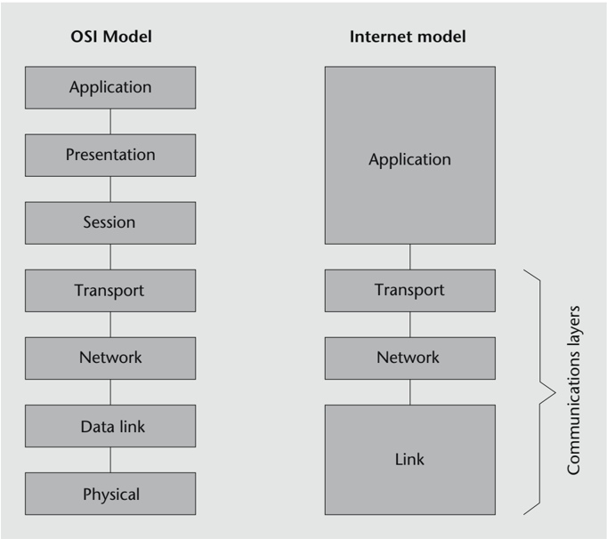

- Physical layer security protection involves making sure that attackers cannot interfere with the transmission medium or equipment (cables, repeaters, etc.). This would include, for example, preventing the cables from being physically tampered with to capture or inject traffic or locking the switching equipment in a room with restricted physical access. We do not consider this type of protection in this module.
- Data link layer security protection is intended to prevent frames sent at low layers of communication from being intercepted or modified. Within this category, the mechanisms to protect the traffic of wireless networks are particularly relevant since the transmission medium used, in this case the air, cannot be 'protected' physically.
- Network layer security protection ensures that data sent over higher-layer protocols, such as TCP or UDP, will be securely transmitted. The downside is that the network

infrastructure may have to be adapted, namely the routers, so that they understand the extensions that need to be added to the network protocol (IP) to provide this security.

- Transport layer security protection has the advantage that you only need to adapt the implementations of the protocols (TCP, UDP, etc.) located in the end nodes of the communication, which are typically incorporated in the operating system or in specialized libraries. In this case, therefore, only a change in the software is necessary.
- Application layer security protection can better respond to the needs of certain protocols. A clear example is that of electronic mail, where it is desirable to protect the application data (i.e. email messages) rather than packets in the transport or network layers. This is so because a message is vulnerable to direct access or spoofing attacks not only when transmitted over the network but also when it is stored in the recipient's mailbox.

In this section, we focus on the protection of frames sent in wireless communication networks. The problem to be solved is specific to this type of network since unlike wired networks, access in the transmission medium is free, meaning that you don't need to do anything special to physically connect to it. For example, any user with a Wi-Fi device in monitor mode can see the frames that are transmitted in their environment, with distance to the broadcasting station being the only constraint.

## 1.1 Basic concepts of Wi-Fi networks

The standard for communications in wireless local networks (WLAN) most commonly used today is IEEE 802.11, also known as Wi-Fi. The first version of the specification, which dates back to 1997, allowed communications of up to 2 Mbit/s. Since then, extensions have been added that support ever higher maximum transmission speeds: 11 Mbit/s (802.11b), 54 Mbit/s (802.11a and 802.11g), 600 Mbit/s (802.11n or Wi -Fi 4), 6.9 Gbit/s (802.11ac or Wi/Fi 5) and 9.6 Gbit/s (802.11ax or Wi-Fi 6).

.

One of the initial design criteria for this standard was to facilitate interoperability, which has not always been fully compatible with security. Early versions based communications protection on the WEP protocol, which soon proved to be too weak. In 2004, the IEEE 802.11i standard was published to address the shortcomings of the WEP security system.

IEEE 802.11 allows communication between devices, called stations , that have a wireless network interface. Each interface has a 48-bit MAC address in the same format as Ethernet addresses. A set of two or more stations that can communicate with each other is called a Basic Service Set (BSS). There are two types of BSS: independent and infrastructural. An independent BSS , also known as an ad hoc network, is an isolated network which only allows direct communications from one station to another. In contrast, an infrastructure BSS has a specific station called Access Point (AP) that allows wired or wireless connec-

## WLAN

WLAN stands for Wireless Local Area Network.

tion with other networks. An Extended Service Set (ESS) is a set of one infrastructural BSS or more than one interconnected through their APs. From the point of view of the stations, ESS works as if it were a single BSS.

Wi-Fi network components

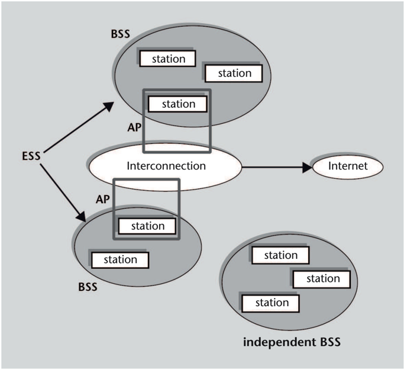

BSSs are identified with a BSSID, which in infrastructural systems is the MAC address of their AP. ESSs have a free-form identifier of up to 32 bytes. The term Service Set Identifier (SSID) is used to refer to the identifier of an independent BSS or an ESS.

Stations can dynamically join and leave a BSS. In an infrastructural BSS, the AP announces its presence by periodically sending beacon frames , typically every 100 ms. The different beacon fields indicate the SSID of the network, transmission speeds, etc.

A station becomes a member of an infrastructural BSS when it establishes an association with the corresponding AP. At all times, a station can only be associated with one AP. Once the association is established, the station normally sends and receives all its frames through this AP. To be able to do the association and join the BSS, the station must first perform authentication through the AP.

The frames that can be transmitted and received by Wi-Fi stations belong to one of these three types: management frames, data frames and control frames. Examples of control frames include Acknowledgment (ACK), Request To Send (RTS) and Clear To Send (CTS). Management frames include beacon frames, authentication and deauthentication frames, association and disassociation frames and others.

## Wi-Fi settings

The typical configuration of home Wi-Fi networks consists of a router that accesses the Internet via ADSL and acts as an AP , allowing connection from the stations that are within its radius of action. This configuration has an ESS formed by a single BSS. In contrast, a business Wi-Fi network typically has several APs in different parts of a building: in this case, all BSSs usually belong to the same ESS.

Data frame format

| MAC headers   | data   | CRC   |
|---------------|--------|-------|

The data frames transmitted in an infrastructural BSS have the following components:

- The MAC header, which is 24 bytes long.
- The data sent in the frame (frame body), with a length of up to 2,304 bytes, or 2,312 bytes if the data frame includes WEP encapsulation.
- An error checking code, which is a 32-bit CRC code calculated over the frame header and body.

## 1.2 Authentication methods of Wi-Fi stations

With the idea to keep things simple and a willingness to facilitate interoperability as much as possible, the first versions of the Wi-Fi standard prior to IEEE 802.11i supported two methods for the authentication of Wi-Fi stations to the AP.

- Open system authentication. This authentication is very simple, if the AP is configured to allow it: each station that requests authentication automatically receives confirmation. That's why it's also known as a null authentication algorithm.

The advantage of this authentication system is that stations do not need to do much to be able to complete it, with the idea of facilitating the connection of stations that are incorporated into the network.

- Shared key authentication. This authentication method is used together with the WEP encryption system. In this case, the AP uses a preconfigured WEP key that is only known by the stations that have to authenticate. When a station requests authentication, the AP sends the station a message with 128 random bytes and the station has to respond with a frame containing the same message encrypted with the WEP key.

This is, therefore, a challenge-response protocol with a symmetric key. The disadvantage of this protocol is that it is based on WEP encryption and, as will be discussed later, an attacker can easily crack a WEP key if they manage to capture a sufficient number of encrypted frames.

An additional problem of this authentication protocol is that the encrypted response does not include any identifier of the station that wants to be authenticated. As will be discussed later, this allows an attacker who captures a single message exchange to use the captured data to successfully authenticate to the AP.

The use of shared key authentication has not been recommended since the publication of the IEEE 802.11i standard in 2004. It is only considered in situations where compatibility with very old systems is desired. For more secure authentication, IEEE 802.11i introduces the concept of Robust Security Network Association (RSNA), based on the Extensible Authentication Protocol (EAP) and the IEEE 802.1X standard.

## 1.3 Frame protection using the old WEP system

.

The first version of the IEEE 802.11 standard defined a security mechanism to protect frames sent via radio: the Wired Equivalent Privacy (WEP) protocol. The main goal of this protocol is to achieve a type of data privacy that is similar to that of wired networks. In a wired network, potential intruders must have the means to intercept the cable if they want to access the communication. In a wireless network with WEP, they can't see the data being transmitted either. The method to achieve this privacy is to encrypt the data. In addition to the privacy service, WEP also provides an integrity service through a data integrity code.

The AP can have up to four WEP secret keys configured. This allows, for example, to use different keys with groups of different stations, or periodically change the key, but most times only one WEP key is used.

Each WEP frame is encrypted with an independent encryption key. Among other things, this makes it difficult for an attacker to detect repeated data. The encryption key used in a specific frame is obtained from the WEP key being used plus a different initialization vector for each frame. The value of this initialization vector must be included in the frame itself so that the receiver knows how to decipher it.

The WEP data frame structure

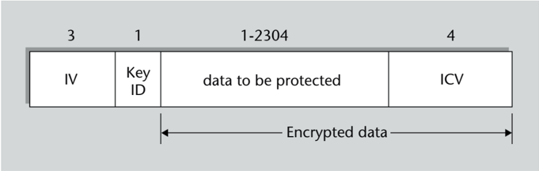

A WEP encrypted frame has the same format as a normal data frame, but the part corresponding to the data is structured in four fields.

- The first field is the initialization vector (IV) used to encrypt the frame.

- The second field is the key identifier, which serves to indicate which of the 4 WEP keys that the AP can have in its configuration has been used for encryption.
- The third field includes the protected data.
- The fourth field is the Integrity Check Value (ICV), which is a 32-bit CRC calculated over the third field (before encryption).

The third and fourth fields, that is, the protected data and the ICV, are transmitted in encrypted form.

Including the ICV allows you to check that the encrypted frame has not been manipulated. If an attacker who does not know the key wants to modify the data of a WEP frame sent, or inject a WEP frame with invented data, when the receiver deciphers it, they will most likely see that the ICV does not match. However, a CRC does not have the security properties that a cryptographic integrity code can have (for example, based on hash functions). On the other hand, the rest of the frame fields are not protected and can therefore be manipulated. Again, the criterion of simplicity prevails over security in the design of the protocol (a CRC is much easier to calculate than a hash).

## 1.3.1 WEPencryption

The cryptographic algorithm used to encrypt the WEP frames is the stream cipher RC4 ('Ron's Code 4'), designed by Ronald Rivest. It was chosen for its simplicity and the level of security it provides considering the low complexity of the required computations.

This criterion was particularly important considering that most Wi-Fi devices can be mobile devices, where low energy consumption plays an important role. If a more sophisticated algorithm had been chosen instead, with more computing power necessary to encrypt and decrypt the same data and more energy being consumed, the battery life of mobile devices back then would have been significantly reduced.

The length of RC4 keys is generally not fixed: there can be RC4 keys of up to 2,048 bits (although such a long encryption key does not make much sense for a symmetrical cipher).

.

The WEP protocol mainly stipulates the use of two RC4 encryption key lengths: 64-bit keys or 128-bit keys.

The encryption keys used in a BSS to encrypt each WEP frame have a variable part and a fixed part:

- The variable part, which consists of the first 24 bits of the key, is called an initialization vector (IV). The IV is different for each frame that is transmitted.
- The fixed part is the rest of the key: 40 bits if the key is 64 in total, or 104 bits if the key is 128 in total. It is also known as a root key .

Extended WEP key lengths

Some Wi-Fi system manufacturers introduced a version of WEP with 152-bit and 256-bit keys.

The WEP root key of 40 bits or 104 bits is, then, the secret key (or secret keys if two, three or four keys are used, although the most common situation is to use only one) configured on the AP and which must also be configured on the Wi-Fi stations that you want to associate.

The steps followed by any one station to generate a WEP encrypted frame, including the AP, are the following:

- 1) Generate a 24-bit string to be used as an IV, making sure that it is different from the last IV generated.
- 2) Concatenate the 24 bits of the IV with the WEP root key to form the RC4 frame encryption key.
- 3) Calculate the CRC of the data to be secured. The ICV is generated with this operation.
- 4) Concatenate the data with the ICV and encrypt this sequence with the RC4 algorithm using the encryption key from point 2. Since it is a stream cipher, this operation involves generating as many bits of encryption text (keystream) as the sequence to be protected and adding them to those of the sequence one by one.
- 5) Fill in the data part of the WEP frame with the fields that make it up: the IV, the identifier of the WEP key and the encryption result obtained in point 4.

The station that receives the WEP encrypted frame has to run the operation in reverse to decrypt it:

- 1) Read the IV field of the WEP frame.
- 2) Concatenate the 24 bits of the IV with the root key indicated by the WEP key identifier field. This is how the RC4 key for decrypting the frame is obtained.
- 3) Decrypt the encrypted part of the frame with the RC4 algorithm using the decryption key from point 2. As before, the decryption consists of the bit-by-bit addition of the encrypted data to the encryption text (keystream) generated from the key.
- 4) Calculate the CRC of the decrypted data and check that it matches the ICV field that has just been decrypted.

The ultimate goal of including an IV is to have a different encryption key for each frame. To this end, each IV would have to be different, or at least not be repeated until after a very large number of frames have been generated. Wi-Fi implementations typically use one of the following two techniques to achieve this:

- Generate each IV with a pseudorandom number generator.
- Generate the first IV as a 24-bit random number and get the next ones by adding 1 at a time to the previous one. This way of generating IVs is called counter mode .

## Initialization vector

The variable part of the key is commonly referred to as initialization vector , although this concept is related to block ciphers rather than stream ciphers. In fact, the concept of bits of salt would be closer to the function of this variable part of the key.

## Value of the root key

The value of the root key can be any combination of bits, but to facilitate the manual configuration of the stations it is common for a 104-bit root key to have the form of a 13 ASCII-character string.

## Note

Remember that the encryption text or keystream in stream ciphers is the sequence of bits, generated from the key and seemingly random, which is added bit by bit with the plaintext.

## Performing XOR bit by bit

Remember that bit-by-bit addition, which coincides with the logical XOR (OR exclusive) operation, is self-complementary and, therefore, both encryption (sum) and decryption (subtraction) are performed in the same way.

## Different IVs

At most, 2 24 different IVs can be generated, that is, about 16 million.

As explained previously, the RC4 algorithm was chosen for WEP encryption because of the simplicity of its implementation. Although it was a reasonably secure algorithm, the way its use was designed in the WEP protocol, especially with the introduction of initialization vectors, makes it particularly vulnerable.

To fully understand the implications of these vulnerabilities, we first need to discuss the main characteristics of the RC4 algorithm.

## 1.3.2 The RC4 algorithm

The simplicity of the RC4 algorithm is given, on the one hand, by the operations on which it is based and, on the other, by the little amount of memory that is required to store the encryption state information.

- The only arithmetic operation necessary to implement the algorithm is modulo 256 addition, or 8-bit addition ignoring the generated carry. This basic operation can be easily implemented in hardware and is very fast to compute. The algorithm also uses the swapping operation to swap elements of a vector, although this is not an arithmetic operation but simply an operation to move data in memory.
- The state information the algorithm operates with is a vector of 256 elements of 8 bits, plus two counters or indexes, also of 8 bits each. In total, 258 bytes of memory are required to store this state information (apart from the space occupied by the key, which is only needed in the initial phase of the algorithm).

The RC4 algorithm consists of two stages: the Key-Scheduling Algorithm (KSA) and the Pseudo-Random Generation Algorithm (PRGA).

- The main goal of the KSA algorithm is to use the value of the secret key K so as to obtain a state vector V that can be utilized by the PRGA algorithm to start generating the ciphertext S . The key K is repeatedly concatenated to a length of 2048 bits, that is, 256 bytes. The algorithm starts with a vector V 0 that is also 256 bytes long, where each byte V 0 [ x ] is equal to x ( x = 0, . . . , 255), and uses two indices i and j , initially equal to 0, to access the elements of the vector. At each iteration the bytes V [ i ] and K [ i ] are added (modulo 256) to the index j , the index i is incremented by 1 and the bytes V [ i ] and V [ j ] are swapped in the vector. This sequence is repeated 256 times, that is, until the index i reaches the end of the vector.

The KSA algorithm generates a vector V of 256 elements, each of which is a different value between 0 and 255, but ordered in a way that is given by the byte values of the K key. That is, the initial state vector is an apparently random permutation of the elements 0..., 255.

- The PRGA algorithm is run once this initial state vector is obtained. PRGA works very similarly to KSA, with the difference that only V [ i ] is added to the j index, instead of V [ i ] + K [ i ], and the index i is initialized to 1, and when it reaches 255 it becomes 0.

## ARC4 and ARCFOUR

Since RC4 is a trademark, many independent implementations use the name ARC4 or ARCFOUR, which stands for Alleged RC4.

## Note

The number of permutations or different ways of sorting the values from 0 to 255 is equal to the factorial of 256 ( 256! = 8 · 10 506 = 2 1684 ). Therefore, with key lengths &gt; 1684 bits we can be confident that there would be different keys that would give

the same result.

Each iteration of the PRGA generates one byte of the keystream S which is equal to V [ s ], where s is the sum (modulo 256) of the two elements swapped to the state vector, V [ i ] and V [ j ].

This description of the RC4 allows us to verify that, indeed, the algorithm is a very simple cipher to implement both in software and hardware. On the other hand, the degree of security it provides is reasonably good considering the computing power constraints of the system, such as a mobile device that has to consume little energy.

## 1.4 WEPprotocol vulnerabilities

As mentioned before, the WEP protocol has a set of vulnerabilities. Some of these weaknesses are independent of the choice of RC4 as the encryption algorithm, while others are directly related to the way this algorithm is used.

## 1.4.1 Vulnerabilities unrelated to the RC4 algorithm

These vulnerabilities result from certain WEP protocol design decisions that are independent of the use of the RC4 algorithm.

## Frame injection

.

An attacker who captures a WEP frame corresponding to a certain association can retransmit it as many times as they want and, if the association continues to exist, the receiver will accept the frame as valid. If the association no longer exists, the attacker can swap the addresses of the transmitting and/or receiving station with those of other stations that are associated, and the new receiver will also accept the frame as valid.

This is so, on the one hand, because neither the data link layer within IEEE 802.11 nor the WEP protocol have anything in place to detect duplicate frames. WEP frames injected by the attacker will have the IV repeated, but this is not the receiver's problem. Although the use of IVs is intended to ensure that encrypted frames are always different, nothing prevents a station from sending identical encrypted frames with the same IV. And receiving stations do not tend to check for frames with repeated IVs, as this would mean having to remember the IVs of the last frames received and compare each new arriving frame, which is something they do not normally do. On the other hand, since the MAC header fields are not protected by the ICV integrity code, there's nothing wrong with changing the addresses of this header.

As a trivial example of an unwanted effect of a frame injection attack, it can be truly destructive if the contents of the duplicate frames have a meaning such as 'delete the next record from the database'. On the other hand, frame injection is a useful tool to obtain a large number of different IVs and thus facilitate WEP key discovery attacks, as will be discussed later.

## Fake authentication attacks

Fake authentication only makes sense in the shared key method because there is nothing to forge in the open system authentication method.

.

If an attacker captures the frames exchanged during a shared key authentication between a station and an AP, they can successfully authenticate to the same AP without needing to know the corresponding WEP key.

The shared key authentication process involves the exchange of 4 frames: authentication request, challenge, response and result. The third frame is encrypted using the WEP key, but the attacker knows its decrypted content because the second frame includes the plaintext challenge. So if the encrypted content of the third frame is subtracted bit by bit from (i.e. added to) the decrypted content, the intruder obtains the ciphertext (keystream) that is generated with the WEP key and the IV of the third frame.

Then the attacker only has to send an authentication request to the AP, receive the challenge and build a response frame with the previously captured IV and the bit-by-bit addition of the challenge and the computed keystream. The AP will see that it is a correctly encrypted response because, when decrypting it, it will obtain the challenge of the second frame and the attacker's station will therefore be authenticated.

This diagram shows the frames sent during a fake authentication attack:

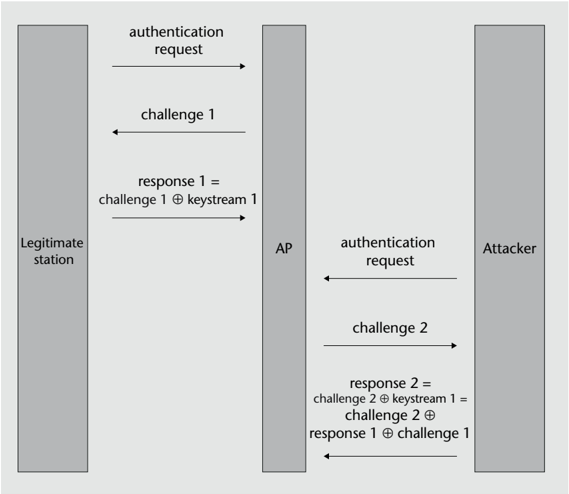

In general, the capture of authentication frames allows to obtain a certain amount of keystream corresponding to a specific IV. The response frame has 140 encrypted bytes with a known decrypted value (128 from the challenge plus the other fields) and there- fore 140 bytes of keystream are produced. This can be useful to generate other encrypted frames apart from that of the authentication response. And besides, there are other attacks that allow more bytes of keystream to be computed in case longer frames have to be forged.

## Frame decryption using integrity check or the 'chopchop attack'

.

Without knowing the encryption key, an attacker who has captured a WEP frame can decrypt the last n bytes of encrypted data by sending an average of 128 × n frames to the AP.

The ICV integrity code that WEP frames incorporate is computed with the CRC-32 algorithm, which is a very good method to detect transmission errors but it is not a cryptographic algorithm. Since the CRC-32 is based on linear arithmetic operations such as the division of polynomials modulo 2, it is possible to perform inverse calculations.

Suppose we have captured a WEP frame in which the encrypted part X is made up of m bytes: X [0], X [1], . . . , X [ m -1]. From this frame, we can construct a new one by removing the last encrypted byte, X [ m -1], leaving us with a new encrypted part X ′ formed by the first m -1 bytes of X . We can then hypothesize that the encrypted byte we deleted, X [ m -1], corresponded to a decrypted byte equal to i , and compute the sequence of 4 bytes Yi that should be added bit by bit (that is, using the XOR operation) to the last bytes of X ′ so that these bytes form a correct ICV. It is easy to compute this sequence Yi because, owing to CRC properties, it only depends on the deleted byte X [ m -1] and, at the same time, because we are working with a stream cipher, if we add a constant bit by bit to some encrypted bits and decrypt them, the result is the same as if we had added the constant to the decrypted bits.

Thus, for any of the 256 possible values of i , an attacker can construct a modified frame with an encrypted part Yi that, once decrypted, has a valid ICV if the decrypted value of the deleted byte is equal to i . Logically, for the encrypted frame to also be valid, the CRC of the entire frame will have to be recomputed.

Modification of WEP frames for the chopchop attack

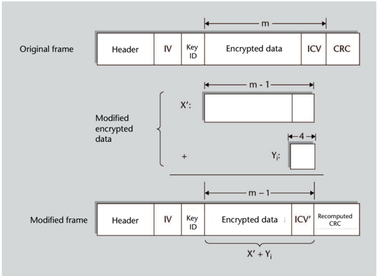

Then, the intruder sends these modified frames to the AP to determine whether the ICV is valid or not. When the response by the AP indicates that the frame is valid, the attacker will know the decrypted value of the last encrypted byte of the frame: the one that corresponds to the value Yi used. Then the attacker will do the subtraction (i.e. addition) using the encrypted value and the decrypted value to get the last byte of the keystream used to encrypt the frame.

Since there are 256 different possible values to try, the number of frames that will have to be sent before finding the right one will be 128 on average.

Using the right frame, the intruder can repeat the attack again to determine the penultimate byte of the keystream, and so on. Using this method, we could get all but the first 4 bytes of the keystream (and thus decrypt all the encrypted bytes of the original frame) because the Y values are 32-bit sequences and we can't parse the frame to a length less than 4. But because the decrypted bytes include those of the ICV code, it is easy to deduce the missing bytes so that this code is correct.

There are different ways of making the AP tell us if the ICV of a WEP frame is correct or not. These two are the main ones:

- If we have two stations, we can perform authentication from each of them (fake, if we do not know the WEP key) and an association with the AP. Then, we can send the frames to test from the first station to the second through the AP. If the ICV of a frame is correct, the AP will retransmit it to the second station, and if it is not, it will discard it.
- Another simpler way is to send the frames to test from a non-associated station: if the ICV of a frame is correct, the AP will respond with a management frame indicating that the station is not associated, and if it is not, it will discard it.

This attack, which allows the attacker to interactively decrypt the last n bytes of plaintext of an encrypted packet, is known as a 'KoreK chopchop attack'. It builds on the technique of another previously published attack called the 'Arbaugh inductive attack'. The latter is actually the reverse version of the chopchop attack: instead of going back byte by byte, it goes 'forward' using trial and error and so is able to learn the next bytes of the keystream. This way, with an average of 128 attempts per byte, an arbitrary length of keystream can be obtained that is sufficiently useful to construct longer or shorter fake WEP frames without knowing the key.

## Fragmentation attack

.

An attacker who has captured n bytes of a keystream can obtain up to 16 × n -60 bytes of keystream encrypted with the same root key by sending up to 16 fragmented frames to the AP.

## Adding bits to the encrypted data

Conceptually, the operation to be done is decrypting the data, adding the sequence Y and re-encrypting them. But since the encryption is actually also a sum (of bits of plaintext and the keystream), the result is the same if the addition is done directly on the encrypted data.

## First encrypted bytes of a frame

In practice, it is possible for the AP to discard WEP frames that do not have a minimum length so that there is a point beyond which no more bytes of keystream can be obtained with the chopchop attack.

## Link of interest

To find more information about the chopchop attack, visit aircrack-ng.org /doku.php?id=chopchoptheory

## KoreK

KoreK is the pseudonym used by the author who has published various attacks against Wi-Fi protocols.

IEEE 802.11 allows a frame to be sent in fragments up to a maximum of 16. If a station sends the AP a fragmented frame that needs to be retransmitted, the AP will normally recompose the frame before retransmitting it. And if the fragments are encrypted, the recombined frame will also be encrypted, possibly with a new IV.

Thus, an attacker with n bytes of keystream (obtained, for example, with a chopchop attack) can construct 16 WEP frame fragments, each containing n -4 bytes of data plus the 4 ICV bytes, all encrypted with the same IV and keystream. If the attacker sends these fragments to the AP for retransmission, the resulting frame will have 16 × ( n -4 ) bytes of data and 4 bytes of encrypted ICV (provided that it does not exceed the maximum data length of a frame), a total of 16 × ( n -4 )+ 4 = 16 × n -60 bytes, all of which of known decrypted value. Therefore, the attacker will have obtained this number of bytes of keystream from the n it had at the start.

If the recovered keystream still does not reach the length required to encrypt a long frame, this attack can be repeated until the maximum possible length is obtained.

## 1.4.2 Vulnerabilities related to the RC4 algorithm

This set of vulnerabilities emerges as a consequence of the method how the RC4 algorithm is used in the WEP protocol. Below is a list of attacks that exploit these vulnerabilities:

- FMS attack
- Korek attacks
- Klein and PTW attacks

## The FMS attack

Cryptanalysts Scott Fluhrer, Itsik Mantin and Adi Shamir laid out in their 2001 paper the theoretical bases of an attack that made it possible to recover a WEP root key from encrypted frames if a sufficient number of these frames were available. In 2004, another team of researchers published the results of the first implementation of this attack against a real Wi-Fi network.

.

With the FMS attack, an attacker knowing the first keystream byte (S[0]) of approximately 4 to 9 million WEP frames, encrypted with the same root key, can recover the value of the key with a success probability of 50%.

FMS attack

FMS bears the initials of the surnames of its discoverers.

This attack is based on the observation of how the RC4 algorithm works. Because of the way this algorithm is used in the WEP protocol, the first three bytes of the RC4 key, K , are always known because they form the initialization vector (IV) that is transmitted in the clear prefixed to the encrypted data. For each frame captured with the corresponding IV, the attacker has the bytes K [0], K [1] and K [2], and the goal of the attack is to get the bytes K [ n ] starting at n = 3.

If we call the state vector of the KSA algorithm Vk as is left after k iterations, knowing the first three bytes of the key K allows us to easily reconstruct both the vector V 3 and the value of the indices i and j in the third iteration. In the fourth iteration, we know that the value of i will be 3, but to know the value of j we would first need to know the fourth byte of the key, K [3], since j 4 = j 3 + V 3[3] + K [3].

Despite not knowing K [3], the FMS attack tries to find a clue about its value from the first byte of keystream, S [0]. According to the PRGA algorithm, this byte S [0] is obtained by computing the index s = V 256[1] + V 256 [ j ], where in this case j is V 256[1]. We also don't know the vector V 256, but there is some probability that V 256[1] is equal to V 3[1], which we do know. This will be the case if, between the fourth and the last iteration of the KSA, the value of the index j is not 1 at any time, and therefore element 1 of the vector is not exchanged with any other. The probability of this happening is (255/256) 253 , that is, 37.1%.

To continue to figure out K [3], the attack focuses on a subset of the captured frames that have a peculiar property and ignores all the others. This property is that, on the one hand, when obtaining the vector V 3, the value V 3[1], which we will call x , is such that V 3 [ x ] + x = 3, and on the other, this value x is smaller than 3. These two conditions are called solution conditions of the FMS attack.

Continuing on with the probabilistic study, also in 37.1% of the cases V 256 [ x ] will be equal to V 3 [ x ] because the probability that j does not take the value x is the same as it is for the value 1, and also, since x is smaller than 3, the index i will not take this x value between iterations 4 and 256, either. There is also a probability that V 256[3] is equal in this case to V 4[3], which is 37.3%, and we know that V 4 [ 3] is V 3 [ j 4] since in the fourth iteration of the KSA the elements of the positions i 4 (which is 3) and j 4 are swapped.

Therefore, in the frames that meet the solution conditions, there is a total probability of 37.1% × 37.1% × 37.3%, equal to 5.1%, that the immobility conditions that we have just seen are satisfied, that is, that the elements in positions 1, x and 3 have not been exchanged with any other from the fourth iteration of the KSA algorithm. In these cases, the values V 256 [1], V 256 [ x ] and V 256[3] will be equal to V 3 [1], V 3 [ x ] and V 3 [ j 4], respectively. So we can obtain a tentative value of j 4 from S [0] knowing, as we have seen before, that S [0] = V 256 [ s ] = V 256 [ V 256[1] + V 256 [ V 256[1]]] and that, in 5.1% of the solvable frames, this value will be V 256 [ x + V 256 [ x ]] = V 256 [ x + V 3 [ x ]] = V 256[3] = V 3 [ j 4]. This value of j 4, which can be computed because V 3 is known and we start from the hypothesis that S [0] is also known, allows us to determine a candidate value of K [3] knowing, as we have also seen before, that j 4 = j 3 + V 3[3] + K [3]. This candidate value will be the correct value if the immobility conditions are met. If not, the result obtained with this formula will be a random value.

## First keystream byte

The most common case is that the encrypted data in an unfragmented frame, or in the first fragment of a fragmented frame, starts with the first byte of the LLC header equal to AA (hexadecimal). Therefore, knowing the first byte encrypted and the first byte decrypted, the first byte of keystream is also known.

## Solution conditions

Statistically, one in 21,675 frames will meet the resolution conditions for n = 3 . If n increases, the number of frames that meet the conditions also increases.

That is, if we calculate the possible value of K [ 3 ] from a sufficient number of frames so that the distribution of incorrect values is uniform, then approximately 15 out of 270 frames will give the same value and the other 255 will give different values from each other. It can be empirically verified that from some 60 frames analyzed there is already a value that stands out from the others because it is repeated at least 3 or 4 times. This candidate value that has the largest number of 'votes' is the one that, in principle, can be considered as valid.

Elements of the state vector that should not be modified for the FMS attack hypothesis to be true

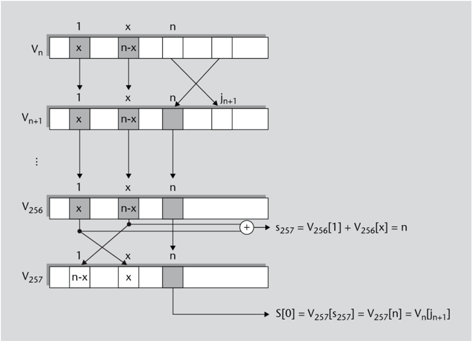

Once the candidate value to be the fourth byte of the key, K [3], has been determined, the attack can be performed on the next byte, K [4], and in general, the attack for each K [ n ] byte of the key can be repeated. The solution conditions are updated in each iteration since the frames to be analyzed are those in which Vn [ x ] + x = n , where x in this case is Vn [1], and that also x &lt; n .

We can find false positives when obtaining each byte of the key. This will happen if several of the frames that do not meet the immobility condition give the same (incorrect) value of K [ n ] and exceed the number of frames that give the correct value so that the false value has more votes than the correct one. When a found byte K [ n ] is incorrect, all subsequent bytes K [ m ] with m &gt; n will be miscalculated because the KSA algorithm to obtain the vector Vm will be applied using wrong values.

Checking to see if the key bytes are correct can only be done when all of them have been found, from K [ 3 ] to K [ 15 ] in the case of a WEP-104 key. A few IVs can then be used to see if the computed key gives the byte of keystream S [ 0 ] corresponding to each of the IVs. If not, you have to go back and redo the calculations. For example, you can look at which of the key bytes won by the narrowest majority, replace it with the value with the second most votes and recalculate all subsequent bytes. And if the verification is not satisfactory

## Inversion of the V [ x ] transformation

Given y = V [ x ] , it is always possible to determine the unique value x = V -1 [ y ] because V is a permutation of the elements 0, . . . , 255: each element appears once and once only in the permutation.

## Probability of no exchange

As n increases, the probability that elements will not be exchanged also increases because there are fewer iterations left until the end of the KSA, but the variation is not very large: from 5.07% for n = 3 to 5.84% for n = 15.

## Obtaining the last byte of the key

If there are many frames to process, instead of getting the last byte of the key, K [ 15 ] , by the voting system, it may be more efficient to only get up to the penultimate byte and run 'brute force' checks with each of the 256 possible values of the last byte. In some cases, brute force can even be applied to the last two bytes of the key.

either, keep repeating these substitutions until finding the correct value or until a maximum number of attempts has been exceeded.

It has been experimentally proven that, once four million frames have been captured, the FMS attack can recover the correct value of the WEP key with a success probability of 50%. This number of frames, however, rises up to nine million if the IVs are generated in counter mode instead of being randomly generated. This is so because the frames that satisfy the solution conditions in counter mode are not uniformly distributed, but concentrated in consecutive or very close series. It has also been found that, after a certain point, no matter how much the number of frames processed is increased, it is difficult to reach a success probability of 75%.

## The KoreK suite of attacks

KoreK attacks are a series of attacks on the WEP protocol that exploit certain correlations between the root key and the first bytes of ciphertext or keystream. In 2004, an Internet user under the name of 'KoreK' published a tool that integrated all of these attacks, which were 17 in total. Some of them were already known, such as the FMS attack, and others were identified by KoreK.

.

With KoreK attacks, an attacker knowing the first two keystream bytes ( S [ 0 ] , S [ 1 ] ) of approximately 150,000 to 700,000 WEP frames, encrypted with the same root key, could recover the value of the key with a success probability of 50%.

KoreK attacks can be divided into three groups:

- Attacks to find K [ n ] from K [ 0 ] , . . . , K [ n -1 ] and S [ 0 ] . The FMS attack belongs to this group.
- Attacks to find K [ n ] from K [ 0 ] , . . . , K [ n -1 ] , S [ 0 ] and S [ 1 ] .
- 'Negative' attacks that, if Vn satisfies certain conditions and S [ 0 ] takes certain values, allow certain values of K [ n ] to be discarded.

As with the FMS attack, many attacks are based on the probability that certain elements of the state vector are not exchanged from the n -th iteration of the KSA algorithm. Each of the individual attacks has its own solution conditions. The tool that was published did a frame-by-frame check to see if the conditions of any attack were satisfied and, if so, it carried it out and collected a vote in favour of a candidate for K [ n ] , or a vote against in case it was a negative attack. The votes were weighted according to the probability of success of the attack performed.

Implementing several different attacks in parallel makes it easy to crack the key with a smaller number of frames analyzed. It has been experimentally found that, using 150,000

## Success of the FMS attack

A criterion to assume that the attack has not been successful is that the trial and error method to determine the correct key does not give any result after 2 or 3 minutes, considering the average computing power of computers today.

## Second keystream byte

Just as in the majority of cases, the first byte of encrypted data in a WEP frame is the first byte of the LLC header, the second encrypted byte is the second byte of the same header, which is also equal to AA (hexadecimal), and from this value the second byte of keystream S [ 1 ] can be figured out.

frames KoreK can recover the correct value of the WEP key with a success probability of 50% if the IVs are randomly generated. At the same time, if the IVs are generated in counter mode, the number of necessary frames increases to 700,000 if the same 50% success rate is to be achieved. Using 270,000 frames in random mode, and 1,700,000 in counter mode, the success rate increases to 90%.

## The PTW attack

A new attack known as PTW was published in 2007. It is an improved variant of yet another attack identified in 2005 called the Klein attack .

.

With the PTW attack, an attacker knowing the third through fifteenth bytes of keystream ( S [ 2 ] , . . . , S [ 14 ] ) of approximately 35,000 WEP frames, encrypted with the same root key, can recover the value of the key with a 50% chance of success.

The Klein attack is based on an anomaly in the statistical properties of the RC4 key schedule. The KSA algorithm generates an apparently random state vector, and since each element can have one of 256 possible values, the probability that an element V [ n ] has a given value x is expected to be 1 / 256, that is, approximately 0.4%. A combination of vector elements, such as V [ V [ i ] + V [ j ]] + V [ j ] , would in principle also have to be equal to any value 0 ≤ x ≤ 255 in an equiprobable way. But the so-called Jenkins correlation shows that one value of this expression is more likely than the others. Specifically: Prob ( V [ V [ i ] + V [ j ]] + V [ j ] = i ) = 2 / 256 Thus, the previous combination of elements can take the value i with an approximate probability of 0.8%, instead of the 0.4% that would be expected.

/negationslash

Moreover, the Jenkins correlation also shows that the rest of the x = i values are equiprobable, such that the probability of each of them is ( 1 -2 / 256 ) / 255 = 127 / 32640.

As occurs with the FMS attack, in the Klein attack we initially have to do the first 3 iterations of the KSA algorithm to obtain V 3, and in iteration 4 we know that the element V 3 [ j 4 ] will become V 4 [ 3 ] . In some of the following iterations, the index j can take the value 3, and then this element will change places. But the index i will not take the value of 3 again until iteration 258, already within the PRGA algorithm, that is, until after 254 iterations.

The probability that the index j does not take the value 3 between iterations 5 and 258, both included, is 37.0%. Since the index i will not be equal to 3 in any of the 254 iterations, this is the probability that the element V 4[3] has not moved from its place until iteration 258.

In the next iteration, 259, the third byte of keystream S [ 2 ] will be obtained:

<!-- formula-not-decoded -->

## PTW attack

The name of this attack bears the initials of the surnames of the authors who published it: Andrei Pyshkin, Erik Tews and Ralf-Philipp Weinmann.

## The first 15 bytes of keystream

In some frames, such as those containing ARP packets, the first 15 bytes of data correspond to header fields with constant values. Therefore, if these frames are encrypted, 15 bytes of keystream can be obtained.

Since in this iteration the elements of positions 3 and j 259 will have swapped places, the sum V 258 [ 3 ] + V 258 [ j 259 ] will be the same as V 259 [ j 259 ] + V 259 [ 3 ] , and therefore:

<!-- formula-not-decoded -->

Adding V 259 [ j 259 ] :

<!-- formula-not-decoded -->

And we know by the Jenkins correlation that this expression is more likely to be 3 than any other value. Thus, there is a probability of 2 / 256 that S [ 2 ] + V 259 [ j 259 ] = 3 is satisfied or, since V 259 [ j 259 ] is the element that was in V 258 [ 3 ] before the last exchange, that S [ 2 ] + V 258 [ 3 ] = 3 is satisfied.

To get the value of byte K [3], the Klein attack is based on the probability that the hypothesis S [2] + V 4[3] = 3 is true. If it is, since we assume that S [2] is known and V 4 [3] is V 3 [ j 4 ], we can know K [3] from j 4 as we have already seen in the FMS attack.

Element of the state vector that would not have to be modified for the Klein attack hypothesis to be true

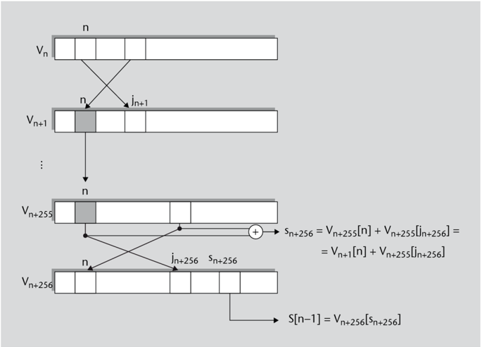

For the Klein attack hypothesis to hold, S [2] + V 4[3] = 3, two possibilities must be considered:

- It holds true that V 258[3] = V 4[3] and that S [2] + V 258[3] = 3. The probability of the first condition is 37.0% and, according to the Jenkins correlation, that of the second condition is 2 /256. The probability of this combination is 0.37 × 2/256 = 0.74/256.
- It does not hold true that V 258[3] = V 4[3] but it does that S [ 2] + V 4[3] = 3. The probability of the first condition is 63.0% (complementing the previous case), and that

## Probability of the Klein attack hypothesis

While the FMS attack hypothesis has a probability that varies with n , in the Klein attack it is the same for any n because the number of iterations considered is constant (254).

of the second, since it is does not correspond to the most probable case of the Jenkins correlation, is 127/32640. The probability of this combination is 0.63 × 127/32640 = 0.63/256.

Since they are disjoint combinations, we can add the partial probabilities to find that the total probability that the hypothesis is true is 1 . 37 / 256. In other words, the probability that the Klein attack hypothesis is fulfilled is 1.37 times the 'normal' probability. This result is not very spectacular if we compare it, for example, with the FMS attack hypothesis, which was fulfilled with an approximate probability of 5% (about 14 times the normal probability).

.

However, the main difference between the FMS attack and the Klein attack is that there are no solution conditions in the latter and all frames can be used to obtain a candidate value for each K [ n ] . So even if the probability that the attack hypothesis is fulfilled is 10 times smaller, the Klein attack requires much fewer frames to recover the WEP key.

It has been experimentally proven that with 43,000 frames the Klein attack can recover the correct value of the WEP key with a success probability of 50%. In addition, the probability of success with 60,000 frames is already 90%. On the other hand, the number of frames needed in the Klein attack is independent of how the IVs are generated (random mode or counter mode) since there are no solution conditions and all frames are used.

The PTW attack itself consists of adding a series of improvements to the Klein attack that increase its efficiency. The following are some of the changes introduced in the PTW attack:

- In the Klein attack, once the value of K [ 3 ] has been determined, the value of K [ 4 ] is searched for and then that of K [ 5 ] , and so on. In contrast, the PTW attack searches for the cumulative sums of the bytes of the root key: σ 3 = K [ 3 ] , σ 4 = K [ 3 ] + K [ 4 ] , σ 5 = K [ 3 ] + K [ 4 ] + K [ 5 ] , and so on. These sums can be obtained if, instead of working, for example, with j 5 = j 4 + V 4 [ 4 ] + K [ 4 ] , we continue to develop the expression and work with j 5 = j 3 + V 3 [ 3 ] + V 4 [ 4 ] + K [ 3 ] + K [ 4 ] .

This modification does not decrease the number of frames necessary to crack the key, and also the probabilities that the hypotheses on the sums of bytes are fulfilled are lower than those of the Klein hypotheses. But working with sums has the advantage of making the search for alternative keys much faster when a candidate key is found to be incorrect. This is due to the fact that, unlike K [ i ] bytes, which have to be computed sequentially because each one depends on the previous ones, each σ i sum can be obtained independently of the others.

Starting from the sums σ 3 , σ 4 , . . . σ 15, we can get K [ 3 ] , K [ 4 ] , . . . K [ 15 ] very quickly by doing some simple subtractions. If we get a key that is not correct using the most voted sums, one of the sums is changed for the next most voted one and then we only have to subtract the σ i sum necessary to obtain a new key. This is much faster than

## Effect of Jenkins correlation

Note that without Jenkins correlation the total probability of the hypothesis

would be

0 . 37 × 1 / 256 + 0 . 63 × 1 / 256 = 1 / 256 . That is, the case S [ 2 ] + V 4 [ 3 ] = 3 would occur with the same probability as any other.

recalculating the state vectors to regenerate the new values of the K [ i ] bytes, as is done in the Klein attack.

- This speed in obtaining new keys makes it possible to implement more exhaustive and efficient algorithms to determine the correct key. For example, we can select two or more candidates for each σ y that have many more votes than the rest and try different combinations of these candidates. With the Klein attack, this would require recalculating the state vectors for each combination, whereas with the PTW attack the check is much faster.
- Using sums of bytes σ n instead of bytes K [ n ] introduces a problem that does not exist in the Klein attack. It may be the case that some byte K [ n ] has a value such that the index j n + 1 coincides with some index j p of a previous iteration p . If this happens, an exchange will occur in the iteration p that will undo the working hypothesis of the PTW attack and the Jenkins correlation will not apply. As this condition is independent of the IV, in this case all the values of the sum σ n will be more or less equiprobable and it will be much more difficult to guess the correct value. Then K [ n ] is said to be a strong byte of the key.

One solution is to detect that a byte is strong when the distribution of the votes of the candidate sums resembles a uniform distribution. Then, it is a matter of deducing which of the values of K [ n ] for each possible value of p make the strong byte condition true and consider the results obtained as candidates for K [ n ]. Another solution is to try all the values of K [ n ] using brute force or, if there are many strong bytes in the key and brute force is not feasible, use the Klein attack instead of the PTW.

The introduction of these improvements allows the PTW attack to reduce the number of frames necessary to have a success probability of 50% to 35,000, and down to 47,000 to have a success probability of 90%.

## 1.4.3 Tools to exploit WEP vulnerabilities

After different attacks against the WEP protocol were published, tools that implemented these attacks were developed, many of which were open source or free software. One of the first tools was AirSnort (2001). Then the publication of the FMS and KoreK attacks gave rise to the Aircrack project (2004) and, based on this and other developments such as wesside (2004), Aircrack Next Generation or Aircrack-ng (2006) was created. Aircrackng implemented the PTW attack with the release of version 0.9 (2007).

Aircrack-ng is actually a package that incorporates a few tools, including airmon-ng , aireplay-ng , airodump-ng and the aircrack-ng tool itself.

## The airmon-ng tool

This script is used to enable monitor mode on wireless interfaces and thus capture frames sent by other stations. Monitor mode is equivalent to a promiscuous mode without the need of establishing an association with any other station or AP.

## The aireplay-ng tool

This tool allows you to inject new or previously captured frames. This can force the generation of response WEP frames in case there are no active Wi-Fi stations nearby.

The aireplay-ng tool can work in different attack modes. Among the significant modes are the following:

- Deauthentication mode. In this mode, fake deauthentication frames are generated and directed at a station authenticated with the AP. The goal is to cause this station to initiate a new authentication and, depending on the operating system it uses, send an ARP request to determine the IP address of the AP that acts as the router.
- Fake authentication mode. In this mode, a fake authentication attack like the one we have seen before is carried out. This attack may be necessary to be able to perform other attacks later if there is no other associated station.
- ARP request replay attack mode. This is probably the most effective way to force the replaying of WEP frames to capture the IVs necessary to determine the key. In this mode, the tool listens for an ARP packet.

The ARP packet will be encrypted, but it is relatively easy to detect whether a frame contains an ARP request or not. Firstly, because the length of the encrypted data will be 40 bytes: 8 from the LLC header, 28 from the ARP packet itself and 4 from the ICV. Secondly, because the destination address, which is not encrypted, will be the broadcast address.

When the ARP request has been captured, the aireplay-ng tool starts retransmitting it over and over again, taking advantage of the frame injection vulnerability we've already seen. If the requested IP address is that of the AP, it will send as many WEP frames with ARP response packets as requests it receives and each response will be encrypted using a different IV. If the original request had been sent by a station requesting the address of another station, the AP will retransmit the request, the requested station will send the response to the AP and the AP will retransmit the response to the original requestor so that for each frame injected, 3 new ones will be generated, each with its own IV.

This attack is usually very productive because packet filters typically allow ARP protocol traffic to pass through without restriction and intrusion detection systems do not take any special action with these types of packets. The station that had generated the original request can receive many responses, but it will usually ignore them. With this technique, then, it is easy to obtain a few hundred IVs per second and the necessary ones to perform a PTW attack in under a minute.

## The airodump-ng tool

This tool is the equivalent of the tcpdump tool for wired networks: it captures the frames it detects and allows you to save them to a file. Frames can come from an active attack

## Length of ARP packets

Instead of only looking for packets with 40 bytes of encrypted data, aireplay-ng looks for packets that are 40 or 58 bytes long. The reason for this is that if the source is a computer on a wired network, it will have added bytes of padding up to the minimum data length of an Ethernet frame (46 bytes).

triggered with aireplay-ng , or be captured in a passive attack by simply listening in. In this last case, most of the captured frames most likely correspond to IP packets.

When saving the captured frames to file, airodump-ng has the option of saving only the information useful for the aircrack-ng tool: the IV and the first keystream bytes of each frame.

## Structure of an ARP packet in a Wi-Fi frame

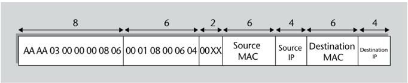

## Structure of an IPv4 header in a Wi-Fi frame

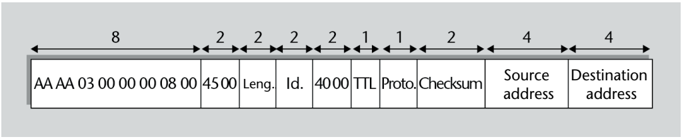

The keystream is determined by deducing the type of frame in question. If it can be inferred by its length that it contains an ARP packet, it is possible to determine at least the first 22 bytes of decrypted data and the keystream is determined by subtracting the encrypted data:

- The first 8 bytes are the LLC/SNAP header, with fixed value: in hexadecimal, AA:AA (source and destination access points), 03 (control code), 00:00:00 (organization code) and 08:06 (Ethernet type: ARP).
- The next 6 bytes are the ARP header, also with fixed value: in hexadecimal, 00:01 (protocol type: Ethernet), 08:00 (network protocol: IPv4), 06 (MAC address length), 04 (IP address length).
- The next 2 bytes are the ARP opcode: 00:01 (request) or 00:02 (response).
- The next 6 bytes are the MAC address source, which has to match the one in the 802.11 MAC header (not encrypted).

Next is the source IP address, which cannot be deduced from the frame itself but can be inferred from the context by looking at other frames. The destination MAC address is either zero in the requests or is decrypted in the 802.11 header in the responses. Finally, there is the destination IP address, which can also be inferred from the context. Other frame types may contain STP protocol packets or, by default, are assumed to contain IPv4 packets. In the latter case, the first 12 bytes of the keystream can be obtained from the values of the decrypted bytes, making assumptions that are met in most cases, e.g. the packet is not fragmented:

- The first 8 bytes are the header LLC/SNAP, the same as that of the frames with ARP packets, but changing the Ethernet type to 08:00 (IPv4).

## LLC/SNAP

LLC stands for Logical Link Control, and SNAP stands for Sub-Network Access Protocol.

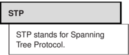

- The protocol version, the header length and the differentiated services field are in the next 2 bytes. In most IPv4 packets these two bytes are, in hexadecimal, 45:00.
- The next 2 bytes are the length of the IP packet, which can be deduced from the length of the frame.

Next are the 2 bytes of the datagram identifier, which will generally have an unknown value. When finding the WEP key with the PTW attack, Aircrack-ng searches for all possible values of these two bytes if it only has IPv4 packets. If the packet is not fragmented, the next 2 bytes will contain the values 40:00 or 00:00, depending on whether or not the Don't Fragment (DF) flag is set. The first of these two bytes is the last one used to obtain the keystream needed by the PTW attack. Aircrack-ng assumes that 85% of the packets will have the flag set and assigns the corresponding weight to the votes collected with this assumption. The other fields in the IPv4 header can have more indeterminate values, but they are not used in the PTW attack.

## The aircrack-ng tool

This tool implements the attack to determine the WEP key based on the captured IVs. By default, it applies the PTW attack and the KoreK attacks in parallel, which include the FMS attack, but it has options to disable the attacks that are not wanted. It can also automatically run a Klein attack when it finds that there are many strong bytes in the key that are resistant to the PTW attack.

The following figure shows an example of the result of using the aircrack-ng tool. In this example, it took 9 seconds for the attack to find the correct key from just over 35,000 IVs. While testing possible values of the key, the tool displays on the screen the number of weighted votes collected by the candidate values of each byte of the key.

Example of execution of the aircrack-ng tool

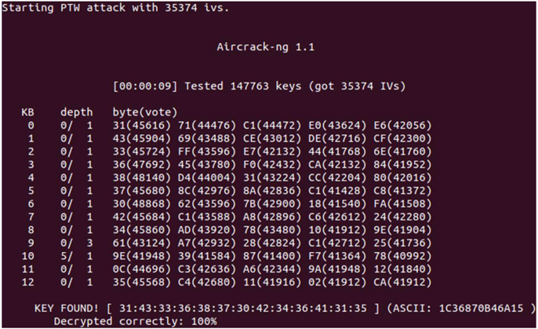

## 1.5 Solutions to WEP vulnerabilities

.

When the initial security design in the IEEE 802.11 standard was found to have significant shortcomings, several solutions were proposed to try to correct these problems.

The main proposals are the following:

- In an article from 2001 that described the FMS attack, the authors suggested applying it to frames in which the IV starts with K [ 0 ] = n and K [ 1 ] = 255 when searching the value K [ n ]( 3 ≤ n &lt; 8 ) , because in these cases it is easier for the attack hypothesis to come true. Therefore, a first solution was to not send WEP frames encrypted with these IVs, called weak initialization vectors . In reality, this measure only very slightly increases the number of frames that the attacker needs to crack the key, but even so, most operating systems built it into their kernel and Wi-Fi cards that implemented it in their hardware were given the commercial label WEPplus .
- Another solution proposed in 2001, called WEP2 , was based on the use of 128-bit initialization vectors and 128-bit secret root keys, that is, RC4 keys of 256 bits in total. This, in fact, does not prevent the attacks designed for the original WEP protocol from being carried out, but it does increase the amount of time required to complete them successfully, although the growth is not exponential but linear.
- Some manufacturers opted for Dynamic WEP , which is a more effective solution. This technique consists of dynamically changing the WEP keys, which considerably complicates attacks with respect to static keys. However, the different implementations were not interoperable with each other because each manufacturer followed their own specifications.

The standardization efforts that followed were based on the proposal of dynamics keys, which led to the publication of the IEEE802.11i specification in 2004. In the 2007 edition, this extension ceased to be a separate specification and it was incorporated as a chapter of the IEEE 802.11 base standard.

While the text of this specification was being prepared, and because the problems raised by the WEP protocol needed to be fixed as soon a spossible, an association of manufacturers called Wi-Fi Alliance developed an intermediate solution called WPA to be used with the same hardware as existing Wi-Fi cards or with only minor modifications to the microsoftware (firmware). This solution was based on the drafts published by the IEEE 802.11i working group. When the official version was approved in 2004, the IEEE 802.11i standard was incorporated into the Wi-Fi Alliance specifications under the name of WPA2. In 2018 this association published the first version of the specification called WPA3 , which introduces certain additional requirements with respect to WPA2.

## WPA

WPA stands for Wi-Fi Protected Access.

## 1.5.1 WPA

The WPA standard introduces fundamental changes both in the authentication method of the stations and in the encryption algorithm of the frames.

.

Unlike the WEP protocol, in which there is normally only one secret key shared by the AP and the stations, WPA establishes the use of different keys in each secure association , that is, in each RSNA, and defines mechanisms to set these keys dynamically.

As is specified in the WEP protocol, the use of a single key shared between the AP and the stations may be appropriate for a home wireless network, but it can be a problem in a medium or large corporate network. When there are tens or hundreds of stations with the same key, if an attacker accesses the key in one of the stations, the communications of all the others are automatically compromised. Also, changing the key may require manual updates at each of the stations, which may be impractical.

For this reason, WPA establishes the use of the network access control method defined in another standard of the IEEE 802 series, namely IEEE802.1X . This standard makes it easy to securely exchange session keys between two network nodes, once mutual authentication has been performed between them. Mutual authentication in WPA means that the endpoint authenticates to the AP, but the AP also authenticates to the endpoint, so the endpoint can ensure that it is not talking to a spoofed AP. The IEEE 802.1X standard, in turn, is based on the EAP protocol, which allows authentication to be performed working at the data link layer, that is, without the need to still have a network address (IP) assigned. EAP specifies various authentication methods and, as the name indicates, other methods defined in other specifications can be added. Thus, through EAP, authentication can be carried out based, for example, on usernames and passwords, public keys and X.509 certificates, physical devices such as smartcards, etc.

IEEE 802.1X defines a frame format called EAPOL to send EAP protocol messages over a local network. In IEEE 802.1X terminology, the end of the EAP communication that requests authentication is called the supplicant , and the end that grants it is called the authenticator . The authenticator may grant authentication by itself, or it may communicate with an authentication server which makes the final decision. Typically, the server will use a protocol, such as RADIUS or Diameter, to perform authentication.

WPA also continues to allow the use of a shared key, or PSK, for simplicity in the case of small networks such as home networks. However, in this case the encryption key is not directly the shared key plus an IV, as is with the WEP protocol. Instead, the shared key is used to derive the corresponding session keys for each association.

In any case, each station-AP pair uses its own keys to secure its communications. In this way, a station cannot spy on the frames sent between the AP and another station of the same BSS.

## RSNA

RSNA stands for Robust Security Network Association.

## EAP

EAP stands for Extensible Authentication Protocol. This protocol is defined in the RFC 3748 specification.

## EAPOL

EAPOL stands for EAP Over LANs.

## PSK

PSK stands for Pre-Shared Key.

This scheme, however, has a drawback: while it is easy to send an encrypted frame simultaneously to more than one node with a shared key, as in the case of broadcast or multicast frames, with independent keys it would be necessary to send as many frames as recipients, each encrypted with the corresponding key. To avoid this shortcoming, WPA works with two types of keys:

- Pairwise keys are keys used for the frames between each pair of nodes, that is, between the AP and each station.
- Group keys are known by all BSS members and are used for broadcast or multicast frames. A new group key can be generated each time a station leaves the BSS and disassociates from the AP, to prevent it from continuing to decrypt the group traffic.

## WPA authentication and key management

WPA defines two authentication modes:

- WPA-PSK mode . This mode works with a predefined master key, shared between the AP and the stations. As said before, it is typically used only in networks with few stations. The Wi-Fi Alliance also named this mode WPA-Personal .
- WPA-802.1X mode . It is the one that uses access control based on IEEE 802.1X plus EAP, along with an authentication server. The Wi-Fi Alliance also gave this mode the name WPA-Enterprise .

Whether using one mode or the other, a station that wants to enter an ESS has to follow these steps:

- 1) The station has to identify the ESS it wants to access. It uses beacon frames to identify the information it needs about the ESS and the AP that manages it, such as BSSID (i.e. MACaddress of the AP), supported transmission speeds, etc.

Among the beacon frame fields, also called IE, there may be a RSN-type field (Robust Security Network). If this is the case, it means that the AP supports WPA secure association establishment. The different subfields of IE RSN indicate the supported authentication and encryption algorithms.

- 2) For compatibility with systems that implement the 802.11 state machine, the station has to do an open system authentication first, as seen in section 1.2, followed by an 802.11 association.

The management frame containing the association request includes an RSN type IE where the authentication algorithm and the encryption algorithm that the station is willing to use are specified, among those announced by the AP in the beacon frames. The chosen authentication algorithm determines whether it will be done in WPA-PSK mode or in WPA802.1X mode.

IE

IE stands for Information Element.

Shared key authentication

Remember that shared key authentication is completely insecure and is therefore not supported by the WPA standard.

- 3) The station and AP securely establish a 256-bit PMK or pairwise master key.
- If WPA-PSK mode is used, the PMK master key is directly the pre-configured PSK shared key.

On many occasions, to facilitate the configuration of the stations, the PSK shared key is not specified directly but as a passphrase. In these cases, the PSK bits are the result of applying a key generation function, defined in the PKCS #5 standard and based on hash functions, given the passphrase and the SSID.

- If WPA-802.1X mode is used, the EAP protocol is started to perform authentication. The station agrees with the authenticator, which can either be the AP or an authentication server, on the EAP method to use. This method has to guarantee that a spy observing the communication cannot obtain any password or other secret information that allows them to perform a fake authentication.

The supplicant and authenticator then exchange the necessary EAP messages until authentication is complete. If the process ends successfully, it means that the station and the AP have successfully authenticated each other. In addition, the EAP method used also has to provide a 512-bit value to be used as the master session key or MSK.

Finally, the PMK is determined, which is equal to the first 256 bits of the MSK.

- 4) Authentication is completed by executing a 4-way handshake . On the one hand, this negotiation allows us to verify that both the AP and the station have correctly obtained the PMK master key and thus verify that they are authentic. On the other hand, as a result of the negotiation, the necessary keys to protect the WPA frames are obtained, both between pairs and groups.

The 4-way handshake messages are sent in a special type of frame, called EAPOL-Key, defined in the IEEE 802.1X standard. During the negotiation, an encryption key and a message authentication key, called KEK and KCK respectively, are determined to be used exclusively in the negotiation itself. The negotiation messages are sent in encrypted form with RC4, except the first two because the KEK key is not yet available, and authenticated with HMAC-MD5, except the first one because the KCK key is not available, either. Also, one of the fields of the EAPOL-Key frames is a counter to detect replay attacks.

The exchange of messages in the 4-way handshake is as follows:

- a) The authenticator (AP) sends the supplicant (station) a random value NA .
- b) The supplicant generates another random value NS and computes the 512-bit Pairwise Transient Key or PTK. The calculation is done by applying a one-way function to the PMK master key, the random values NA and NS and the authenticator and supplicant MAC addresses. Then the KCK and KEK keys are determined by taking the first 128 bits of the PTK and the next 128 bits, respectively.

Once these keys are determined, the supplicant sends the value NS to the authenticator.

- c) The authenticator does the same calculations to determine the PTK key and uses this key to determine the KCK and KEK keys. It then sends the group temporal key or GTK to the supplicant, encrypted using the KEK key.

KEK, KCK, PTK and GTK

KEK stands for Key Encryption Key, KCK stands for Key Confirmation Key, PTK stands for Pairwise Transient Key and GTK stands for Group Temporal Key.

- d) The supplicant checks that the previous message is correct. If so, authenticity of the authenticator (AP) will have been confirmed. The supplicant then sends the authenticator a message that need not contain anything in its data field. If the authenticator sees that it is correct, authenticity of the supplicant (station) will also have been confirmed.

As a result of the above process, the AP and the station have agreed on a PTK key to use between themselves. Using this PTK key, taking bits 256-511, a temporal key or TK is determined, which will be used for encryption and authentication of WPA frames.

In the negotiation, the AP also sends the GTK group key to the station. This group key is determined unilaterally by the AP. The way to determine it is an internal matter of the AP, but by analogy with the PTK, it can be determined, for example, by applying a one-way function to a group master key or GMK plus a random value NG .

Once the session is established, the 4-way handshake protocol can be initiated again at any time to renegotiate the transient PTK key, for example when the session is long and the same key has been used for quite some time. In this case, sending the GTK key is optional if it hasn't changed.

And right when the GTK changes, for example because a station has left the BSS and no longer has to continue receiving broadcast traffic, another type of negotiation called group key handshake is performed between the AP and each station. This negotiation has two steps because it only requires sending the new encrypted GTK key to the station and the station confirming that it has received it.

As can be seen, WPA authentication introduces strong security measures to prevent any type of attack: a secure mechanism to derive a PMK master key that is different for each session with each station (except in WPA-PSK mode), a PTK transient key that can be changed periodically and a 4-step temporal key generation protocol added to the authentication method by using cryptographic keys independent of those of normal communication, derived from MAC addresses and with counters to prevent replay attacks.

A weakness of this scheme is the use of the RC4 and MD5 algorithms for encryption and authentication of the 4-step handshake, which are not as secure as other algorithms that have been developed since. However, the initial goal of the WPA standard was that it could be used with available hardware, and this was a compromise solution while WPA2 implementation was not widespread. On the other hand, in the WPA-PSK mode, a station that captures the NA and NS values of the handshake of another station, which are not sent in encrypted form, will immediately know its PTK key and will be able to decrypt its traffic.

To sum up, the following diagram shows the relationships between the different keys that make up the so-called WPA key hierarchy.

## WPA key hierarchy

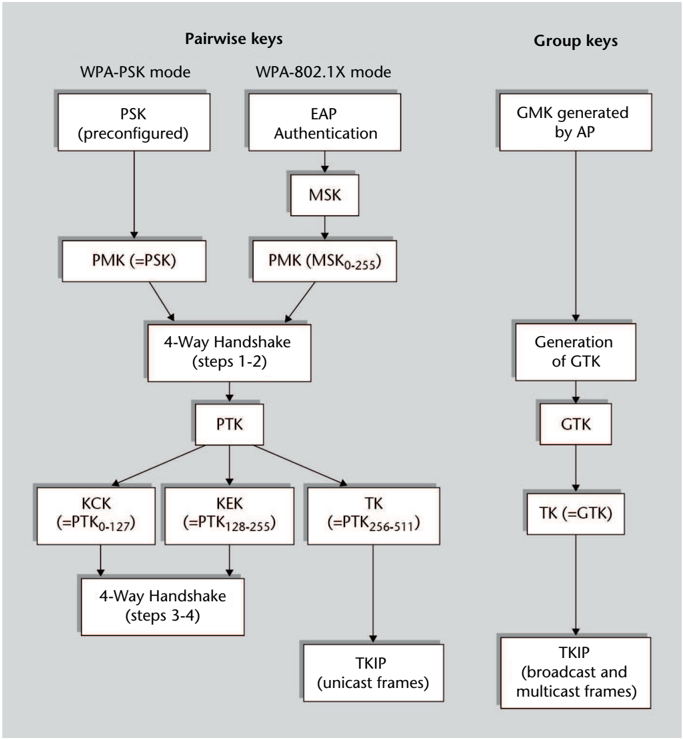

## EAP authentication methods used in WPA-802.1X

There are currently dozens of EAP methods, including those standardized by the IETF and those defined by various manufacturers. Some of the most commonly used ones in WPA-802.1X mode are the following:

- EAP-TLS . In this method, the communication with the authentication server, for example a RADIUS server, is protected by the TLS protocol with mutual authentication based on server and client certificates.
- EAP-TTLS (EAP-Tunneled TLS). It is a simplified variant of the previous method where client certificates are not required, which makes it much more practical. The TLS protocol is used to create a secure channel or 'tunnel' with only a server certificate. Then, client authentication is performed through this secure channel using another method, which can be, for example, password-based.
- PEAP (Protected EAP). It is a generic method to encapsulate client authentication inside another method with server authentication, for example based on TLS.

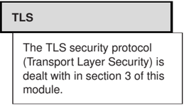

In addition to the steps to perform authentication, each of these methods also has to define how the value to be used as the master session key (MSK) is generated.

Methods such as EAP-TTLS or PEAP establish server authentication, but then another method needs to be used for client authentication. This other method can be, for example:

- EAP-MD5 . It is a challenge-response method. The response is an MD5 hash of a string consisting of the client's password and the challenge.
- EAP-MSCHAPv2 (EAP-Microsoft Challenge Handshake Authentication Protocol version 2). It uses the MSCHAPv2 protocol, defined in the RFC 2759 specification.
- EAP-GTC (EAP-Generic Token Card). It is also a challenge-response method in which the response is generated by a physical device such as a smartcard.

## TKIP encryption

In addition to the authentication method, the other fundamental change introduced in WPA with respect to WEP is the encryption algorithm, or to be more precise, the generation of encryption keys, given that the algorithm itself is the same: RC4. As was outlined before, this was decided to try to take advantage of the network card hardware that existed at the time.

The encryption scheme used in the WPA standard is called TKIP. The main differences compared to the WEP scheme are as follows:

- The key used to encrypt the data of each frame is not determined from a variable initialization vector and a fixed part. Instead, all the bits of the RC4 key are recalculated in each frame.
- TKIP frames incorporate a MIC code computed from a secret key, as a prevention against modification or truncation attacks such as chopchop. The MIC code does not replace but complements the ICV field. On the other hand, when fragmentation occurs, this code is calculated on the original frame before fragmentation, instead of having a MIC code for each fragment.
- To prevent injection attacks, the MIC code is not only calculated on the encrypted data but the MAC addresses of the source and destination stations are also added.
- Each frame includes a 48-bit sequence counter, called TSC, as a measure against replay attacks. This counter is reset to 1 each time a new TK temporal key is used. The counter N of a frame sent after another frame with counter M has to satisfy N &gt; M (if they are consecutive frames, it can be for example N = M + 1, but not necessarily). Frames received that do not follow this rule are discarded.

## MSK generation

In TLS-based EAP methods, the MSK is typically generated by applying a one-way function to the random bit strings used in the TLS negotiation phase (handshake protocol) and the master secret that is obtained from it.

## TKIP

TKIP stands for Temporal Key Integrity Protocol.

## MIC

MIC stands for Message Integrity Code, which is the nomenclature used by IEEE 802.11 to refer to the message authentication code so as to avoid confusion with Medium Access Control (MAC).

Some frames may have a priority assigned to them, and it may happen that frames of different priorities are received in a different order than they are sent. Therefore, sender and receiver have to maintain a separate TSC counter for each priority used (there can be a maximum of 8 different ones).

## Generation of TKIP encrypted frames

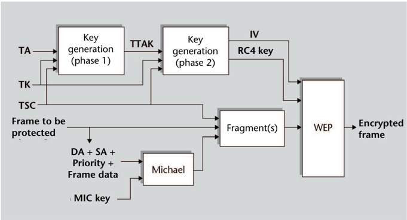

The process followed in the TKIP algorithm to generate an encrypted frame includes the following steps:

- 1) The MIC code is generated by applying an algorithm called Michael to the following inputs:
- The following information of the frame to be protected: the destination MAC address (DA), the source MAC address (SA), the priority and the data field.
- The 64-bit MIC key. To prevent replay attacks in the opposite direction, two different MIC keys are used for frames from the AP to the station and for frames from the station to the AP. The first is determined from bits 128-191 of the TK key and the second from bits 192-255 of the same key.

The Michael algorithm is a simple hash function with simple operations that can be computed very quickly. It is not, however, a secure hash function because it does not have the unidirectional property.

- 2) If necessary, fragmentation is applied to the frame plus the MIC code. Each fragment is assigned a different TSC counter, respecting the increasing order at all times.
- 3) A cryptographic function, called Phase 1 , is applied to the following inputs:
- The TK temporal Key determined in the 4-way handshake. The first 128 bits (0-127) of the TK key are used as the key for encryption.
- The MAC address of the transmitting station, TA.
- The TSC counter. For Phase 1, the 24 highest-weight bits of the counter are used.

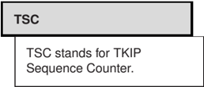

The outcome of Phase 1 is an 80-bit TTAK value (TKIP-Mixed Transmit Address and Key). This value is the same for all frames that have the same 24 highest-weight bits of the TSC counter and therefore it won't have to be recalculated each time.

- 4) Another cryptographic function, called Phase 2 , is applied to the following inputs:
- The TTAK outcome of Phase 1.
- The same encryption key as in Phase 1 (bits 0-127 of the TK key).
- The TSC counter. For Phase 2, the 24 lowest-weight bits of the counter are used.

The outcome of Phase 2 is a 128-bit RC4 encryption key, with 24 bits of IV and 104 bits of root key.

.

The main property of TKIP encryption is that the 104 bits of root key are different for each frame, so statistical attacks against WEP encryption are not applicable.

The IV is constructed in such a way that the first and third bytes are copied from the 16 lowest-weight bits of the TSC and the second byte is derived from the first one with the precaution that the outcome is not a weak IV, meaning that the second byte is not equal to 255.

- 5) Finally, the frame, or each frame fragment if it applies, is encrypted in the same way as in the WEP protocol.

TKIP frame data

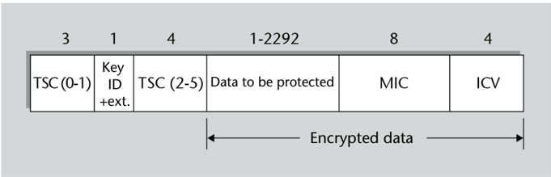

The structure of the TKIP encrypted frame that is generated is slightly different from that of regular WEP frames.

- The first field contains the IV , as in the WEP frames, but in this case it is obtained from the two lowest-weight bytes of the TSC.
- The next field has an extension bit set to indicate that an additional field follows.
- The additional extension field is used to include the rest of the TSC bytes (2-5).
- Following the frame data, and before the ICV field, the 64 bits of the MIC code are inserted.

## Vulnerabilities and countermeasures

The main vulnerability of the WPA system is that it permits the use of a shared key authentication mode, WPA-PSK. Even if a 256-bit PMK master key is used, if this key comes exclusively from a word that is more or less easy to remember, the space of possible keys is greatly reduced and a brute force attack becomes feasible. For example, the aircrack-ng tool allows you to perform a dictionary attack on the packets of the 4way handshake between a station and the AP. Unlike WEP attacks, where the greater the number of frames available, the faster the key can be determined, the WPA dictionary attack only needs the frames from a single handshake. In fact, two out of the four frames is enough. These frames can be obtained with airodump-ng , passively waiting for some station to establish an association with the AP or actively causing the association with the deauthentication mode of the aireplay-ng tool. The attack consists of testing, for each word in the dictionary, if the derived keys match the encrypted and authenticated content of the captured frames.

The bottom line is that if the WPA-PSK mode is used, the word to be chosen as key cannot be found in any dictionary, nor be part of any language, nor be a trivial combination of words (for example, a word written backwards). It is advisable to use long sentences, at least 20-character long, that do not contain dictionary words either.

The following figure shows an example of running the aircrack-ng tool to determine a WPA-PSK key with the dictionary attack. In less than a minute and a half, and after trying just over 28,000 dictionary words, in this example the tool has found that the key is the word 'funicular'.

Execution of a WPA dictionary attack

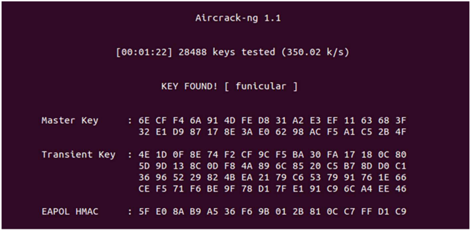

Regarding the TKIP protocol, as we have seen before, its design includes a series of cryptographic protections to prevent injection attacks, replay attacks, modification attacks, truncation attacks, etc. But in addition, the specification also includes a measure in the operation of the protocol to try to counteract attacks against the MIC code. The goal is to prevent trial and error attacks, such as the chopchop attack on the ICV. If an intruder managed to break the MIC code, they could inject correct frames. To prevent this, the TKIP protocol is designed to slow the rate at which attack attempts can be made. Specifically, the specification establishes that frames with incorrect CRC, ICV or TSC fields have to be ignored. But if these fields are correct and the MIC code is wrong, this has to be considered as a possible attack and flagged as such in the security logs. The station that detects the error has to send

## coWPAtty

In addition to aircrack-ng , there are other tools that make it easy to automate a dictionary attack against WPA-PSK authentication, such as coWPAtty .

a special type of EAPOL-Key frame to the AP, called Michael MIC failure report. And if two erroneous frames are detected in less than 60 seconds, the reception of TKIP frames has to be disabled for one minute. When it resets, the keys need to be renegotiated.

This implies that an attacker will not be able to make more than two attempts per minute. Even so, some attacks have been proposed, such as the so-called Beck-Tews attack, which in certain conditions would theoretically allow an intruder to decrypt the last 12 bytes of a frame (MIC and ICV) in just over 12 minutes. If it is an ARP frame with known content, the MIC key can be easily determined since the Michael algorithm is not designed to be unidirectional. And in 4 or 5 more minutes the attacker could get enough keystream to be able to inject certain types of frames.

## 1.5.2 WPA2

The WPA2 specification incorporates all the functionality of the IEEE 802.11i standard. The changes it introduces with respect to WPA are of two types:

- On the one hand, it defines mechanisms such as pre-authentication and the storage of master keys (PMK caching), which make the re-authentication of a mobile station faster and more efficient when it leaves a BSS and joins an adjacent BSS of the same ESS (roaming).
- On the other hand, it introduces a new encryption algorithm, called CCMP , which is not based on RC4 but on the AES-128 cipher. This encryption method is much more secure as there are currently no known significant vulnerabilities, and although it is not as easy to implement as RC4, it is considerably more efficient than most other existing block ciphers.

WPA2 systems are required to support CCMP encryption. For compatibility with WPA systems, the use of TKIP encryption is optional. In addition, the cryptographic algorithms used in the 4-way handshake when working with CCMP are AES (according to RFC 3394 standard) for encryption and HMAC-SHA1 for message authentication, instead of RC4 and HMAC-MD5 respectively.

CCMP encryption consists of utilizing the CCM mode with the AES block cipher with a 128-bit key, as defined in the RFC 3610 specification. CCM mode provides both message authentication and confidentiality, all with the same key. The CCMP key is 128 bits long and is derived, as in TKIP, from bits 0-127 of the TK temporal key.

- The MAC authentication code is generated by performing AES-128 encryption in CBC mode, using the technique known as CBC-MAC. The initialization vector, according to the CCM specification, has 1 byte of flags, 2 bytes indicating the data length, and the other 13 bytes have to be unique for each frame. To achieve this, these 13 bytes are constructed as follows:
- -1 byte encodes the priority.

## CCMP

CCMP stands for CTR with CBC-MAC Protocol.

## TK bits

The only bits needed in the CCMP protocol are the first 128 bits of the TK because they are used for both encryption and authentication. When working with CCMP , then, there is no need to generate 512 PTK bits in steps 2 and 3 of the 4-way handshake, just 384.

- -The next 6 bytes are the Medium Access Control (MAC) address of the transmitting station.
- -The last 6 bytes are a 48-bit Packet Number (PN) that is incremented with each frame. After this initialization vector, the next 2 blocks that are encrypted contain a combina-

tion of the invariant fields of the Medium Access Control (MAC) header of the frame.

After these 2 blocks, the data of the frame is encrypted, completed at the end with bytes equal to 0 if its length is not a multiple of 16. The first 64 bits from the result of encrypting the last block are taken, and this will be the MAC code that will authenticate the frame.

- The encrypted data is obtained by performing an encryption in 'counter mode' (CTR mode) according to the CCM terminology. For each block of data to be encrypted, an auxiliary block is constructed that has 1 byte of flags, 2 bytes containing a counter equal to 1 for the first block and is incremented with each subsequent block, and the other bytes equal to the unique 13 bytes used to generate the MAC code.

This auxiliary block is then encrypted with AES-128 and the outcome is added bit by bit (i.e. XORed) to the corresponding block to be encrypted, as if it were a stream cipher. If the length of the last block is less than 16 bytes, only the required encrypted auxiliary block bytes are used.

The MAC code obtained in the first step is also encrypted by adding it to another encrypted auxiliary block, in which the counter is equal to 0. The outcome is the MIC code, according to WPA terminology.

## Data of a CCMP frame

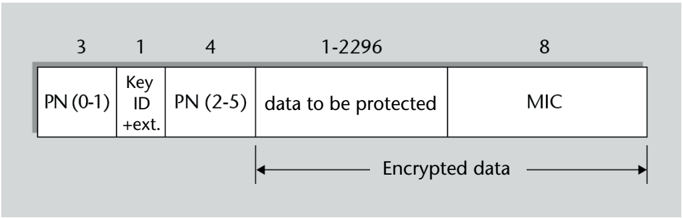

After performing message authentication and encryption, the CCMP encrypted frame can be generated. Its structure is similar to that of TKIP frames, replacing the TSC counter bytes with those of the PN packet number. The main difference is that CCMP does not include the ICV field. This field, which in TKIP serves to reinforce the MIC code based on the Michael algorithm, is not considered necessary in CCMP given the strength of CBCMACauthentication with the AES cipher.

The only known practical attacks on the WPA2 system are the same ones that affect the WPA system when PSK mode is used. That is, WPA2-PSK is exactly as vulnerable to dictionary attacks as WPA-PSK since these attacks act on the 4-way handshake and are independent of the encryption algorithm of the frames.

## CCM terminology

In the context of the CCM specification, 'MAC' means Message Authentication Code, and 'initialization vector' is used with the meaning normally given to it in block ciphers, that is, the random block that is used as if it were the one before the first block to be encrypted.

## 1.5.3 WPA3

The WPA3 specification, developed by the Wi-Fi Alliance, defines new authentication modes designed to provide a higher degree of protection than WPA2.

- The WPA3-Personal mode, suitable for home networks, replaces Shared Key (PSK) authentication with the SAE method, defined in the IEEE 802.11s standard.

SAE authentication is based on a key exchange called Dragonfly , defined in RFC 7664, which in turn relies on the Diffie-Hellman key exchange. Like in PSK authentication, in SAE authentication a preestablished shared password is used, as well as the MAC addresses of the participating devices (station and AP).

However, unlike PSK, it is not possible to make an offline dictionary attack against SAE, because in this case the attacker needs to actively conduct the protocol for every attempt to break authentication by brute force (remember that with PSK only the frames of a single exchange need to be captured to make the dictionary attack). WPA3 recommends limiting authentication attempts when it is detected that a trial and error attack may be in progress.

- The WPA3-Enterprise mode, appropriate for business environments, still uses IEEE 802.1X (EAP) authentication. However, it does not allow the use of the SHA-1 algorithm (160 bits) for key generation, it must be at least SHA-256. For more sensitive environments, there is a special mode called 192-bit WPA3-Enterprise , which makes use of stronger cryptographic algorithms for authentication (with 384-bit elliptic curves, or 3072-bit RSA keys) to negotiate frame authentication and encryption keys of at least 192 bits instead of 128.
- WPA3 also introduces an authentication mode called WPA3 Enhanced Open , which is equivalent to open system authentication but with key establishment for frame encryption. In fact, this mode does not provide authentication, only privacy, but it is useful in situations where public access is allowed on a Wi-Fi network (such as in cafes, airports, etc.) and managing access with passwords is not very practical, and yet it is desirable that the frames are not decipherable for an attacker who may be doing a passive listen.

The mechanism intended for secret key exchange in Enhanced Open mode is based on the OWE technique, as defined in the RFC 8110 specification, which in turn is based on the Diffie-Hellman exchange based on public keys (not authenticated) generated by each device.

In addition, the IEEE 802.11w standard specifies that it is mandatory to use the MFP scheme in WPA3, in which cryptographic methods are also used with the management frames sent after the 4-way handshake. In this way, protection services (confidentiality, integrity, data origin authentication and non-repetition) are provided not only to data frames, but also to deauthentication and disassociation frames. On the other hand, beacon frames,

## WPA3 and WPA2

WPA3 can be considered a particular case of WPA2 since WPA3 does not define new functionalities but makes advanced functionalities that are optional in WPA2 mandatory.

## SAE

SAE stands for Simultaneous Authentication of Equals.

## OWE

OWEstands for Opportunistic Wireless Encryption.

## MFP

MFP stands for Management Frame Protection.

association frames or authentication frames are not protected because they are sent prior to key negotiation.

The specification also defines certain transient modes called WPA3-Personal Transition mode and WPA3-Enterprise Transition mode, whereby WPA2 authentication methods (PSK and EAP with SHA-1, respectively) are allowed in order to facilitate coexistence of WPA3 and WPA2 stations in a BSS. In addition, a transient WPA3 Enhanced Open Transition mode is defined that allows the coexistence of Enhanced Open and traditional open system authentication.

## 2. Network Layer Protection: IPsec

In the previous section we have seen the basic protection of wireless communication networks. In the following sections we analyze the security of higher-layer communication protocols, applicable to both wired and wireless networks.

In this section we focus on the IPsec architecture, which is designed to protect the network protocol used on the Internet, i.e. the IP protocol. We discuss in subsequent sections mechanisms designed to provide security to communications at both the transport layer and application layer.

## 2.1 IPsec architecture

.

IPsec architecture (RFC 4301) adds security services to the IP protocol (version 4 and version 6), which can be used by higher-layer protocols (TCP, UDP, ICMP, etc.).

IPsec is based on the use of a series of secure protocols. Most services are provided by two of these protocols:

- The AH protocol (Authentication Header, RFC 4302) provides the service of data origin authentication of IP datagrams only (including the datagram header and data).
- The ESP protocol (Encapsulating Security Payload, RFC 4303) provides the following services: confidentiality only, data origin authentication of IP datagrams only (not including the header), or both at the same time.

Alternatively, each of these two protocols can also provide the additional service of datagram replay protection.

Certain keys need to be used for authentication and confidentiality, which correspond to the cryptographic algorithms used. One option is to configure these keys manually on the IPsec nodes. However, it is common practice to use other protocols for key distribution , such as:

- IKEv2 (Internet Key Exchange version 2, RFC 4306), which is the protocol applicable to IPsec by default. It combines and updates the functions formerly offered by IKEv1 (RFC 2409) and ISAKMP (Internet Security Association and Key Management Protocol, RFC 2408).
- The OAKLEY Key Exchange Protocol (RFC 2412)

## IPSec architecture versions

The first version of the IPSec architecture was published in 1995 in the RFC 1825-1827 specifications, which were updated by RFC 2401-2412 and later by RFC 4301-4309.

## Secure gateways

An IPsec router typically acts as a gateway, but in some communication it can also act as an end node, such as when it is sent configuration commands using the SNMP management protocol.

- KINK (Kerberized Internet Negotiation of Keys, RFC 4430)

The agents involved in the IPSec architecture are as follows:

- The end nodes of the communication: source and final destination of the datagrams.
- Intermediate nodes that support IPsec, called security gateways , such as routers or firewalls with IPsec.

IPsec traffic can also go through intermediate nodes that do not support IPsec. These nodes are transparent to the protocol because, to them, IPsec datagrams are like any other IP datagram.

The relationship established between two nodes that send IPsec datagrams to each other is called a Security Association (SA). These two nodes may or may not be the ends of the communication, that is, the source of the datagrams or their final destination. Therefore, we can distinguish two types of SA:

- End-to-end SAs. They are established between the node that originates the datagrams and the destination end node.
- SAs with a secure gateway. At least one of the nodes is a secure gateway (they both can be a secure gateway). Therefore, the datagrams come from another node and/or go to another node.

In addition, SAs are considered to be unidirectional, i.e. if A sends IPsec datagrams to B and B sends IPsec datagrams to A , we have two SAs, one in each direction.

Likewise, when an SA is established between two nodes, one of the two basic IPsec protocols is used: either AH or ESP. If both are to be used at the same time, two SAs have to be established, one for each protocol.

Therefore, it may happen that several SAs intervene in a communication between two end nodes, each one with its start and end nodes and with its protocol.

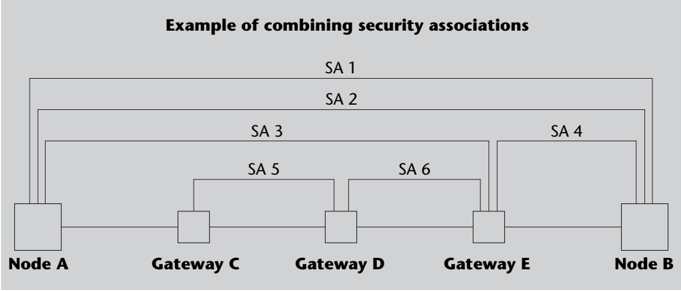

Each node must store information about its SAs, such as the cryptographic algorithms used by each one, keys, etc. In IPsec terminology, this information is stored in the Security Association Database (SAD). Each SA has a number called Security Parameter Index (SPI). All SAs that a node has established with another node must have different SPIs. Therefore, each SA in which a node participates is identified by the destination IP address and its SPI.

For each datagram that arrives at an IPsec node, a Security Policy Database (SPD) is consulted where criteria are specified to determine which of the following 3 actions should be performed:

- Apply IPsec security services to the datagram, i.e. process it according to AH and/or ESP.
- Process it as a normal IP datagram, that is, transparently to IPsec.
- Discard the datagram.

## 2.2 The AH Protocol

The AH protocol defines a header that contains the information necessary for the data origin authentication of a datagram.

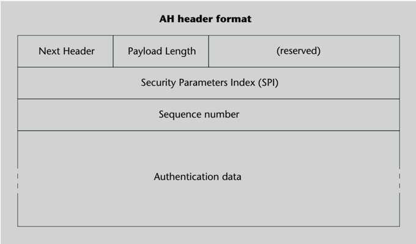

| of combining security associations Formato de la cabecera AH AH header format   | of combining security associations Formato de la cabecera AH AH header format   | of combining security associations Formato de la cabecera AH AH header format   |
|---------------------------------------------------------------------------------|---------------------------------------------------------------------------------|---------------------------------------------------------------------------------|
| Next Header                                                                     | Payload Length                                                                  | (reserved)                                                                      |
| Security Parameters Index (SPI)                                                 | Security Parameters Index (SPI)                                                 | Security Parameters Index (SPI)                                                 |
| Sequence number                                                                 | Sequence number                                                                 | Sequence number                                                                 |
| Authentication data                                                             | Authentication data                                                             | Authentication data                                                             |

The Next Header field is used to indicate which protocol the data that follows the AH header corresponds to. The Payload Length field indicates the length of the header (this information is needed because the last field is of variable length since it depends on the authentication algorithm).

The SPI field is used to identify which SA this AH header corresponds to, and the sequence number is used if the datagram replay protection service is to be provided.

Finally, the last field contains an authentication code, for example a MAC code, calculated according to the algorithm that corresponds to this SA. The code is obtained from the entire datagram, except for fields that may vary from node to node (such as the TTL and Checksum fields of the IP header), or those that have an unknown value a priori (like the authentication data field of the AH header itself).

The node that receives a datagram with an AH header will verify the authentication code, and if it is correct, it will consider it to be a good datagram and process it normally. If, besides, the replay protection service is used, it needs to verify that the sequence number is not repeated: if it is, the datagram is discarded.

## 2.3 The ESP Protocol

The ESP protocol defines another header, which actually includes all the data that come after it in the datagram (referred to as 'payload').

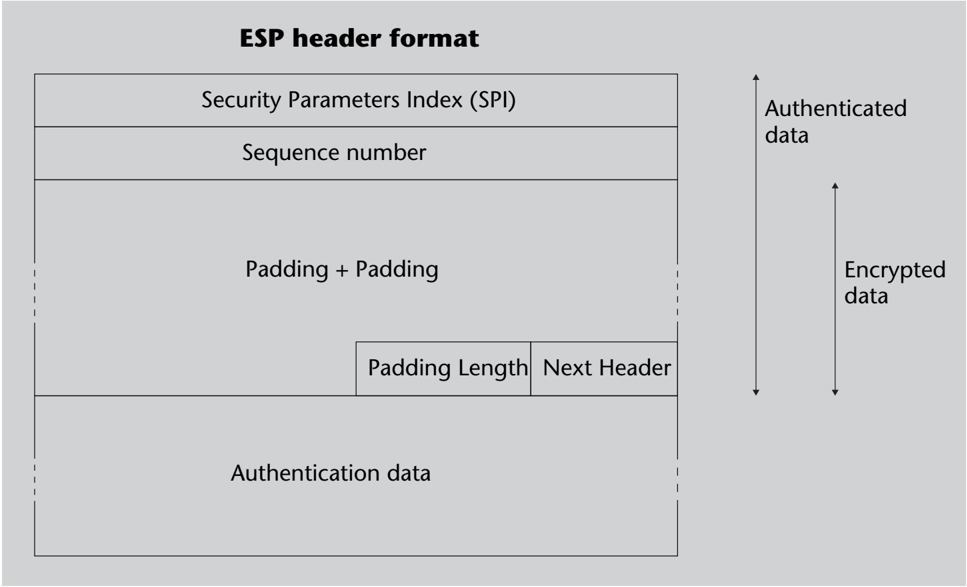

The SPI and sequence number fields are analogous to those in the AH header.

## Next Header field in AH

Possible values of the Next Header field are, for example, 6 (TCP), 17 (UDP), 50 (if followed by an ESP header), etc.

Next come the datagram data (payload), to which additional bytes (padding) may need to be added, if a block cipher algorithm is used, to make the number of bytes to be encrypted be a multiple of the block length. The Padding Length field indicates the exact number of bytes that have been added (it can be 0). The Next Header field indicates which protocol the datagram data is from.

Depending on the service or services provided by this ESP header, the data may be encrypted (including the padding, Padding Length and Next Header fields), an authentication code calculated from the ESP header may be added (but not calculated from any headers that may have come before it), or both at the same time.

The node receiving a datagram with an ESP header must verify the authentication code, decrypt the data, or both (in this order, because if the two services are applied, the data is first encrypted and then the encrypted data is authenticated). If the replay protection service is also used, the sequence number must also be checked. This last service, however, can only be used when the ESP header is authenticated.

The ESP protocol definition published in the RFC 4303 standard includes two additional techniques to provide the so-called Traffic Flow Confidentiality (TFC) that were not covered in previous versions. This flow confidentiality allows hiding the real volume of traffic between two nodes, making it look larger than it is, as well as other characteristics, such as periodicity, regularity, etc., and therefore it only makes sense if the data is encrypted.

- The ESP datagram can be expanded by adding a field called TFC padding, of arbitrary length, between the data (payload) and padding corresponding to the encryption. If this TFC padding is added, its total length must be deducible from another field of the subsequent protocol (IP, UDP, etc.) that allows knowing the effective length of the datagram.
- Encrypted datagrams without any useful content can also be sent to simulate that there is more traffic than is actually generated. All it takes is putting the Next Header field equal to 59 in these false datagrams, which corresponds to 'no protocol', and this way they will be discarded by the receiver.

Another change introduced in RFC 4303 from earlier versions is the possibility of using a combined mode , in which a single algorithm provides authentication and confidentiality, instead of using two separate algorithms, one for authentication and another for confidentiality. In this case, since the authenticated part of the datagram matches the encrypted one and the SPI and sequence number fields are not transmitted in encrypted form, these fields have to be used as parameters of the combined authentication and encryption algorithm.

## 2.4 IPsec protocol modes

The IPsec architecture defines two modes for the AH and ESP protocols, depending on how the corresponding headers are included in an IP datagram.

## Encrypted data in ESP

Depending on the encryption algorithm used, it may be necessary to previously include the encrypted data parameters, such as initialization vector, etc.

## Next Header field in ESP

The possible values of the Next Header field are the same as in the AH header: 6 (TCP), 17 (UDP), etc. If the data (payload) started with an AH header, the value would be 51, but applying ESP to a datagram with AH is not that common, as it is normally done the other way around.

- In transport mode , the AH or ESP header is included after the conventional IP header, as if it were a higher-layer protocol header, followed by datagram data (for example, a TCP segment with its corresponding header, etc.).
- In tunnel mode , the entire original datagram is encapsulated, with its header and data, inside another datagram. This other datagram will have an IP header in which the source and destination addresses will be those of the start and end nodes of the SA. Therefore, it is said that there is a 'tunnel' between these two nodes within which the original datagrams are left intact. Following the IP header of the 'external' datagram is the AH or ESP header.

The following figures show the layout of the IPsec headers in each mode when the datagram to be protected is IPv4 (the layout would be analogous for IPv6). In these figures, 'trailer ESP' refers to the Padding Length and Next Header fields of the ESP header.

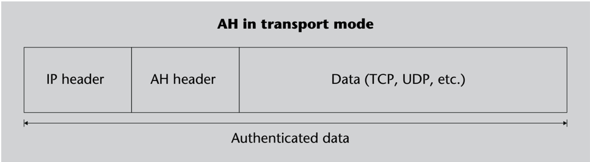

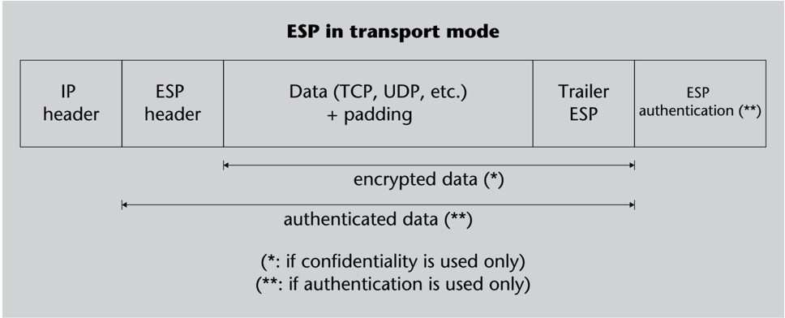

## AH in tunnel mode

| New IP header      | AH header          | Original IP header   | Data (TCP, UDP, etc.)   |
|--------------------|--------------------|----------------------|-------------------------|
| Authenticated data | Authenticated data | Authenticated data   | Authenticated data      |

| New IP header      | ESP header         | Original IP header   | + Data (TCP, UDP, etc.) + padding   | ESP trailer        | ESP authentication (**)   |
|--------------------|--------------------|----------------------|-------------------------------------|--------------------|---------------------------|
| Encrypted data (*) | Encrypted data (*) | Encrypted data (*)   | Encrypted data (*)                  | Encrypted data (*) | Encrypted data (*)        |

(*: if confidentiality is used only)

(**: if authentication is used only)

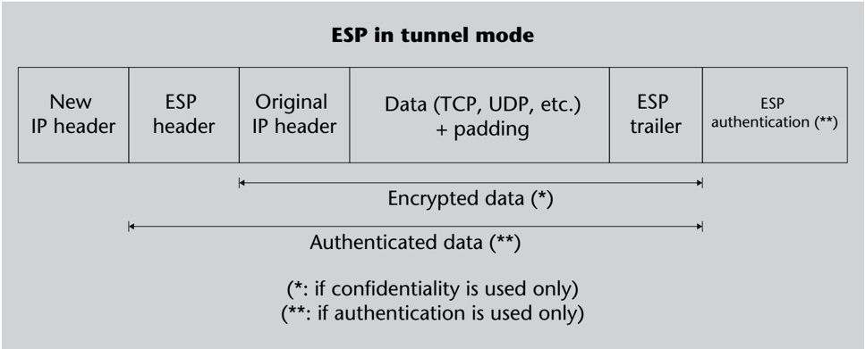

The IP protocol establishes that a datagram can be fragmented, and it may be the case that the fragments of the same datagram go through different paths until they arrive at their final destination. This would be a problem in an SA between secure gateways (or between an end node and a secure gateway) if transport mode were to be used: for example, some fragments might be left unprotected, others might be undecipherable because they did not go through the gateway that was meant to decipher them, etc. To avoid these situations, in IPsec transport mode is only allowed in end-to-end SAs.

Tunnel mode does not have this problem because, even though the SA is between gateways, each datagram has the destination address of the node at the end of the tunnel and all fragments eventually have to reach this node. Therefore, tunnel mode can be used in any SA, whether it is end-to-end or a secure gateway is involved.

There can be several SAs on the path between the source of the datagrams and the final destination, as we outlined before. This means that the AH and ESP header arrangements shown in the previous figures can be combined with each other. For example, there may be a tunnel within a tunnel, or a tunnel within an SA in transport mode, etc.

Another possible case is that of two SAs between the same source and destination nodes, one with the AH protocol and the other with the ESP protocol. In this case, the most logical order is to first apply ESP with confidentiality service and then AH since in this way the protection offered by AH (i.e. authentication) extends to the entire resulting datagram.

## Note

If tunnel mode cannot be used in an SA with a gateway, one solution is to do an unprotected encapsulation IP over IP (RFC 1853 or RFC 2003) within this SA and use IPsec in transport mode.

## 3. Transport Layer Protection: TLS

As we have seen in the previous section, the use of a secure protocol at the network layer may require adaptation of the communications infrastructure, for example changing IP routers for others that understand IPsec.

.

An alternative method that does not require modifications to the interconnection equipment is to introduce security into the transport protocols. The most used solution currently is the use of the TLS protocol or other protocols based on SSL/TLS.

This group of protocols comprises:

- The Secure Sockets Layer (SSL) transport protocol, developed by Netscape Communications in the early 1990s. The first widely spread and implemented version of this protocol was 2.0. Soon after, Netscape released version 3.0, with many changes compared to the previous one. Since the release of the TLS protocol, however, there have been no significant updates to the SSL protocol, which has become obsolete, and SSL has been officially deprecated since 2015 due to its known vulnerabilities (as specified in RFC 7568).
- The Transport Layer Security (TLS) protocol, developed by the Internet Engineering Task Force (IETF). Version 1.0 of the TLS protocol, which was published in 1999, was almost equivalent to SSL 3.0 with some minor differences, so when selecting the protocol in the initial negotiation, TLS 1.0 was considered to be the SSL 3.1 protocol.

Successive versions have been published since: TLS 1.1, TLS 1.2 (RFC 5246), TLS 1.3 (RFC 8446), which in the protocol selection during the initial negotiation are identified with the version numbers 3.2, 3.3 and 3.4, respectively. However, both TLS 1.0 and TLS 1.1 are currently considered too vulnerable for several reasons; for example, because no hash algorithm stronger than SHA-1 can be used in the initial negotiation. Therefore, according to RFC 8996, as of 2020 TLS 1.0 and TLS 1.1 are formally deprecated .

- The Wireless Transport Layer Security (WTLS) protocol, belonging to the Wireless Application Protocol (WAP) family of protocols for network access from mobile devices from the early 2000s, which nowadays it is practically obsolete. The WTLS protocol was an adaptation of TLS 1.0 to the bandwidth limitations of mobile communications at the time, and one of its characteristics was that it provided protection not only for TCP connections, but also for datagram mode communications.

- The Datagram Transport Layer Security (DTLS) protocol. This protocol is an adaptation of TLS for applications that use UDP as transport, such as real-time multimedia communications. The first version of DTLS, published in 2006, was based on TLS 1.0, while version 1.2 (RFC 6347) is based on TLS 1.2. DTLS provides confidentiality and authentication of datagrams, but not protection against replay or reordering of packets, as these situations are normally handled by higher protocols when working with datagrams.

In this section, we discuss the general characteristics common to TLS 1.2 and previous versions, as well as the differences with TLS 1.3, as they are more substantial. Since many of these general characteristics were also applicable to SSL, for historical reasons we will use the nomenclature SSL/TLS protocols even if the use of the SSL protocol is strongly discouraged today, as mentioned before.

## 3.1 Characteristics of the SSL/TLS protocol

The initial goal of the SSL protocol design was to protect connections between clients and web servers with the HTTP protocol. This protection was to allow the client to ensure that it had connected to the authentic server and could send it sensitive data, such as a credit card number, with confidence that no one but the server would be able to see this data.

The security functions, however, were not implemented directly in the HTTP application protocol and it was decided to introduce them at the transport layer instead. In this way, there could be many more applications making use of this functionality. To this end, an access interface to transport layer services was developed based on the standard socket interface and inspired by the concept of Secure Network Programming (SNP) proposed in the early 1990s. In this new interface, functions such as connect , accept , send or recv were replaced by other equivalent functions but that used a secure transport protocol instead: SSL connect , SSL accept , SSL send , SSL recv , etc. The design was made in such a way that any application that used TCP through socket calls could make use of the SSL protocol only by changing these calls. This is where the name of the protocol comes from.

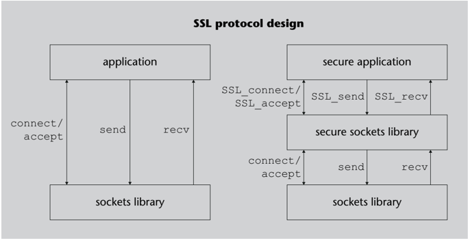

The security services provided by the SSL/TLS protocols are as follows:

Confidentiality . The normal flow of information in an SSL/TLS connection consists of exchanging packets with encrypted data using symmetric keys (for efficiency and speed). At the start of each session, client and server agree on which keys they will use to encrypt the data. Two different keys are always used: one for packets sent from the client to the server and another for packets sent in the opposite direction.

To prevent an intruder who is listening in from knowing what the agreed keys are in the initial dialogue, a secure key exchange mechanism based on public key cryptography is followed. The specific algorithm for this exchange is also negotiated during connection establishment.

Entity authentication . With a challenge-response protocol based on digital signatures, the client can confirm the identity of the server to which it has connected. To validate the signatures, the client needs to know the public key of the server, which is usually done through digital certificates.

SSL/TLS also provides authentication of the client to the server. This option, however, is not used as often because many times, instead of automatically authenticating the client at the transport layer, the applications themselves use their own authentication method.

Message authentication . In addition to being encrypted, each packet sent over an SSL/ TLS connection incorporates a MAC code so that the recipient can verify that no one has modified the packet. The secret keys for calculating the MAC codes (one for each direction) are also agreed securely in the initial dialogue.

Additionally, the SSL/TLS protocols are designed with these additional criteria:

Efficiency. Two of the characteristics of SSL/TLS, session definition and data compression, are designed to improve communication efficiency.

- If the client requests two or more simultaneous connections or in quick succession, instead of repeating the authentication and key exchange (these operations are computationally expensive because public key algorithms are involved), there is the option of reusing previously agreed parameters. If this option is used, the new connection is considered to belong to the same session as the previous one. When establishing each connection, a session identifier is specified, which allows us to know whether the connection starts a new session or is the continuation of another session.
- Early versions of SSL/TLS supported the negotiation of compression algorithms for exchanged data to compensate for the extra traffic that security brings with it. The compression methods are defined in the documents RFC 3749 and RFC 3943. In the TLS 1.3 protocol, however, the option to compress the data was removed as it could pose potential security vulnerabilities, as will be discussed later.

Extensibility. The SSL/TLS protocols can be extended by adding new cryptographic algorithms or a new functionality with TLS extensions.

## Client authentication

An example of client authentication at the application layer is passwords that users can enter into HTML forms. If the application uses this method, the server no longer needs to authenticate the client at the transport layer.

Consecutive or simultaneous connections

A typical situation where SSL/TLS is used is a web browser that accesses an HTML page containing images: with 'non-persistent' HTTP (the only mode defined in HTTP 1.0) this requires a first connection to the webpage, and then as many connections as there are images. If the connections belong to the same SSL/TLS session, the handshake only needs to be done once.

- The specifications of each SSL/TLS version include a list of encryption and authentication algorithms that can be negotiated by client and server, but the list can also be extended with algorithms that will be published later in the hope that they are more efficient or safer.
- As of TLS 1.0, the TLS extensions mechanism is introduced, which provides more flexibility when it comes to negotiating the functionalities that client and server will use in communication protection.

One of the most prominent extensions is Server Name Indication (SNI). The original SSL protocol did not specify a mechanism for the client to indicate the name of the server it wanted to connect to (that is, the equivalent of the Host : header of the HTTP protocol). This functionality is required for servers hosting multiple virtual servers; for example, to be able to send the client the appropriate server's public key certificate.

## 3.2 SSL/TLS secure transport

The secure transport layer provided by SSL/TLS has two sublayers.

- The upper sublayer is basically in charge of negotiating the security parameters and transferring the application data. Both negotiation and application data are exchanged in messages .
- In the lower sublayer, these messages are structured into records to which compression, authentication and encryption are applied, as appropriate.

The SSL/TLS record protocol makes it possible for the protected data to be conveniently encoded by the sender and interpreted by the receiver. The parameters necessary for protec-

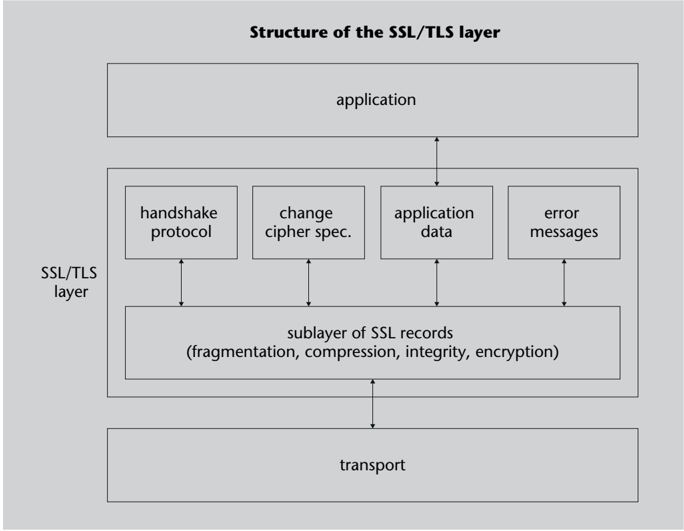

tion, such as algorithms and keys, are established securely when the connection is initiated using the SSL/TLS negotiation protocol . Next, we discuss the characteristics of each of these two protocols.

## 3.2.1 The SSL/TLS record protocol

The information that is exchanged between client and server in an SSL/TLS connection is packaged in records, which have this format:

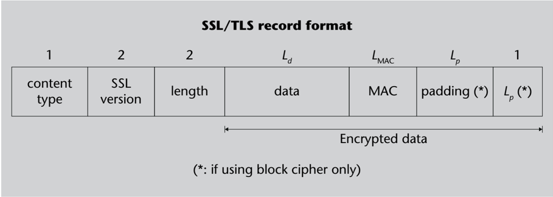

The meaning of each field is defined as follows:

- The first field indicates the type of data content, which can be:
- -a negotiation protocol message,
- -a change cipher message,
- -an error message, or
- -application data.
- The second field is two bytes indicating the protocol version: if they are equal to (3, 0), (3, 1) or (3, 2) the protocol is SSL 3.0, TLS 1.0 or TLS 1.1 respectively. TLS 1.2 uses the value (3, 3), whereas TLS 1.3 does not use this field, but for compatibility with previous versions it also sets this value to (3, 3).
- The third field indicates the length of the rest of the record. Therefore, it is equal to the sum of Ld and L M AC and, if the data is encrypted using a block algorithm, Lp + 1.
- The fourth field is the data, compressed if some compression algorithm has been agreed upon. As of TLS 1.1, when data is encrypted using a block cipher it must be preceded by the corresponding initialization vector (IV), randomly generated. With TLS 1.0, the CBC mode of operation was used and the IV of each block was obtained from the preceding block, but this mode was vulnerable to attacks such as block replay attacks.
- The fifth field is the authentication code (MAC). The calculation of this MAC involves the MAC key, an implicit 64-bit sequence number (which is incremented in each record but is not included in any field) and, naturally, the content of the record, that is, the four previous fields.

## Data of an SSL/TLS record

The data of a record normally corresponds to a message from the upper sublayer, but it is also possible to combine two or more messages in the same record, as long as they all belong to the type indicated by the first field. It may also be the case that a message is fragmented into several records, if its length is greater than a certain maximum (16384 bytes before compression).

The length of this field depends on the MAC algorithm that has been agreed to be used. It can be equal to 0 if the null algorithm is used, which is the one used at the start of the negotiation while no other has been agreed upon.

- If it has been agreed to use a block cipher to encrypt the data, additional bytes of padding must be added to each record to have a total number that is a multiple of the length of the block.

The technique used to find out how many extra bytes there are is to use at least one byte, and the value of the last byte always indicates how many other bytes of padding there are before (this value can be 0 if there was only one byte missing to get a whole block).

The SSL/TLS record protocol is responsible for forming each record with its corresponding fields, calculating the MAC and using the corresponding algorithms and keys to encrypt the data, the MAC and the padding.

In the handshake phase, as long as the algorithms have not been agreed, the records are not encrypted or authenticated, that is, null algorithms are run instead. However, the entire negotiation process is authenticated a posteriori, as will be discussed later.

## 3.2.2 The SSL/TLS handshake protocol

.

The SSL/TLS handshake protocol is intended to authenticate the client and/or server and agree on the algorithms and keys that will be used securely, that is, guaranteeing the confidentiality and integrity of the negotiation.

Like all SSL/TLS messages, the messages of the handshake protocol are included within the data field of the SSL/TLS records to be transmitted to the recipient. The structure of a handshake message is as follows:

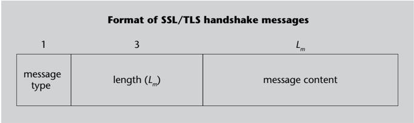

| Format of SSL/TLS handshake messages   | Format of SSL/TLS handshake messages   | Format of SSL/TLS handshake messages   |
|----------------------------------------|----------------------------------------|----------------------------------------|
| 1                                      | 3                                      | L m                                    |
| message type                           | length ( L m )                         | message content                        |

The content of the message will have certain fields depending on the type of handshake message being dealt with. There are 10 different types in total, which are presented below in the order in which they have to be transmitted.

## Padding in SSL and TLS

Another difference between SSL and TLS is in the use of bytes of padding. In SSL there must be the minimum necessary and their value is irrelevant (except for the last byte). In TLS all bytes of padding must have the same value as the last one.

## 1) Hello request

When a connection is established, the server normally waits for the client to initiate the negotiation. Alternatively, a Hello request message can be sent instead to let the client know that the server is ready to go. If the server wants to initiate a renegotiation during the session, it can also let the client know by sending a message of this type.

## 2) Client hello

The client sends a Client hello message when the connection is initiated or in response to a Hello request. This message contains the following information:

- The version of the protocol that the client wants to use.
- A random 32-byte string.
- Alternatively, the identifier of a previous session, if the client wants to reuse the parameters that have been agreed upon.
- The list of cryptographic algorithm suites that the client offers to use, in order of preference. Each suite includes the encryption algorithm, the MAC algorithm and the key exchange method. As of TLS 1.2, the suite also includes a pseudo-random function, or PRF, based on hash functions, which will be used to obtain certain secret values during the handshake.

## Cryptographic algorithms supported by SSL/TLS

The cryptographic algorithms that SSL/TLS allows to use have varied with the different versions:

- -Encryption: SSL 3.0 allowed RC2, RC4, DES, Triple DES, IDEA and FORTEZZA, while TLS 1.2 only maintains RC4 and Triple DES and adds AES.
- -MAC: SSL 3.0 allowed MD5 and SHA-1 and TLS 1.2 adds SHA-256.
- -Key exchange: SSL 3.0 allowed Diffie-Hellman, RSA and FORTEZZA KEA, while TLS 1.2 only supports Diffie-Hellman and RSA.

If we only want to authenticate the connection, without confidentiality, the null encryption algorithm can be sued to that end.

- The list of compression algorithms offered, in order of preference (there must be at least one, even if it is the null algorithm).
- As of TLS 1.0, the list of TLS extensions that the client wants to use. TLS 1.3 compiles about twenty extensions, such as supported versions, which is mandatory. If this extension is not present in a Client hello message, it means that the message corresponds to TLS 1.2 or to an earlier version.

## 3) Server hello

In response, the server sends a Server hello message, which contains this information:

- The protocol version to be used for the connection. The version will be the same as the one sent by the client, or an earlier one if it is not supported by the server.
- Another random 32-byte string.
- The identifier of the current session. If the client sent one identifier and the server wants to resume the corresponding session, it must reply with the same identifier. If the server

## Random bytes

Of the 32 random bytes that are sent in hello messages, the first 4 must be a timestamp with the precision set to seconds.

## Extensions to TLS 1.0

The original TLS 1.0 specification did not support TLS extensions and they were added in a later update (RFC 3546). As of TLS 1.2, the extensions mechanism is built into the protocol definition itself.

doesn't want to resume the session (or can't because it no longer saves the necessary information), the identifier sent will be a different one. Alternatively, the server may not send any identifier to indicate that the current session can never be resumed.

- The suite of cryptographic algorithms chosen by the server from the list sent by the client. If a previous session is resumed, this suite must be the same as the one used then.
- The compression algorithm chosen by the server, or the one used in the session being resumed.
- As of TLS 1.2, the list of TLS extensions requested by the client that the server agrees to use.

If client and server have decided to resume a previous session, they can now start using the previously agreed algorithms and keys and skip the messages that follow, going directly to those for completion of the handshake (Finished messages).

## 4) Certificate or Server key exchange

If the server can authenticate itself to the client, which is the most common case, it sends the Certificate message. This message will normally contain the server's X.509 certificate, or a certificate chain.

If the server does not have a certificate or a key exchange method that does not require one has been agreed upon, it must send a Server key exchange message, which contains the necessary parameters for the method to follow.

TLS 1.2 introduces a new key exchange method called RSA with Pre-Shared Key (PSK) and defined in the RFC 4279 specification. This method uses the Certificate message to send the server's certificate, and optionally the Server key exchange message to send the identifier of the PSK to be used, if client and server have previously agreed (for example, through manual configuration) on more than one shared key.

## 5) Certificate request

In case client authentication must also be performed, the server sends the client a Certificate request message. This message contains a list of the possible types of certificate that the server can support, in order of preference, and a list of certification authority DNs that the server recognizes.

## 6) Server hello done

To terminate this first phase of the dialogue, the server sends a Server hello done message.

## 7) Certificate

Once the server has sent its initial messages, the client already knows how to continue the handshake protocol. First, if the server has requested a certificate and the client has one of the requested characteristics, the client sends it in a Certificate message.

## 8) Client key exchange

The client sends a Client key exchange message whose content depends on the agreed key exchange method. In the case of using the RSA method, this message contains a 48-byte string that will be used as a pre-master secret, encrypted with the server's public key.

## Type of certificates

The SSL/TLS protocol supports the use of RSA, DSA or FORTEZZA KEA public key certificates (the latter only in SSL 3.0).

## Client without certificate

If the client receives a request for a certificate but does not have an appropriate one, in SSL 3.0 it should send a warning message, but in TLS 1.0 it should send an empty Certificate message. In either case, the server may respond with a fatal error or continue without authenticating the client.

Then, client and server compute a master secret , which is another 48-byte string. To make this calculation, the agreed PRF (or a combination of MD5 and SHA-1 if the protocol version is earlier than TLS 1.2) is applied to the pre-master secret and the random strings that were sent in the hello messages.

The following parameters are obtained from the master secret and the random strings:

- The two keys for symmetric data encryption (one for each direction: client to server and server to client).
- The two MAC keys (also one for each direction).
- In versions prior to TLS 1.1, the two initialization vectors (IVs) for the encryption, if a block algorithm is used. In TLS version 1.1 and later they are not necessary because each TLS record encrypted with a block algorithm has its own IV.

## 9) Certificate verify

If the client has sent a certificate in response to a Certificate request message, it can now authenticate by proving that it has the corresponding private key via a Certificate verify message. This message contains a signature, generated with the client's private key, of a string of bytes obtained from the concatenation of all the negotiation messages exchanged so far, from Client hello to Client key exchange.

## 10) Finished

From this point on, the negotiated cryptographic algorithms can already be used. Each party sends the other party a cipher change notification followed by a Finished message. The cipher change notification is used to indicate that the next message will be the first one sent with the new algorithms and keys.

The Finished message immediately follows the cipher change notification. Its content is obtained by applying the chosen PRF function (or a combination of MD5 and SHA-1 if the protocol version is older than TLS 1.2) to the master secret and the concatenation of all exchanged negotiation messages, from the Client hello message up to the one prior to this one (including the other party's Finished message, if it has already sent it). The client is usually the first one to send the Finished message, but if a previous session is being resumed, the server will send it first, right after the Server hello message.

The content of the Finished message is used to verify that the handshake has been carried out correctly. This message also allows authenticating the server to the client since the former needs its private key to decrypt the Client key exchange message and obtain the keys that will be used in the communication.

Once the Finished message is sent, the handshake is terminated and client and server can start sending application data using the algorithms and keys chosen.

The following diagrams sum up the messages exchanged during the SSL/TLS handshake phase:

## Protocol version attacks

A possible attack against the handshake is to modify the messages so that the two parties agree to use the SSL 2.0 protocol, which is more vulnerable. To prevent this attack, the first two bytes of the pre-master secret must contain the version number that was sent in the Client hello message.

## Authenticity verification in SSL and TLS

One of the main differences between SSL 3.0 and TLS 1.0 is in the technique used to obtain the verification codes of Finished messages and also to calculate the master secret and obtain the keys from this secret (in SSL hash functions are used directly, and in TLS HMAC codes are used).

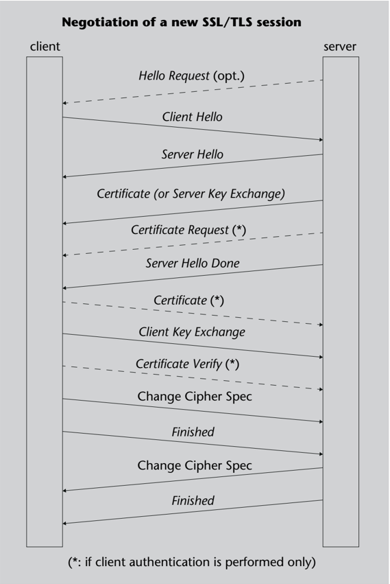

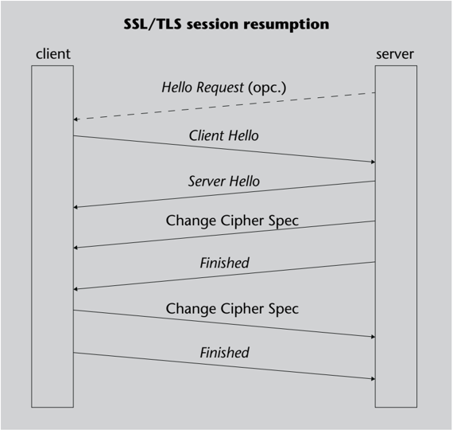

In addition to handshake messages, cipher change notifications and application data, error messages can also be transmitted. These messages contain a severity level code, which can be 'warning message' or 'fatal error', plus an error description code. A fatal error causes the end of the connection and invalidation of the corresponding session identifier, that is, the session cannot be resumed. Examples of fatal errors include: incorrect MAC, unexpected message type, handshake error, etc. (TLS 1.0 provides more error codes than SSL 3.0).

A warning message can also be sent to indicate the normal end of the connection. To prevent truncation attacks, if a connection ends without having previously sent this notice, its session identifier will be invalidated.

## 3.2.3 Changes introduced in TLS 1.3

TLS version 1.3 offers several improvements over older versions. Some of the main improvements are the following:

- Outdated and insecure cryptographic algorithms such as RC4, Triple DES, MD5, or SHA-1 are eliminated. Furthermore, encryption and authentication are not done independently; the Authenticated Encryption with Associated Data or AEAD (RFC 5116) technique is used instead. An AEAD algorithm enables sensitive data to be encrypted and conveyed along with associated unencrypted data and the MAC code of all data.

The parameters of an AEAD algorithm are the data to be encrypted, the associated data, a unique value for each encryption called nonce and the key (which is used for both encryption and authentication). The reverse algorithm (i.e. decryption and verification) receives the encrypted data, the associated data, the nonce, and the key and returns the decrypted data, or a verification error.

Anexample of an AEAD algorithm used in TLS 1.3 is AES-128 in CCM mode (counter with CBC and MAC) with SHA-256. In this algorithm, the encrypted data is obtained as in a stream cipher, whereby the keystream is generated by encrypting with AES a series of blocks constructed from the nonce and a sequential counter, while the MAC code is obtained by doing the XOR operation between the first of these encrypted blocks and the last block that results from encrypting a combination of the nonce, the associated data and the data to be encrypted with AES in CBC mode.

- The negotiation protocol is substantially modified and, consequently, some types of messages are eliminated (Hello request, Server key exchange, Server hello done, Client key exchange) and new ones are introduced (Hello retry request, New session ticket, End of early data, Encrypted extensions, Key update). Also, all messages after the Server hello message are sent in encrypted form and cipher change notifications are eliminated.
- An abbreviated negotiation protocol called Zero Round-Trip Time (0-RTT) is introduced, which allows conveying 'early' application data embedded in the same TLS

record of the Client hello message and the Server hello message. This negotiation can only be used at session resumption, or if client and server share a PSK.

- A new method is introduced to negotiate the version of the protocol to be used, which is not based on a field of the Client hello message, but on the supported versions TLS extension.
- Instead of using a PRF function chosen in the negotiation, the session keys are obtained by using the HKDF technique (HMAC-based Extract-and-Expand Key Derivation Function, RFC 5869).

## 3.3 Security and vulnerabilities of the SSL/TLS protocol

## 3.3.1 Security provided by SSL/TLS

The SSL/TLS protocols are designed to resist the following attacks:

Reading of packets sent by the client and server. When the data is sent in encrypted form, an attacker who can read the packets, for example through sniffing techniques, faces the problem of breaking the encryption if they want to interpret its content. The keys used for encryption are exchanged using public key methods, which the attacker would have to crack if they want to determine the agreed values.

It should be noted that depending on the application that uses it, the SSL/TLS protocol can be the object of attacks with known plaintext. For example, when used in conjunction with HTTP to access web servers with known contents.

If the communication is completely anonymous, that is, without server or client authentication, it is possible to capture the secret keys carrying out a 'man- in-the-middle' attack. In this attack, the spy generates their own public and private keys, and when one party conveys information about its public key to the other, in both directions, the attacker intercepts it and replaces it with the one equivalent with the forged public key. Since the exchange is anonymous, the recipient cannot know whether the public key it receives is that of the authentic sender or not.

By contrast, if server and/or client authentication is performed, it is necessary to send a certificate that must include the sender's public key signed by a certification authority that the receiver can recognize and that therefore cannot be replaced with another key.

Server or client impersonation. When server or client authentication is performed, the digital certificate duly signed by the CA serves to verify the identity of its owner. An attacker who wants to impersonate the authentic server (or client) would need to determine its private key, or that of the certification authority that issued the certificate, to be able to to generate another one with a different public key that looks authentic.

Packet alteration. An attacker can modify the packets so that they arrive at the destination with content different from the original (if they are encrypted, the intruder won't be able to determine the final decrypted content and they will only know that it will be different from the original). If this happens, the receiver will detect that the packet has been tampered with because the authentication code (MAC) will almost certainly be incorrect.

If the modification is made in the handshake messages when no MAC code has yet been applied, with the intent, for example, of forcing the adoption of weaker and more vulnerable cryptographic algorithms, this manipulation will be detected in the verification process of Finished messages.

Repetition, elimination or reordering of packets. If the attacker resends a correct packet that had already been sent before, or deletes a packet so that it does not reach its destination, or changes the order, the receiver will detect it because the MAC codes will not match the expected value. This is so because the MAC calculation uses a sequence number that is incremented with each packet sent.

Neither can messages sent in one direction (from client to server or from server to client) be copied and sent in the opposite direction. This is so because the two communication flows use different MAC and encryption keys.

As a final consideration, it should be noted that the strength of secure protocols lies not only in their design but also in their implementations. If an implementation only supports weak cryptographic algorithms (with few key bits), or generates easily predictable pseudorandom numbers, or stores secret values in storage (memory or disk) that is accessible by attackers, etc., it will not guarantee the security of the protocol.

## 3.3.2 Attacks against the SSL/TLS protocol

Despite the design decisions of the SSL/TLS protocol aimed at providing the greatest possible security, vulnerabilities have been discovered since the first versions and theoretical or practical attacks have been developed that exploit these vulnerabilities. This said, efforts have been made to correct these vulnerabilities in the subsequent versions. Below is a list of such attacks.

SSL/TLS stripping. This is a simple attack that simply modifies unsecured data to prevent subsequent data from being sent SSL/TLS-secured. For example, if an HTML page sent over HTTP contains HTTPS links, the attacker only needs to replace the string https:// with http:// .

One way of mitigating this attack is to have the server sending HTTPS redirect responses to requests that arrive via HTTP. However,if the original HTTP request contained sensitive data, such as session cookies, the attacker will have already seen them. Another way is to get the server to declare the use of the HSTS policy (RFC 6797) in the HTTP headers so that it is the client who automatically converts all subsequent HTTP requests to HTTPS.

Collection of attacks against TLS

You can find references to these attacks in the document RFC 7457 (rfc-editor.org/rfc/rfc7457).

HSTS

HSTS stands for HTTP Strict Transport Security.

Padding oracle attacks. A vulnerability in the CBC mode of operation of block ciphers is that the last encrypted block Cn , where the padding is, can be tampered with to reveal information about any preceding blocks.

In SSL 3.0, an attacker can copy an encrypted block Ci of an HTTP request, where, for example, there is supposed to be a session cookie, over the last block Cn . If the blocks are 8 bytes long and the attacker knows that the total length of the request is a multiple of 8 (or has been able to force it to be), in the last block there will be 8 bytes of padding and the last one would have to be equal to 7. If, when decrypting the modified Cn block, its last byte turns out to be 7 (with a probability of 1/256), the server will consider the last 8 decrypted bytes to be bytes of padding, it will discard them in the MAC code check, it will see that the MAC matches the correct one and it will not return an authentication error. Then if the attacker sees that there is no error, they will know the value of the last decrypted byte of Cn and, therefore, of Ci since we are in CBC mode and this value added to the last byte of Cn -1 has to be equal to 7. By changing the length of the HTTP requests they can determine the second last byte, the third last byte, etc., with an average of 128 attempts ('or oracle queries') for each byte.

This vulnerability was addressed in TLS 1.0 by making all bytes of padding (and not just the last one) have a certain value (with SSL 3.0, bytes of padding up to the penultimate one could be random). And for extra protection, the length of padding is not limited to one block, but it is possible to add two blocks or more of padding.

This protection measure, however, can be overcome by a variant of the attack that does not attempt to make the last byte of padding equal to 7 (or 15, if the block length is 16), but equal to 0. In this case, the padding will always be considered as valid because it doesn't have to have any other bytes, and the next step in the protocol is to verify the MAC code. On the contrary, if the last byte is not 0, the padding is most likely incorrect and it is no longer necessary to check the MAC. If the attacker can accurately measure the response time, they will be able to distinguish the two cases: when the response is faster, the MAC hasn't probably been verified and therefore the last decrypted byte was not equal to 0.

The countermeasure taken in TLS 1.1 is that even if the padding of a record is not correct, the receiver still has to do the MAC calculation before sending the error message.

Lucky thirteen attack. This is a more sophisticated oracle attack against padding of TLS 1.1 and TLS 1.2. Although there is no significant difference in response time between records with correct and incorrect padding, there may be some difference when the MAC is calculated over a different number of blocks.

The attack exploits the characteristic that all hash functions used in the TLS protocol (MD5, SHA-1 and SHA-256) work iteratively on blocks of 64 bytes, after having added an extra of between 9 and 63 bytes to the data to have an integer number of blocks. Thus, the hash of a string of up to 55 bytes is calculated in a single iteration, while strings of 56 bytes or more need more than one iteration.

## CBC cipher mode

Remember that in CBC mode, the ciphertext Ci is obtained from a block of plaintext Mi by doing Ci = e ( Ci -1 ⊕ Mi ) .

## Length of HTTP requests

A method for the attacker to control the length of HTTP requests is to make the victim visit a page with images having names of different lengths, supposedly hosted on the server to be attacked (they don't need to exist). For requests to contain cookies, the same origin protection must be bypassed, but this can be done with Java applets.

## Response time

Response time may be influenced by unpredictable variable factors that make comparisons difficult. This time is usually more regular if the attacker and the victim server are on the same LAN without too much packet traffic.

If, for example, the size of the MAC code is 20 bytes (as is the case with the SHA-1 algorithm), the attacker has to force client requests to have 64 encrypted bytes (that is, 4 blocks). If it happens that, by overwriting the last block, the last two bytes decrypted are (1, 1), the receiver will validate the padding and discard it, interpreting the remaining 62 bytes as 42 data bytes and 20 MAC bytes. Then it will check the MAC code using 13 header bytes (hence the name of the attack): 5 correspond to the first three fields of the record and 8 to the implicit sequence number. It will calculate the MAC code of 13 + 42 = 55 bytes in total, that is, with a single iteration of the hash algorithm. In contrast, if the last decrypted byte turns out to be 0, a single byte of padding will be discarded and the MAC check will be done on 56 bytes, which will require 2 iterations. And, in the most likely case, the padding will be random and incorrect, but the TLS specification suggests that in this case the (fake) MAC check is done as if there were 0 bytes of padding and, therefore, it will also require 2 iterations. In short, if the attacker sees that the response time is faster, they can deduce that the last manipulated block ends in (1, 1) and draw the corresponding conclusions.

BEAST attack. This attack is based on another vulnerability in CBC mode that has also been known for a long time, namely that a known plaintext attack allows the attacker to check whether or not the decrypted text Mi , corresponding to a cipher block Ci , is equal to an arbitrary value x . Indeed, if the attacker sets Mi + 1 equal to Ci ⊕ Ci -1 ⊕ x , the cipher block Ci + 1 will be e ( Ci ⊕ Mi + 1 ) = e ( Ci ⊕ Ci ⊕ Ci -1 ⊕ x ) = e ( Ci -1 ⊕ x ) , and this cipher block will be equal to Ci if x is equal to Mi . The BEAST attack (Browser Exploit Against SSL/TLS) is a refinement of this technique that allows, for example, a session cookie to be decrypted from a TLS 1.0-protected HTTP header byte by byte by getting the client to send an average of 128 requests for each byte to be decrypted.

TLS 1.1 neutralizes this attack by making the first CBC-cipher block of each TLS record not be concatenated with the last block of the preceding record and use a separate initialization vector (IV) for each record instead.

Attacks against RC4 encryption. Given the vulnerabilities in the CBC mode of operation - the only mode defined for block ciphers prior to TLS 1.3 -, some implementations were aimed at stream ciphers and the only encrypted stream envisaged was RC4. This algorithm, however, also has some significant vulnerabilities. For example, the way it was used in WEP protection of Wi-Fi networks made it possible to crack RC4 encryption relatively easily.

There is one vulnerability, however, that is more general and does not depend on how RC4 is used in a protocol, as the first 256 bytes of RC4 keystream generated with random keys do not tend to be evenly distributed when the number of samples grows, but there are certain biases or asymmetries. This can be exploited to decrypt the first few bytes of TLS records if around twenty million encrypted records corresponding to the same plaintext are available (these packets may correspond to HTTP requests and their first bytes may include a session cookie).

The solution to these attacks is simply not to use the RC4 algorithm, as specified by TLS 1.3.

Other combinations of the Lucky13 attack

If the response time is fast, it may also be that the last decrypted bytes are (2, 2, 2), or (3, 3, 3, 3), etc., although this is much less likely.

Compression-based attacks. The CRIME attack (Compression Ratio Info-leak Made Easy) is a known plaintext attack whereby the attacker forces the transmission of TLScompressed HTTP requests containing different character strings and looks at the size of the compressed TLS records. If the size is reduced, this means that there is more redundancy and that it is likely that other parts of the request - namely, a cookie session - match or resemble the text entered by the attacker. Using a directed exploration technique, with a tree diagram, the searched text can be retrieved with about 6 attempts per byte on average.

A form of the CRIME attack called TIME (Timing Info-leak Made Easy) does not look at the length of requests, but rather at that of responses, indirectly based on time of data transmission. The advantages are that it is easier for the responses to be compressed than the requests and that you do not have to capture the packets from the network, but the measurement of the time can be done, for example, using Javascript code.

TLS 1.3 neutralizes these attacks by removing the option of compressing data at the TLS level. There is another attack, however, called BREACH (Browser Reconnaissance and Exfiltration via Adaptive Compression of Hypertext), which is an adaptation of CRIME to compression at the HTTP level. The protection that TLS can offer in this case is to hide the actual length of the records, for example, using bytes of padding.

Version downgrade attacks. These attacks take place during the negotiation of the protocol version, making the client and server agree to use a lower version than the one they support. As a result of this, the protocol is vulnerable to one of the attacks previously mentioned. For example, the POODLE attack (Padding Oracle on Downgraded Legacy Encryption) forces the use of SSL 3.0 as the protocol to be used, despite the fact that the client and server support more modern versions, and it takes advantage of this situation to decrypt packets with an oracle attack.

To mitigate these attacks, the SCSV (Signaling Cipher Suite Value, RFC 7507) mechanism allows to detect whether or not the negotiation of a version earlier than the supported one is intentional. This mechanism is already covered in TLS 1.3, but can be used with any TLS version.

## 3.4 Application protocols using SSL/TLS

As explained at the beginning of this section, the SSL/TLS protocols were designed to allow protection of any application based on a transport protocol such as TCP. The following applications use this characteristic:

- HTTPS (HTTP over SSL/TLS): the most widely used protocol for secure web browsing today (RFC 2818).
- POP3S and IMAPS (POP3 and IMAP over SSL/TLS): for secure access to mailboxes.

- DoT (DNS over TLS, RFC 7858 and RFC 8310): to protect DNS domain name queries over both TCP (TLS) and UDP (DTLS). Unlike DNSSEC (RFC 4033-4035), which only provides authentication, DoT also provides confidentiality.
- Other: FTPS (FTP over SSL/TLS), NNTPS (NNTP over SSL/TLS), etc.

These applications with SSL/TLS work just like the original ones, with the difference that they use the secure transport layer provided by SSL/TLS and are assigned their own TCP or UDP port numbers: 443 for HTTPS, 995 for POP3S, 993 for IMAPS, 853 for DoT, etc.

In many other cases, however, it is preferable to use the extension mechanisms specified in the application protocol itself (if any) to negotiate the use of SSL/TLS, with the aim of preventing the unnecessary use of new TCP ports. This is the case of applications such as:

- TELNET, using authentication option (RFC 2941).
- FTP, using security extensions (RFC 2228).
- SMTP, using its extensions for SSL/TLS (RFC 3207).
- POP3 and IMAP, also using specific commands for SSL/TLS (RFC 2595).

There is also a mechanism defined to negotiate the use of SSL/TLS in HTTP (RFC 2817), as an alternative to HTTPS.

## 4. Virtual Private Networks (VPNs)

The secure protocols we have seen up to this point enable the protection of communications, for example, of an application implemented as a client process running on one computer and a server process running on another computer. If other applications also need secure communication between these two computers, or between computers located on the same local networks, they can make use of other instances of the secure protocols: new IPsec security associations, new SSL/TLS connections, etc. An alternative is to establish a Virtual Private Network (VPN) between these computers or the local networks where they are located. In this section, we discuss the main characteristics of virtual private networks.

## 4.1 Definition and types of VPN

.

A Virtual Private Network (VPN) is a configuration that combines the use of two types of technologies:

- Security technologies that allow the definition of a private network , that is, a means of confidential communication that cannot be intercepted by users outside the network.
- Protocol encapsulation technologies that enable that, instead of a dedicated physical connection for the private network, a public network infrastructure, such as the Internet, can be used to define a virtual network on top of it.

Therefore, a VPN is a logical or virtual network created on a shared infrastructure, but which provides the necessary protection services for secure communication. Depending on the situation of the nodes that use this network, three types of VPN are to be considered:

VPN between local networks or intranets. This is the typical case where a company has local networks in different locations, geographically separated, and in each of them there is a private network or intranet with restricted access to its employees. If it is desirable that one of its sites can access the intranets of other offices, a VPN can be used to interconnect these private networks and form a single intranet.

Remote access VPN. When a company employee wants to access the intranet from a remote computer, they can establish a remote access VPN between this computer and the company intranet. The remote computer can be, for example, a PC that the employee has at home, or a laptop from which they connect to the company network while traveling.

Extranet VPN. Sometimes, a company wants to share a part of its intranet resources with certain external users, such as company suppliers or customers. The network that allows these external accesses to an intranet is called an extranet , and protection is achieved using an extranet VPN.

## 4.2 Settings and protocols used in VPN

Each of the VPN types that we have just seen usually have a specific configuration.

- In VPNs between intranets, the most typical situation is that there is a VPN gateway in each intranet, which connects the local network to the Internet. This gateway communicates with that of the other intranets, applying the necessary encryption and protections to the communications from gateway to gateway through the Internet. When the packets arrive at the destination intranet, the corresponding gateway decrypts them and forwards them through the local network to the computer that has to receive them.

In this way, the public Internet infrastructure is used, instead of establishing dedicated private lines, which would entail a higher cost. It also takes advantage of the reliability and redundancy provided by the Internet since if a route is not available, the packets can always be routed through another path, while with a dedicated line, redundancy would still cost more.

- In remote access VPNs, sometimes called VPDNs, a user can communicate with an intranet through an Internet service provider, using conventional technology such as through an ADSL or optical fiber modem. The user's computer must have VPN client software to communicate with the VPN gateway of the intranet and perform the necessary authentication, encryption, etc.

In this way, the infrastructure of Internet providers is also used for access to the intranet, without the need for calls to a company modem, which can be costly.

- The case of extranet VPNs can be like that of VPNs between intranets, where secure communication is established between VPN gateways, or like that of remote access VPNs, where a VPN client communicates with the intranet gateway. But the difference in this case is that the access control is usually more restrictive to only allow access to authorized resources.

The definition of a virtual network is carried out by establishing tunnels , which allow packets from the virtual network, with its protocols, to be encapsulated within packets from another network, which is normally the Internet, with its protocol, that is, IP.

The most convenient protocols can be used for communication between the different intranets, or between the computer that gains access remotely and the intranet. To be able to reach their destination through the Internet, the packets of these protocols can be encapsulated in IP datagrams, which will contain the original packets inside them. When they

## VPDN

VPDN stands for Virtual Private Dial Network.

reach their destination, these datagrams are decapsulated to recover the packets with the 'native' format of the corresponding protocol.

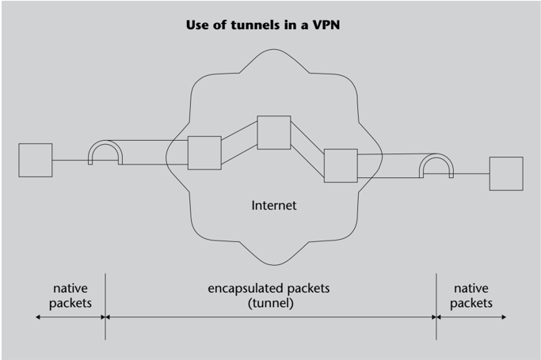

Some protocols can be used to establish tunnels, depending on the layer of communication at which protection is to be carried out.

Network layer tunneling. The protocol used in the vast majority of VPN configurations is IPsec in tunnel mode, usually with ESP to encrypt the data and with the option of using AH to authenticate the encapsulated packets. VPN gateways are, in this case, IPsec secure gateways.

Data link layer tunneling. In the case of remote access VPNs or VPDNs, there is the option of encapsulating PPP frames, which are the ones normally transmitted by a VPN client of this type, over IP datagrams. Several options exist for encapsulating PPP (which itself can encapsulate other network protocols, such as IPX etc. or possibly IP) over IP:

- The PPTP protocol (Point-to-Point Tunneling Protocol, RFC 2637) specifies a technique for encapsulating PPP frames but does not add authentication services. These services can be performed with the same protocols that PPP uses, such as PAP (Password Authentication Protocol) or CHAP (Challenge Handshake Authentication Protocol).
- The L2F protocol (Layer Two Forwarding, RFC 2341) is similar to PPTP but can also work with SLIP in addition to PPP. For authentication, it can use auxiliary protocols such as RADIUS (Remote Authentication Dial-In User Service).
- The L2TP protocol (Layer Two Tunneling Protocol, RFC 2661) combines the functionalities offered by PPTP and L2F.

Transport layer tunneling. The SSH (Secure Shell) protocol, as we will see in the module on security at the application layer, offers the possibility of redirecting TCP ports over a secure channel, which we can consider like a tunnel at the transport layer. From this perspective, you could also think of an SSL/TLS connection as a tunnel at the transport layer that provides confidentiality and authentication. Often times, this last type of tunnel is used for TCP data only and not just for any type of traffic and hence it is not considered an integral part of a VPN.

## 5. Web client authentication: captive portals

As an example of use of the communications protection techniques seen so far, in this section we examine the case of captive portals . Generally speaking, a captive portal is an application running on a web server that basically, like any other portal, provides access to a collection of web links in a unified way.

.

As suggested in its name, the particularity of captive portals is that they force the user to go through the portal page before being able to access any other link.

As we will see below, this can be used to make the user authenticate themselves by filling out a form with their name and password, pay in advance for the Internet connection they are about to use, or confirm having read the conditions of use of the service they will access, etc. Therefore, the captive portal technique makes it possible to ensure that certain conditions are met before allowing access to the network.

## 5.1 Captive portals used as an authentication system

A typical use of captive portals is to authenticate users before allowing them access to other network services. Unauthenticated users are 'captured' and forced to enter the portal web page, which allows for an interaction between the page (via a form, script, etc.) and the router, the firewall, or in general the system in charge of providing secure access to the network.

Thus, the captive portal manages to use the user's web browser as an authentication device. In this way, no specific application is required on the part of the client as the entire process is carried out through its browser.

On the part of server, the captive portal application is responsible for following the steps to complete the authentication and, when successful, allowing the user to access the desired service, such as connecting to a specific server or to the Internet in general. One way to do this is to change the packet filter rules and/or update the access control lists to accept packets that have the authenticated client as the source MAC or IP address.

## 5.2 Implementation techniques

Traditionally, three redirection-based techniques have been used to implement a captive portal. All three techniques get the client to initially go through the web page of the portal, even if the user requests another page.

1) IP redirection. It consists of redirecting the IP traffic of unauthenticated clients to the captive portal server. When the client sends an IP datagram with an external destination address, it will do so through the local network router. If the router sees that the datagram came from an unauthenticated client, it will send it an ICMP redirect message. This message will indicate that datagrams destined for the external address have to be directed to another router, which will actually be the captive portal server.

The server's IP layer has to be configured to accept datagrams addressed to external addresses and respond as if they were addressed to the server itself. And the response to HTTP requests, whatever the resource requested by the client, will be the main page of the portal.

2) DNS redirection. In the client configuration, typically carried out through DHCP, the portal's DNS server will be the DNS server. When the unauthenticated client requests a translation from DNS name to IP address, this server will respond with the portal server's address regardless of what the requested name is.

This ensures that the goal of the captive portal is reached. However, it must be kept in mind that the user could manually configure their computer to use an external DNS server, thereby bypassing the portal. One way of preventing this is by using a packet filter that blocks the DNS requests that try to go outside if they do not come from the local DNS server.

3) HTTP redirection. In this case, when the unauthenticated client sends an HTTP request, it will receive a response code 302 (Moved Temporarily) that will redirect it to the portal page.

In order for the client to receive this response, its original request has to be captured and forwarded to a redirect server , which can be the same web server as the captive portal or a separate one. The system in charge of forwarding the requests to the redirect server can be a firewall that intercepts the HTTP traffic coming from unauthenticated clients.

In any of the three cases, the Cache-Control and/or Expires HTTP headers returned by the portal's web server would have to prevent the client from saving the page obtained in its local cache. Thus, if, once authenticated, the client wants to access the page that it had initially requested, it will make the HTTP request to the real server afresh instead of retrieving the captive portal page.

On many occasions, the portal server will be on the same local network as the clients that want to access this server. But it could also be that it is in an external network, for example when the same server is used for several geographically dispersed Wi-Fi networks. In this case, the firewall system of each network must be properly configured so that it allows unauthenticated clients external access exclusively to the portal server. The same thing occurs if it is the DNS server that is on an external network.

## DNS response expiration

DNS responses to unauthenticated clients must have the Time to Live (TTL) field equal to 0 to prevent them from being cached locally and reused after having been authenticated.

## HTTP redirect server

The redirect server's sole function is to send 302 responses to the HTTP requests it receives. If the same portal server is used for this function, there must be a way to distinguish the original requests from the redirected ones to avoid infinite loops, e.g. by using different virtual servers, each with its own DNS name.

Since the previous methods based on redirects have characteristics that are very similar to man-in-the-middle attacks, and in fact there may be clients with a high level of protection that detect redirects as possible attacks, a new, 'cleaner' and more reliable technique has recently been defined to implement captive portals.

4) The 'captive portal' option of the DHCP protocol. This option, defined in the RFC 8910 standard, allows a DHCP server to inform clients that they are behind a captive portal, telling them the access URI to the services provided by the portal under the RFC 8908 standard.

## 5.3 Using captive portals

The most common use currently given to captive portals is as an authentication method to access Wi-Fi wireless networks. Today, Wi-Fi networks can be found in public places such as Internet cafes, restaurants, hotels, shopping malls, libraries, university campuses, stations, airports and many more. There are also town councils that have deployed Wi-Fi networks in all or part of the territory belonging to their towns.

In addition, there may be captive portals for wired networks in places such as hotel rooms, student dormitories, apartments for rent, etc. These places have ethernet connectors on the walls that allow Internet access. In both cases, the captive portal facilitates user authentication, or in general it makes it easier to check that access conditions are met without the need for any specific application on the clients' end.

## 5.3.1 Wired networks

When used on a wired network, the captive portal provides the initial method of authentication and the network can be used normally thereafter. Specifically, the user can use secure applications, communicate with secure protocols such as IPsec or SSL/TLS, establish connections through virtual private networks (VPN), etc.

If the portal server is on the local network, the user can generally trust its authenticity. A server on an external network may be easier to impersonate because the attacker does not need to have access to the local network. But attacks from within the local network are also possible, for example by sending fake redirects to a computer acting as a 'man in the middle'. Therefore, if the main page of the portal asks the user for their password, they have to make sure that at least the connection has been established through HTTPS.

In addition to that, the fact of using the network from a locatable physical access point (the room where the Ethernet connector is located, or the switch port to which it is connected) also makes it easier to identify the user for the purposes, for example, of charging them for the service involved.

## 5.3.2 Wireless networks: Wi-Fi hotspots

Public places where access to a Wi-Fi network is offered, usually through a captive portal, are known as hotspots .

The captive portal in a hotspot is responsible for performing authentication, but on many occasions it does not provide any other protection at the data link layer. In particular, unencrypted Wi-Fi communications, i.e. without WEP or WPA, and therefore with open system Wi-Fi authentication, may be the only option available. While it is true that secure protocols can be used at higher layers, the user has to be aware that their Wi-Fi frames can be seen by anyone close enough to them or the access point (AP). In this sense, then, the hotspot does not provide the same security that the wired network provides.

This can be convenient to facilitate connectivity with all kinds of devices, from old PDAs to the most powerful laptops. In this way, authentication to the hotspot can be done through a simple browser, by entering a name and a password. But the downside is that special attention must be paid to security at higher layers of communication.

In particular, the precautions regarding authenticity of the portal server that we have discussed for wired networks are even more applicable in the case of hotspots because it is easier to inject frames to perform an attack. It is not critical when the hotspot provides free access to the network and does not ask for credentials, but if a password is required to gain access, it is necessary to make sure that the captive portal server is the authentic one, for example through HTTPS.

## Security in hotspots

The security aspects that must be taken into account in hotspots are those specific to the captive portal networks that we have just discussed, plus those specific to wireless networks. If there is a Wi-Fi network without encrypted communications in the hotspot, we know that the frames sent at the data link layer can be eavesdropped on by anyone and fake frames with any data content and with any header can be injected. And if the network is protected with WEP or WPA-PSK, it is vulnerable to a PTW attack or a dictionary attack, respectively, to crack the key that allows access to the Wi-Fi network.

Apart from the possible attacks against the shared key of the hotspot, if that is the case, there are other attacks against the connecting clients, such as evil twin attacks and AP-less attacks.

In an evil twin attack, the attacker starts up a Wi-Fi station in AP mode using the same network name (SSID) as the hotspot. Victims will connect to this fake AP if their signal is stronger, for example because they are closer, or if the real AP is unresponsive due to a denial of service (DoS) attack. The attacker will then have access to the traffic generated by the victims' devices.

A user who uses a Wi-Fi device in a hotspot has normally preconfigured on a PNL list the SSIDs and the keys of the networks that they use on a regular basis: the one at home, the one at work, etc. When the Wi-Fi connection is activated, the device scans for the presence of the corresponding APs through their beacon frames. But if it doesn't detect them, it also has the possibility of actively searching for them by sending Wi-Fi management frames called probe frames .

In AP-less attacks, the attacker listens for probe frames sent by client computers in a hotspot. Given a probe frame which contains the sought SSID, the attacker can simulate an AP with this SSID, also known as a Wi-Fi honeypot. The client will try to authenticate to this fake AP using the corresponding key and the attacker can use this authentication to determine the value of the key.

- If it is a WEP-secured BSS, the attacker can obtain initialization vectors (IV) and keystream bytes from the client's initial requests encrypted with the BSS key and use this information to send encrypted ARP requests, which in turn will generate responses with more IVs. This is the basis of how the attacks called Caffe Latte and Hirte work. Under the most favourable conditions, the attacker can obtain enough initialization vectors to discover the WEP key with the PTW technique in a matter of minutes.
- If it is a BSS protected with WPA-PSK or WPA2-PSK, the fake AP sends the first message of the 4-way handshake and the victim responds with the second message and waits for the third message to arrive. This third message will not arrive because the AP cannot calculate it without knowing the PSK, but the attacker only needs the second one to be able to perform an offline dictionary attack and determine the value.

.

The main characteristic of non-AP attacks is that the attacker can crack the WiFi network key without having to be physically close. All it takes is for a device configured with the key of this network to be close to a hotspot.

The basic measures to prevent AP-less and evil twin attacks are to configure the Wi-Fi device not to send probe frames with the names of the networks it knows and to define a list of the MAC addresses of the authentic APs. Thus, the device can ask the user if it trusts an AP that has a MAC address that is not on the list. The user can respond positively if they are within range of the Wi-Fi network in question and then the new MAC address is automatically added to the list. But if the current location does not correspond to this Wi-Fi network, the AP will be considered suspicious and no authentication will be attempted.

## PNL

PNL stands for Preferred Network List.

## Caffe Latte attack

The attack was given this name because the typical places to carry it out are Internet cafes. Find more info at https://www.aircrackng.org/doku.php?id=cafelatte.

## Wi-Fi Privacy Policy

The article doi.org/10.4108 /icst.mobiquitous.2014.258025 describes an example app for Android devices, called Wi-Fi Privacy Police, which offers protection against fake AP attacks.

## Summary

In this module, we have seen that when confidentiality and authentication mechanisms are applied to communication protocols, this can be done at different layers. An example of protection at the data link layer is that of wireless communications, using the WEP , WPA , WPA2 and WPA3 protocols.

IPsec architecture can be used to secure communications at the network layer. It includes the AH and ESP protocols to authenticate IP datagrams and encrypt and/or authenticate the data of the IP datagrams, respectively. Some other protocols also exist for secure exchange of the necessary keys.

All communication between two network nodes using IPsec protocols belongs to a Security Association (SA). Each SA establishes the protocol to be used and in which of the two possible modes it works: transport mode , where the AH or ESP header acts as if it were the header of the upper data layer (transport), or tunnel mode, where a new IP datagram is built that has as data the original datagram conveniently protected. In SAs, transport mode can only be used in an end-to-end fashion, that is, from the node that originates the datagrams to the one that receives them.

There is also the option of protecting communications at the transport layer. In this case, the SSL/TLS protocols can be used, which use the standard TCP transport service. In these protocols there is an initial handshake that enables server authentication and, if applicable, client authentication, which is done through their certificates. The same handshake protocol is used to establish the session keys that will be used in the subsequent communication, such as the keys for the symmetric encryption of the data or the keys for the MAC codes.

The typical use of the SSL/TLS protocols is to transparently secure an application protocol such as HTTP. The HTTPS protocol is simply the combination of HTTP with SSL/TLS secure transport.

We have also discussed how Virtual Private Networks (VPNs) allow the public Internet to be used as if it were a dedicated private network, for example, between several intranets of the same organization. The basic technique used by VPNs is tunneling , in which the protected packets are encapsulated within IP datagrams that circulate normally through the Internet.

Finally, we have presented captive portals as an example of web applications that allow authenticating users who want to access certain services or the Internet in general.

## Glossary

AH: see Authentication Header .

AP: see Wi-Fi access point

.

Authentication Header (AH): IPsec architecture protocol that provides authentication of IP datagrams.

CRC: see Cyclic Redundancy Code .

Cyclic Redundancy Code (CRC): value calculated from a sequence of bits to confirm (within a margin of probability) that there has not been a transmission error when this sequence reaches the recipient.

Encapsulating Security Payload (ESP): IPsec architecture protocol that provides authentication and/or data confidentiality of IP datagrams.

ESP: see Encapsulating Security Payload .

Extranet: private network of an organization where part of its resources are accessible to certain users external to this organization.

HMAC: technique for calculating message authentication codes (MAC) based on hash functions.

Intranet: private, corporate network of an organization, with access restricted to users belonging to this organization.

IPsec: set of network-layer protocols (AH, ESP, etc.) that add security to the IP protocol.

IV: see WEP initialization vector .

Man-in-the-middle attack: authentication attack on communications using secure protocols whereby the attacker intercepts authentication messages and replaces them with messages with changed public keys, such that spoofing can occur if authenticity of these keys is not verified.

Padding: additional data that may need to be added to a plaintext before a block cipher is applied to it so that its length is a multiple of the block length.

Pre-Shared Key: fi xed secret key that must be configured in an AP and in the stations that want to connect; in the WPA family protocols is used to calculate the session keys for each association.

PSK:

see Pre-Shared Key .

Pyshkin-Tews-Weinmann (PTW) attack : attack against the WEP protection of Wi-Fi networks that makes it possible to discover the WEP key from a relatively small number of captured frames (less than 50,000 for a success probability of 90%).

SA: see Security Association .

Secure Sockets Layer (SSL): protocol to secure communications at the transport layer that offers secure communication services similar to those offered by the sockets interface.

Security Association (SA): relationship between a source node and a destination node that use one of the IPsec protocols (AH or ESP) to send protected IP datagrams.

Security Parameter Index (SPI): a number that, together with the IP address of the destination node, allows a source node to identify an IPsec security association.

Service Set Identifier: a string of up to 32 bytes or characters that is used to identify a Wi-Fi network or group of wireless devices that communicate directly with each other.

SPI:

see Security Parameters Index .

SSID:

see Service Set Identifier .

SSL:

see Secure Sockets Layer .

TLS:

see Transport Layer Security .

Transport Layer Security (TLS): version of the SSL protocol standardized by the IETF (Internet Engineering Task Force).

Tunnel: association between two nodes of a network to exchange packets of a certain protocol, possibly with source and final destination in other nodes, encapsulated in packets of the communication protocol used by the network (typically, the network is the Internet and the encapsulation protocol is IP).

Virtual Private Network (VPN): logical (virtual) network defined over a public network, such as the Internet, which works through tunnels as if it were a dedicated private network.

VPN: see Virtual Private Network .

WEP: see Wired Equivalent Privacy .

WEP initialization vector: the 24-bit non-secret part of the encryption key of a WEP frame, which is sent at the beginning of the frame and which, together with the 104-bit WEP root key common to all associations with the same AP, makes up the 128-bit RC4 key used to encrypt the frame.

Wi-Fi access point: a device on a wireless network that acts as a router and allows other devices on the same network to connect to other networks (typically, the Internet).

Wi-Fi Protected Access: a family of protocols (WPA, WPA2, WPA3) that define more robust protection methods for Wi-Fi frames than the one defined by the WEP specification of the original IEEE 802.11 standard.

Wi-Fi station: a device capable of using the IEEE 802.11 protocol to communicate wirelessly with other devices.

Wired Equivalent Privacy: a method of protecting Wi-Fi frames defined by the original IEEE 802.11 standard and replaced by the WPA standard due to its weaknesses.

Wireless Transport Layer Security (WTLS): TLS protocol version adapted to wireless communications in a WAP environment (Wireless Application Protocol).

WPA:

see Wi-Fi Protected Access .

WTLS:

see Wireless Transport Layer Security .

## Bibliography

[1] Yuan, R.; Strayer, W. T. (2001). Virtual Private Networks, Technologies and Solutions. Boston: AddisonWesley.

[2] Stallings, W. (2020). Cryptography and Network Security, Principles and Practice, 8 th ed. London: Pearson.