## Security in the application layer

PID\_00293494

Xavier Perramon Tornil

Recommended minimum reading time: 5 hours Xavier Perramon holds a PhD in Telecommunications Engineering from the Universitat Politècnica de Catalunya (UPC). He has worked as a security consultant in ICT systems. He is currently a professor of Information Systems at the UPC's Escola Superior d'Enginyeries Industrial, Aeroespacial i Audiovisual (ESEIAAT) in Terrassa.


Xavier Perramon Tornil


The review of this UOC Learning Resource has been coordinated by the lecturer: Victor Garcia Font

## How￿to￿cite￿this￿learning￿resource￿as￿per￿the￿Harvard￿style:

Perramon, X. (2023) Security in the application layer [Textual learning resource]. 1st ed. Barcelona: Fundació Universitat Oberta de Catalunya (FUOC).

First edition: February 2023 Av. Tibidabo, 39-43, 08035 Barcelona Authorship: Xavier Perramon Tornil

© of this edition, Fundació Universitat Oberta de Catalunya (FUOC)

Production: FUOC

Permission is granted to copy, distribute and/or modify this document under the terms of the GNU Free Documentation License, Version 1.3 or any later version published by the Free Software Foundation; with no Invariant Sections, no Front-Cover Texts, and no Back-Cover Texts. The terms of the license can be consulted in http://www.gnu.org/licenses/fdl-1.3.html.

## Contents

| Introduction . . . . . . . . . . . . . . . . . . . . . . . . . . . . . . . . . . . . . . . . . . . . . . . . . . . . . . . . . . . . . . . . . . . . 5   | Introduction . . . . . . . . . . . . . . . . . . . . . . . . . . . . . . . . . . . . . . . . . . . . . . . . . . . . . . . . . . . . . . . . . . . . 5   | Introduction . . . . . . . . . . . . . . . . . . . . . . . . . . . . . . . . . . . . . . . . . . . . . . . . . . . . . . . . . . . . . . . . . . . . 5   |   Introduction . . . . . . . . . . . . . . . . . . . . . . . . . . . . . . . . . . . . . . . . . . . . . . . . . . . . . . . . . . . . . . . . . . . . 5 |
|----------------------------------------------------------------------------------------------------------------------------------------------------------|----------------------------------------------------------------------------------------------------------------------------------------------------------|----------------------------------------------------------------------------------------------------------------------------------------------------------|----------------------------------------------------------------------------------------------------------------------------------------------------------|
| Objectives . . . . . . . . . . . . . . . . . . . . . . . . . . . . . . . . . . . . . . . . . . . . . . . . . . . . . . . . . . . . .                     | Objectives . . . . . . . . . . . . . . . . . . . . . . . . . . . . . . . . . . . . . . . . . . . . . . . . . . . . . . . . . . . . .                     | Objectives . . . . . . . . . . . . . . . . . . . . . . . . . . . . . . . . . . . . . . . . . . . . . . . . . . . . . . . . . . . . .                     |                                                                                                                                                        6 |
| 1.                                                                                                                                                       | The SSH protocol . . . . . . . . . . . . . . .                                                                                                           | . . . . . . . . . . . . . . . . . . . . . . . . . .                                                                                                      |                                                                                                                                                        7 |
|                                                                                                                                                          | 1.1                                                                                                                                                      | Characteristics of the SSH protocol . . . . . . . . . . . . . . . . . .                                                                                  |                                                                                                                                                        7 |
|                                                                                                                                                          | 1.2 The                                                                                                                                                  | SSH transport layer . . . . . . . . . . . . . . . . . . . . . . . . . . . . .                                                                            |                                                                                                                                                        8 |
|                                                                                                                                                          | 1.2.1                                                                                                                                                    | The SSH packet protocol . . . . . . . . . . . . . . . . . . . .                                                                                          |                                                                                                                                                        9 |
|                                                                                                                                                          | 1.2.2                                                                                                                                                    | The SSH transport layer protocol . . . . . . . . . . . .                                                                                                 |                                                                                                                                                       11 |
|                                                                                                                                                          | 1.2.3                                                                                                                                                    | The user authentication protocol . . . . . . . . . . . . .                                                                                               |                                                                                                                                                       12 |
|                                                                                                                                                          | 1.2.4                                                                                                                                                    | The connection protocol. . . . . . . . . . . . . . . . . . . . .                                                                                         |                                                                                                                                                       14 |
|                                                                                                                                                          | 1.3                                                                                                                                                      | Attacks against the SSH protocol . . . . . . . . . . . . . . . . . . . .                                                                                 |                                                                                                                                                       16 |
|                                                                                                                                                          | 1.4                                                                                                                                                      | Applications using the SSH protocol . . . . . . . . . . . . . . . . .                                                                                    |                                                                                                                                                       17 |
| 2.                                                                                                                                                       | Secure email . . . . . . . . . . . . . . . . . . . . . . . . . .                                                                                         | . . . . . . . . . . . . . . . . . . . .                                                                                                                  |                                                                                                                                                       19 |
|                                                                                                                                                          | 2.1 Email                                                                                                                                                | security. . . . . . . . . . . . . . . . . . . . . . . . . . . . . . . . . . . . . . .                                                                    |                                                                                                                                                       20 |
|                                                                                                                                                          | 2.1.1                                                                                                                                                    | Privacy . . . . . . . . . . . . . . . . . . . . . . . . . . . . . . . . . . . . .                                                                        |                                                                                                                                                       21 |
|                                                                                                                                                          | 2.1.2                                                                                                                                                    | Message authentication . . . . . . . . . . . . . . . . . . . . .                                                                                         |                                                                                                                                                       23 |
|                                                                                                                                                          | 2.1.3                                                                                                                                                    | Compatibility with non-secure mail systems .                                                                                                             |                                                                                                                                                       23 |
|                                                                                                                                                          | 2.2 S/MIME . . . . . . . . . . . . . . . . . . . . . . . . . . . . . . . . . . . . . . . . . . . . . . . . . . . . . .                                   | 2.2 S/MIME . . . . . . . . . . . . . . . . . . . . . . . . . . . . . . . . . . . . . . . . . . . . . . . . . . . . . .                                   |                                                                                                                                                       24 |
|                                                                                                                                                          | 2.2.1                                                                                                                                                    | The PKCS #7/CMS format . . . . . . . . . . . . . . . . . .                                                                                               |                                                                                                                                                       26 |
|                                                                                                                                                          | 2.2.2                                                                                                                                                    | S/MIME message format . . . . . . . . . . . . . . . . . . . .                                                                                            |                                                                                                                                                       31 |
|                                                                                                                                                          | 2.2.3                                                                                                                                                    | Key distribution with S/MIME . . . . . . . . . . . . . .                                                                                                 |                                                                                                                                                       35 |
| 2.3                                                                                                                                                      | PGP                                                                                                                                                      | and OpenPGP...... . . . . . . . . . . . . . . . . . . . . . . . . . . . .                                                                                |                                                                                                                                                       36 |
|                                                                                                                                                          | 2.3.1                                                                                                                                                    | PGP message format . . . . . . . . . . . . . . . . . . . . . . . .                                                                                       |                                                                                                                                                       38 |
|                                                                                                                                                          | 2.3.2                                                                                                                                                    | PGP key distribution . . . . . . . . . . . . . . . . . . . . . . . .                                                                                     |                                                                                                                                                       41 |
|                                                                                                                                                          | 2.3.3                                                                                                                                                    | PGP certification process . . . . . . . . . . . . . . . . . . . .                                                                                        |                                                                                                                                                       42 |
|                                                                                                                                                          | 2.3.4                                                                                                                                                    | PGP integration with email . . . . . . . . . . . . . . . . . .                                                                                           |                                                                                                                                                       43 |
| 2.4                                                                                                                                                      | Protection against other attacks . .                                                                                                                     | . . . . . . . . . . . . . . . . . . . .                                                                                                                  |                                                                                                                                                       47 |
|                                                                                                                                                          | 2.4.1                                                                                                                                                    | DKIM........ . . . . . . . . . . . . . . . . . . . . . . . . . . . . . .                                                                                 |                                                                                                                                                       49 |
|                                                                                                                                                          | 2.4.2                                                                                                                                                    | SPF . . . . . . . . . . . . . . . . . . . . . . . . . . . . . . . . . . . . . . . .                                                                      |                                                                                                                                                       52 |
|                                                                                                                                                          | 2.4.3                                                                                                                                                    | DMARC . . . . . . . . . . . . . . . . . . . . . . . . . . . . . . . . . . .                                                                              |                                                                                                                                                       53 |
|                                                                                                                                                          | 2.4.4                                                                                                                                                    | ARC . . . . . . . . . . . . . . . . . . . . . . . . . . . . . . . . . . . . . . .                                                                        |                                                                                                                                                       55 |
| Summary . . . . . . . . . . . . . . . . . . . . . . . . . . . . . . . . . . . . . . . . . . . . . . . . . . . . . . .                                    | Summary . . . . . . . . . . . . . . . . . . . . . . . . . . . . . . . . . . . . . . . . . . . . . . . . . . . . . . .                                    | Summary . . . . . . . . . . . . . . . . . . . . . . . . . . . . . . . . . . . . . . . . . . . . . . . . . . . . . . .                                    |                                                                                                                                                       57 |
| Glossary . . . . . . . . . . . . . . . . . . . . . . . . . . . . . . . . . . . . . . . . . . . . . . . . . . . . . . . . .                               | Glossary . . . . . . . . . . . . . . . . . . . . . . . . . . . . . . . . . . . . . . . . . . . . . . . . . . . . . . . . .                               | Glossary . . . . . . . . . . . . . . . . . . . . . . . . . . . . . . . . . . . . . . . . . . . . . . . . . . . . . . . . .                               |                                                                                                                                                       59 |
| Bibliography . . . . . . . . . . . . . . . . . . . . . . . . . . . . . . . . . . . . . . . . . . . . . .                                                 | Bibliography . . . . . . . . . . . . . . . . . . . . . . . . . . . . . . . . . . . . . . . . . . . . . .                                                 | . . .                                                                                                                                                    |                                                                                                                                                       63 |

## Introduction

This module describes applications that make use of communications security techniques to protect data exchange.

An example of applications that must be protected is those that allow interactive work sessions to be established with a remote server. The first part of the module looks at one such application, called SSH , which defines its own protocol so that the application's data are transmitted in encrypted form. The same protocol also provides authentication mechanisms of the server to the user and of the user to the server. We also look at how the SSH protocol can be used for applications other than interactive sessions since it allows TCP connections to be encapsulated on any port within a SSH connection.

The second part of this module focuses on another of the main applications that usually needs protection: electronic mail . With the appropriate protection mechanisms in place, we can guarantee confidentiality , that is, that no one other than the legitimate recipient or recipients can see the content of the messages, as well as authenticity , that is, that the recipients can verify that no one has falsified the information in a message. Current email systems typically use digital signatures to provide the message authentication service.

Apeculiarity of secure email compared to other applications such as SSH is that protection is applied preferably to the messages sent, rather than to the communication protocols used. This is so because confidentiality and authenticity have to be guaranteed not only during message transmission, but at any other time afterwards, since the recipient can save the messages received and read them again when convenient.

In this module we discuss two of the main systems currently used to protect email messages: S/MIME and PGP . We also look at mechanisms such as DKIM and SPF , which are used to prevent and mitigate domain spoofing attacks, the most common attacks used to perform digital fraud by email or phishing.

## Objectives

The materials for this teaching module will allow the student to achieve the following objectives:

1. To know the general operating mechanism of the SSH protocol and the main applications that use it.
2. To understand the security functions that can be provided by secure mail systems and the mechanisms used to obtain them.
3. To know the method of representing secure information in PGP and the trust model of the PGP system.
4. To identify the S/MIME standard as an application of the MIME specification to secure mail, and know how the PKCS #7 standard and the X.509 digital certificates are put to use.
5. To understand that protection tools against domain spoofing attacks, such as DKIM or SPF, make it easier to fight email phishing.

## 1. The SSH protocol

.

SSH is an application designed to replace certain remote access tools traditionally used on Unix systems, such as rsh (Remote Shell), rlogin (Remote Login) or rcp (Remote Copy), with new versions with security services.

SSH is short for Secure Shell, which stands for 'secure version of the Remote Shell program'.

The application defines its own protocol for secure data transmission, called SSHprotocol . This protocol is located directly above the transport layer (the TCP transport) and, as we discuss in this section, provides services like those of the SSL/TLS protocol. Apart from establishing secure connections, the SSH protocol also offers other functionalities, such as TCP port forwarding or communication between X window clients and servers, through a SSH connection.

The author of the first SSH implementation, Tatu Yl¨ onen, from the Helsinki University of Technology, published the specification of version 1 of the protocol in 1995. Since then, he has worked on the specification of a new version of the protocol, 2.0, which was formally published as RFC 4251 in 2006. Although it basically provides the same functionality, the new version incorporates many improvements and is substantially different from the previous one. The old and new versions of the protocol are commonly referred to as SSH1 and SSH2, respectively. In this section, we focus mainly on the SSH2 protocol.

## 1.1 Characteristics of the SSH protocol

SSH provides security services equivalent to those of the SSL/TLS protocol.

Confidentiality. SSH is used to communicate data, which is usually the input of a remote application and the output it generates, or the information that is transmitted through a forwarded port. Confidentiality of this data is accomplished by encryption.

As in the case of the SSL/TLS protocol, in SSH a symmetric encryption is applied to the data and, therefore, a secure exchange of keys between client and server needs to be made first. One difference with respect to SSL/TLS is that, in SSH2, different encryption algorithms can be used in the two directions of communication.

An additional service that SSH provides is user identity confidentiality. While in SSL 3.0 and in TLS versions prior to 1.3, if you choose to authenticate the client, the client has to send its certificate in the clear, in SSH (and also in SSL 2.0 and TLS 1.3) user authentication is done when the packets are already sent in encrypted form.

In addition to that, SSH2 also allows certain traffic features to be hidden, such as real packet length.

Entity authentication. The SSH protocol provides mechanisms to authenticate both the server computer and the user who wants to connect. Server authentication is often done in conjunction with key exchange. In SSH2, the key exchange method is negotiated between the client and the server, although as of today only one has been defined, and which is based on the Diffie-Hellman algorithm.

Different methods exist to authenticate the user. Depending on which one is used, client computer authentication may also be required, while other methods allow the properly authenticated user to access the server from any client computer.

Message authentication. As with SSL/TLS, data authenticity in SSH2 is guaranteed by adding a MAC code calculated with a secret key to each packet. Different MAC algorithms can also be used in each direction of communication.

Like SSL/TLS, SSH is also designed with the following additional criteria:

Efficiency. SSH supports compression of the data exchanged to reduce packet length. SSH2 allows negotiating the algorithm to be used in each direction of communication, although only one is currently defined in the protocol specification. This algorithm is compatible with the one used by programs such as gzip (RFC 1950-1952).

Unlike SSL/TLS, in SSH there is no provision for the reuse of keys from previous sessions: the keys are recalculated in each new connection. This is so because SSH is intended for relatively long-lasting connections, such as interactive work sessions with a remote computer, and not for short but consecutive connections, which are more typical of the HTTP application protocol (which is what was initially meant to be protected with SSL). However, SSH2 defines mechanisms to try to shorten the negotiation process.

Extensibility. In SSH2, the encryption, user authentication, MAC, compression and key exchange algorithms are also negotiated. Each algorithm is identified with a string of characters that represents its name. The names can correspond to officially registered algorithms, or else algorithms proposed experimentally or locally defined.

## SSH adaptation to local languages

SSH2 makes it easy to adapt implementations to local languages. Wherever the protocol provides for the transmission of an error or informative message to the user, a label identifying the language of the message is included, in accordance with RFC 5646.

Both these messages and usernames are represented with the universal ISO/IEC 10646 character set using the UTF-8 encoding, according to RFC 3629 (ASCII is a subset because in UTF-8 characters with a code smaller than 128 are represented by a single byte, with a value equal to the code).

## 1.2 The SSH transport layer

In the same way that the secure transport layer in SSL/TLS is divided into two sublayers, the same thing can be considered in SSH. Furthermore, in SSH2 the upper layer is structured in three protocols, one on top of the other, as shown in the following figure:

## Unofficial algorithms

Unofficial algorithm names must be of the form ' name @ domain ', where domain is a DNS domain controlled by the organization defining the algorithm (e.g. ' strongencryption@uoc.edu ').

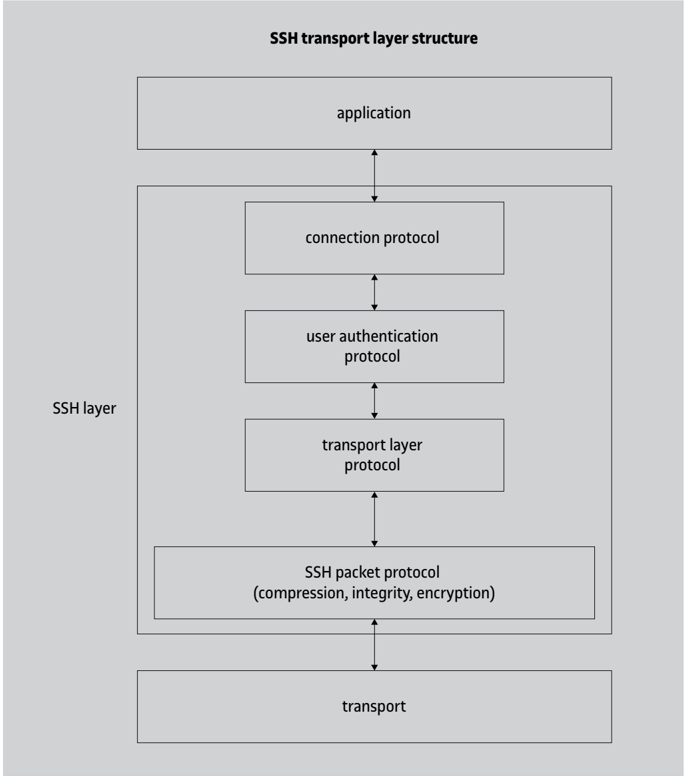

At the bottom of the SSH layer is the SSH packet protocol . The three existing protocols above this one are as follows:

- The transport layer protocol , which handles key exchange.
- The user authentication protocol .
- The connection management protocol .

## 1.2.1 The SSH packet protocol

.

The SSH packet protocol is responsible for constructing and exchanging the units of the protocol, which are SSH packets .

At the time of sending data, the following methods are selected and used with the messages of the upper layers (in this order):

- Compression.
- MAC authentication code.

## · Encryption.

Upon receiving the data, the same process is applied to each packet, but run in reverse (decryption, authenticity verification and decompression).

The format of SSH2 packets is as follows:

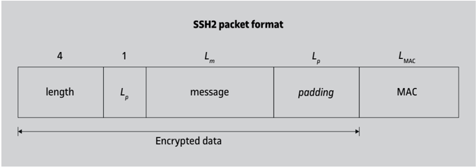

The existing fields in a SSH2 packet are as follows:

- The first field is the length of the rest of the packet, excluding the MAC (so it is equal to 1 + L m + L p ).
- The second field indicates how many bytes of padding there are. This number of bytes must be such that the total length of the packet, excluding the MAC, is a multiple of 8 (or cipher block size, if it is larger than 8).
- The third field is the content of the message, compressed if necessary. The first byte of the content always indicates what type of message it is, and the structure of the rest of the bytes depends on the type.
- The fourth field is random bytes of padding. They are always present, even with stream encryption, and their length must be at least equal to 4. Therefore, the minimum length of a packet, without counting the MAC, is 16 bytes.
- The fifth field is the MAC authentication code, obtained using the HMAC technique from a secret key, a 32-bit implicit sequence number, and the value of the other four fields of the packet. The length of the MAC depends on the algorithm chosen, and it may be 0 if the null algorithm is used.

When packets are encrypted, encryption is applied to all fields except the MAC, but the length is included. This means that the receiver has to decrypt the first 8 bytes of each packet to know the full length of the encrypted part.

## Bytes of padding

Bytes of padding ensure that the length of the data to be encrypted is suitable for block ciphers.

## 1.2.2 The SSH transport layer protocol

.

The transport layer protocol handles transport connection establishment, server authentication and key exchange, and service requests from the other protocols.

The client connects to the server using the TCP protocol. The server must be listening for connection requests on the port assigned to the SSH service, which is 22.

Once the connection is established, the first step is to negotiate the version of the SSH protocol to be used. Both client and server send a line with the text ' SSHx . y -implementation ', where x . y is the version number of the protocol (e.g. 2.0 ) and implementation is a string identifying the client or server software. If the version numbers don't match, the server decides whether it can continue or not: if it can't, it just closes the connection. Before sending this line of text, the server can also send other lines with informative messages provided that they don't start with ' SSH-'.

When client and server have agreed on the version, they start exchanging messages with the SSH packet protocol seen above, initially without encryption and without MAC. To save time, the first SSH packet can be sent along with the line indicating the version, without waiting to receive the line from the other party. If the versions match, the protocol continues normally; if not, it may be necessary to restart it.

First, the keys are exchanged. In SSH2, each party sends a KEXINIT message containing a random 16-byte string called cookie, together with the lists of supported algorithms in order of preference: key exchange algorithms and, for each direction of the communication, symmetric encryption algorithms, MAC and compression. A list of languages supported for the informative messages is also included. For each type of algorithm, the first one from the client's list that is also in the server's list is chosen.

## Algorithms supported by SSH2

The cryptographic algorithms included in the initial specification of SSH2 are the following:

- For key exchange: Diffie-Hellman.
- For encryption: RC4, Triple DES, Blowfish, Twofish, AES, IDEA and CAST-128.
- For MAC: HMAC-SHA1 and HMAC-MD5 (with all bytes or only with the first 12).

As cryptographic techniques evolve, new algorithms are added, such as HMAC-SHA2 (RFC 6668), SHA-256 and SHA-512 (RFC 8332). In contrast, algorithms such as RC4 (RFC 8758) have been deprecated and are no longer being used.

The packets after the initial message are the key exchange packets, and they depend on the chosen algorithm.

It can be assumed that most implementations will have the same preferred algorithm of each type. Thus, to reduce response time, the first key exchange message after the KEXINIT message can be sent without having to wait for the other party's message using these preferred algorithms. If the assumption is correct, the key exchange continues

## Compatibility with version 1

In SSH2, a compatibility mode with SSH1 is defined whereby the server identifies its version with the number 1.99: SSH2 clients should consider this number equivalent to 2.0, while SSH1 clients will respond using their actual version number.

normally, and if not, packets sent early are ignored and resent with the correct algorithms. Regardless of the algorithm, a shared secret and a session ID are obtained as a result of the key exchange. With the Diffie-Hellman algorithm, this identifier is the hash of a string made up of, among others, cookies from the client and server sides. Encryption and MAC keys and initialization vectors are computed by applying hash functions in various ways to different combinations of the shared secret and session ID. To finish the key exchange, each party sends a NEWKEYS message, indicating that the next packet will be the first to use the new algorithms and keys.

This entire process can be repeated to regenerate the keys when necessary. The SSH2 specification recommends doing this after every gigabyte transferred or every hour of connection.

If an error occurs during the key exchange or at any other stage of the protocol, a DISCONNECT message is generated, which may contain an explanatory text of the error, and the connection is terminated.

Other messages that can be exchanged at any time are as follows:

- IGNORE : its content should be ignored, but it can be used to counter traffic flow analysis.
- DEBUG : used to send informative messages.
- UNIMPLEMENTED : sent in response to an unknown type of message.

In SSH2, after the key exchange is complete, the client sends a SERVICE REQUEST message to request a service which can be user authentication, or direct access to the connection protocol if authentication is not required. The server responds with SERVICE ACCEPT if it allows access to the requested service, or DISCONNECT if it does not.

## 1.2.3 The user authentication protocol

Different methods of user authentication are employed in SSH:

- 1) Null authentication. The server allows the user to directly access the requested service without having to verify their identity. An example is access to an anonymous service.
- 2) Authentication based on access lists. Given the IP address of the client system and the name of the user in this system requesting access, the server uses a list to determine if the user is granted or denied access to the service. This is the same authentication used by the Unix program called rsh , in which the server queries the files .rhosts and /etc/ hosts.equiv . Because of its vulnerability to IP address spoofing attacks, this method can only be used in SSH1. SSH2 does not support it.
- 3) Authentication based on access lists with client authentication. Same as above, but the server verifies that the client system is indeed who it says it is, to prevent IP address spoofing attacks.

- 4) Password-based authentication. The server allows access if the user provides a correct password. This is the method that the login process normally follows on Unix systems.
- 5) Public key-based authentication. Instead of providing a password, the user authenticates by proving that they possess the private key corresponding to a public key recognized by the server.

In SSH2, the client sends USERAUTH REQUEST messages, which include the username (it can change from one message to the next), the requested authentication method and the service the client wants to access. If the server allows access, it will respond with a USERAUTH SUCCESS message; if not, it will send a USERAUTH FAILURE message that contains the list of authentication methods that can continue to be tried, or will terminate the connection if there have been too many attempts or too much time has elapsed. The server may optionally send an informative USERAUTH BANNER message prior to authentication.

Depending on the method used, authentication request messages contain the following information:

- 1) For null authentication, no additional information is required.
- 2) In authentication based on access lists (only applicable to SSH1), the client system must provide the username. The IP address of this system is assumed to be available via the underlying protocols (TCP/IP).
- 3) When using access lists with client authentication, in SSH2 the client sends its full DNS name, the local username, the client system's public key (and certificates, if any), the signature of a string of bytes that includes the session ID, and the algorithm used to generate this signature. The server must validate the public key and the signature to complete the authentication.
- 4) For password authentication, only the password needs to be sent directly. For obvious reasons, this method should not be allowed if the SSH transport sublayer protocol uses the null encryption algorithm.
- 5) Public key-based authentication is similar to access lists with client authentication. In SSH2, the client must send a message containing the user's public key (and certificates, if any), the algorithm that corresponds to this key and a signature in which the session ID is involved. The server will validate the authentication if it correctly verifies the key and the signature.

To avoid unnecessary calculations and interactions with the user, the client can also send a message first with the same information but without the signature, so that the server responds whether the offered public key is acceptable or not.

When the authentication process has been successfully completed, in SSH2 the next step is accessing the service that the client requested in its last USERAUTH REQUEST message (the one that resulted in successful authentication). As of today, there is only one defined service: the connection.

## Message USERAUTH BANNER

The USERAUTH BANNER message may include, for example, text identifying the server system, notices about restrictions of use, etc. This is the type of information that Unix systems normally display before the login prompt to enter the username, and is usually stored in the /etc/issue file.

## Password expired

SSH2 envisages the case in which the user's password on the server system has expired and needs to be changed before continuing. The change should not be allowed if no MAC is being used (null algorithm), because an intruder could modify the message containing the new password.

## 1.2.4 The connection protocol

.

The connection protocol manages interactive sessions for remote command execution, sending input data from client to server and output data in the opposite direction. It also handles TCP port forwarding.

As the following figure shows, with TCP forwarding it is possible that the connections made to a certain port PC of the client be forwarded to a port PB of a computer B from the server, or that the connections made to a certain port PS from the server be forwarded to a port PD of a computer D from the client. In this way, the SSH connection can be used, for example, to tunnel other connections through a firewall that is located between the client and the SSH server.

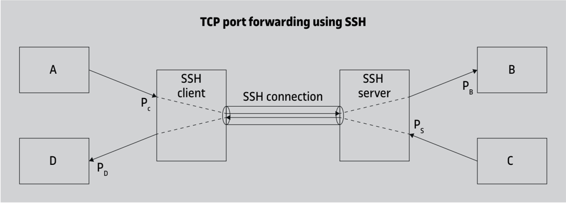

In addition, SSH supports the possibility of using an authentication agent . This agent is a process that allows user authentication based on public keys to be automated when it is necessary to do it from a remote computer. For example, suppose the situation of the following figure:

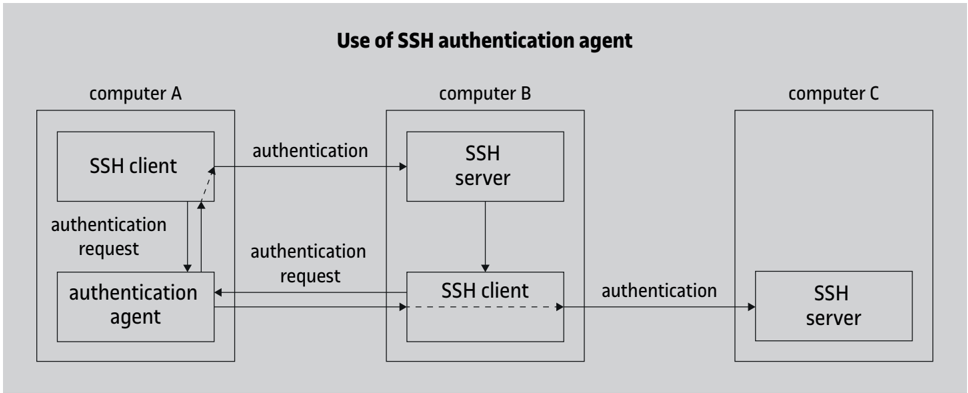

The user on computer A uses a SSH client to connect to computer B and work with an interactive session. Computer A can be, for example, a laptop PC where the user has saved their private key and from which they never want this key to leave. So it turns out that the user needs to establish a SSH connection (e.g. another interactive session) from computer B to computer C and has to authenticate with their personal key. The client of computer B, instead of directly performing the authentication, which would require having the user's private key, asks the agent from computer A to sign the appropriate message to prove that it possesses the private key. This scheme can also be used locally by clients of the same computer A.

.

Each interactive session, forwarded TCP connection or connection to an agent is a channel . There can be different open channels in the same SSH connection, each one identified with a number at each end (the numbers assigned to a channel on both the client and server ends may be different).

SSH2 establishes fourteen types of messages that can be sent during the connection phase. These are some of the functions that the messages allow to perform:

Open a channel. Channels of different types can be opened: interactive session, X window channel, forwarded TCP connection, or connection with an authentication agent.

Configure channel parameters. Before starting an interactive session, the client can specify if they need to be assigned a pseudo-terminal on the server, as the Unix rlogin program does (the rsh program does not do it, though), and if so, with what parameters (terminal type, dimensions, control characters, etc). There exist other messages to indicate whether they want a connection to the authentication agent or X window connection forwarding.

Start an interactive session. Once the necessary parameters are configured, the client can either give the name of a command to be executed on the server (as in rsh ) or indicate that they want to run a shell (as in rlogin ). In addition to a remote process, in SSH2 it is also possible to start a 'subsystem' such as a file transfer.

Send data. There are two types of messages in SSH2 to this end: one to send normal data in any direction and through any channel (including interactive sessions), and another to send special data (for example, those of the error output stderr ). In addition to the session data, the client can also send a message to indicate that a signal has been received or that a change in the dimensions of the terminal has occurred.

Close a channel. When the normal execution of the process or shell finishes, the server sends a message indicating the exit code (the numeric value that the process returns). If it has terminated because of a signal, in SSH2 it sends a message with the signal number. Other messages serve to indicate that there is no more input data, to request the closure of a channel from one end, and to confirm the closure from the other end.

Other operations (not associated with an open channel). The client can request that the connections arriving at a certain TCP port of the server be redirected to be able to forward them to another address.

The following figure summarizes message exchange in SSH2.

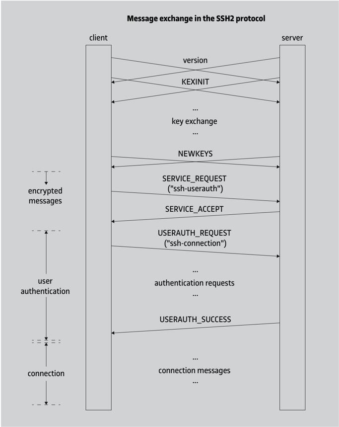

## 1.3 Attacks against the SSH protocol

Many of the considerations on protection provided by SSL/TLS apply to the SSH protocol as well. This protocol is designed in such a way that an attacker cannot read the content of the messages or alter them, nor can they change the sequence of the messages.

Confidentiality is guaranteed with the key exchange method based on public key cryptography, which protects against the 'man-in-the-middle' attacks that we have seen in the section on SSL/TLS. Also, this method allows the client to ensure that they are connecting to the authentic server. To verify that the public key sent by the server is really the server's

## Improvements in SSH2

The SSH1 protocol was vulnerable to packet replay, drop, or reordering attacks because it did not use sequence numbers. It was also vulnerable to forwarding packets in the opposite direction if a single encryption key was used for both directions. These problems are no longer found in SSH2.

key, certificates can be used or else a client's local database in which the keys of recognized servers are stored. In addition, to authenticate the user using a public key (theirs or that of the client from which they connect, depending on the authentication method), the two options are also available: certificates or a key database on the server.

If certificates are not used, the protocol supports the possibility (although it is not recommended) of accepting a server's public key the first time a connection is established, without the need for any prior communication. This is not appropriate in a security-critical environment because it lends itself to 'man-in-the-middle' attacks. In other environments, and as long as the key infrastructure is not widely spread, directly accepting keys received for the first time may strike a balance between convenience of use and security.

An interesting feature added to SSH2 is that packet lengths are sent in encrypted form. An intruder seeing the data exchanged as a stream of bytes cannot tell where each SSH2 packet begins and ends (if the intruder has access to the TCP packet level, they can try to make inferences but they can never be completely sure). This, together with the ability to include arbitrary padding (up to 255 bytes) and send IGNORE messages, can serve to hide traffic features and make it more difficult to be attacked using known plaintext.

Moreover, it is worth noting that the user authentication methods based on access lists rely on the server trusting the client system administrator (in the same way as the rsh and rlogin protocols):

- When the client system is not authenticated (possibility supported by SSH1 only), the server only has to accept connections that come from a privileged TCP port (less than 1024) so that it is not easy for any user to send packets impersonating someone else's identity.
- When there is authentication of the client system, the server trusts that the users will not have access to the private key of this system. Otherwise, they could use it to generate authentication messages using another user's ID.

Finally, as with SSL/TLS, the SSH protocol is designed to offer certain protections, but the level of security it provides in each case will be given by the implementations and by the use it is put to. It is recommended that features (e.g. user authentication methods, TCP port forwarding, etc.) that imply some vulnerability or chance for abuse in a certain environment can be disabled or restricted.

## 1.4 Applications using the SSH protocol

Given that the main purpose of SSH is to allow remote execution of processes in the manner of rsh and rlogin , other programs (e.g. ssh and slogin ) could be implemented (as in fact some programs have) to do the same, but using the SSH protocol.

The same arguments can be used: the name of the server, ' -l username ' to specify the username on the server, and so on. Programs can also be configured to use differ- ent authentication methods. In particular, the one based on the .rhosts and /etc/ hosts.equiv fi les works like in rsh / rlogin , and the password-based one works like in rlogin . If client system authentication is used, its private key must be stored somewhere with restricted access. And if user authentication is based on their public key, the corresponding private key should be kept in protected form, usually encrypted with a symmetric key derived from a password or a passphrase.

In its various versions, the original implementation of the ssh program supports arguments of the form ' -L p1 : adr : p2 ' and ' -R p1 : adr : p2 ' to specify local (client) or remote (server) TCP port forwards respectively, from port p1 to the port p2 of the computer adr .

## Examples of TCP port forwarding with SSH

- 1) From a computer named near , we can do the following:

ssh -L 5555:srv.far.com:23 -l admin middle

If we authenticate successfully, we will have established an interactive connection to the computer middle as admin user, and in addition, any connection to port 5555 of near , like the following:

```
telnet near 5555
```

will be forwarded to port 23 (TELNET) of the computer

srv.far.com (passing through middle , and with the section between near and middle protected with SSH).

- 2) This would be a way to secure a connection to an HTTP server via a SSH tunnel, assuming we can authenticate against this server:

ssh -L 5678:localhost:80 www.far.com

Once this operation is done, we can enter the address http://localhost:5678/ in any web browser on the local computer, and it will automatically take us to the address

http://www.far.com/ with an encrypted connection (if there is an HTML page at this address with non-absolute references to pages on the same server, these other pages will also reach us via SSH).

## 2. Secure email

Email is one of the most widely used applications on computer networks. In the case of Internet, the protocol that the transfer of messages is based on, SMTP, was published in the RFC 821 standard in 1982. As its name suggests, the main characteristic of this protocol is its simplicity. This has allowed SMTP, along with the message format standard (RFC 822, updated by RFC 5322) and the MIME specification, to be the technological basis of the vast majority of current mail systems.

SMTP's greatest strength, simplicity, is in turn a source of many security problems, as it can be surprisingly easy for an attacker to capture messages or send fake messages on behalf of others. In this section, we will see some existing techniques to add security to the email service.

If we consider email as an application layer protocol, a way to protect email messages is to use the security that lower layers provide, such as the network or transport layers. For example, with the SMTP protocol the use of the secure transport SSL/TLS can be negotiated via a special command called STARTTLS (RFC 2487).

But different intermediate agents may intervene in the transfer of messages, and it would be necessary to protect all the links to be able to carry out secure end-to-end communication, or try to make a direct connection between the originator's system and those of the recipients. In addition to that, the store-and-forward feature of the email service means that messages are vulnerable not only when they are transferred from one intermediate node to another, but also while they are stored in these nodes. This includes the final destination system: once the message has reached the user's mailbox, its content can be inspected or modified by third parties before it is read by the legitimate recipient, or even after it has already been read.

.

This is why methods have been developed to protect email in the application layer itself, regardless of the transport system used. The idea is to apply the necessary cryptographic functions to the message before delivering it to the transfer agents of the mail service so that they only have to get it to its destination in the usual way.

In this way, on the one hand, the existing email infrastructure can be leveraged without needing to change the servers, etc., and on the other, the protection is effective throughout the entire process, even while the message is stored in the recipient's mailbox.

## SMTP

SMTP stands for Simple Mail Transfer Protocol.

## MIME

MIME stands for Multipurpose Internet Mail Extensions.

The majority of secure email systems that have been proposed follow this model of incorporating safety within the messages themselves without modifying the transfer protocol. Examples of these systems include:

## · PEM (Privacy Enhanced Mail)

It was one of the first secure mail systems to be developed, with the first version being published in the RFC 989 specification. Directly based on the RFC 822 standard, it only supported the transmission of messages written in ASCII text. It is currently deprecated, but some of the techniques it used are still being used today on more modern systems.

## · MOSS (MIME Object Security Services)

It was the first specification that used the MIME format to represent security-related information. It was based on the PEM system and was published in the RFC 1848 document.

## · PGP (Pretty Good Privacy)

One of the most popular systems for providing confidentiality and authentication, not only to email but to any type of data. In many environments, it is the de facto standard for the secure exchange of information. It has evolved over the years and there are currently several versions, including variants such as PGP/MIME, OpenPGP and GnuPG.

## · S/MIME ( Secure MIME )

This is another system that uses MIME technology, but in this case, it is based on the syntax defined by the PKCS #7 standard. There are also a variety of implementations available.

In this section, we examine some details of the S/MIME and PGP systems. First, though, we discuss the general characteristics of secure email. Later, we will look at other types of email protection that do not act on the body of the message, but rather on other aspects such as the message headers or authenticity of the agents involved in the SMTP protocol.

## 2.1 Email security

When providing security services to email, the following considerations must be taken into account:

- In electronic mail, the transmission of messages is carried out non-interactively, and therefore there can be no negotiation of algorithms or exchange of keys when a message is sent. This means that an additional step may be necessary to obtain the key necessary to communicate with a certain correspondent (using a public key database,

asking the user to send their key, etc.). All secure mail systems must support some key distribution mechanism.

- A basic email functionality is sending the same message to multiple recipients . With secure email, if it is necessary to use different cryptographic parameters for each recipient, it would not be a very efficient solution to send them separately. But if we want to take advantage of the capabilities of existing mail systems, we must use a technique that allows us to combine all the necessary information so that it can be processed by each of the recipients.

Secure email providers offer two services:

Confidentiality. Using encryption techniques, it can be guaranteed that a message can only be read by its legitimate recipients.

Message authentication. Messages can include an authentication code (a MAC code or a digital signature) so that the recipients can verify that they were generated by the authentic originator and that they were not tampered with.

Each of these two services can be based on symmetric key or public key cryptographic techniques.

A particular case of message authentication is a variant of origin authentication called email domain authentication . This service does not ensure that a particular user is the author of a message, but rather that their email address belongs to the institution or organization that owns the corresponding address domain. Thus, even if we do not know the person listed as the sender, we can make sure that the message comes from the correct domain, which can be used, for example, to detect fake messages that try to perform digital fraud by email (phishing).

## 2.1.1 Privacy

In order for an originator A to send an encrypted message to a recipient B , both must have agreed on using a certain exchange key k AB . This can be done securely through 'offline' communication (e.g. face to face) or using a key distribution mechanism.

The exchange key k AB can be a symmetric key or a public key. If it is symmetric, it can be used in both directions, from A to B and from B to A ( k AB = k BA ). The use of symmetric key exchange was specified in the PEM standard, but today it is not very common.

The most common situation is that the exchange key is a public key, and then the keys corresponding to a recipient B are all the same: k 1 B = k 2 B = k 3 B = . . . = k pub B .

## Other services

There are other services that not all secure mail systems are able to provide: traffic flow confidentiality (concealing who is sending messages to whom and when, and how long the messages are), protection against denial of receipt (that a user cannot report that they have not received a message, or that a third party cannot delete messages so that the recipient does not read them) or against message replay attacks, etc.

.

To encrypt an email message, a symmetric-key encryption algorithm is always used, since public-key algorithms are much more expensive, especially if the message is long.

The method used to send an encrypted message is called envelope encryption , which involves:

- 1) Randomly generating a symmetric encryption key k S different for each message. This key k S is called content-encryption key or, by analogy with transport protocols, session key .
- 2) Encrypting the message M with this symmetric key to get C = E ( k S , M ) .
- 3) For each recipient B y of the message, encrypting the session key with this recipient's public key to get K B y = E ( k pub By , k S ) .
- 4) Constructing a new message by adding all the encrypted keys K B y to the encrypted message C .
- 5) Sending this message to the recipients (the same message for all recipients).

Therefore, if a confidential message has to be transmitted to N recipients, it is not necessary to send N copies of the message encrypted with each recipient's key. The same copy can be used for everyone. This way, it is possible to take advantage of already existing mechanisms to send a message to multiple recipients.

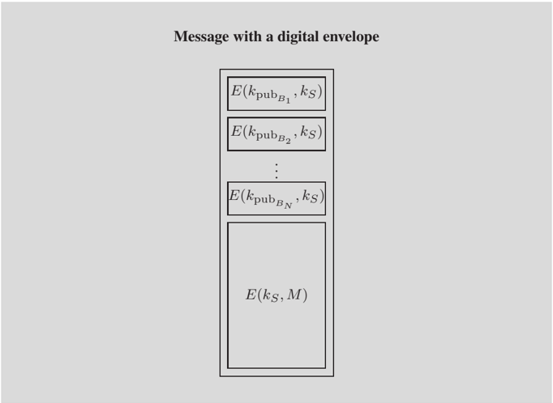

Upon receiving the message, each recipient B y must select the K B y corresponding to their public key, decrypt it with their private key k priv By to get the session key k S , and decrypt C with this session key to retrieve the message M .

## Digital envelope

The term 'digital envelope' was chosen to draw an analogy with traditional mail transmission. Thus, an unencrypted email message is like a postcard, whose contents can be read by everyone, while a message encrypted in this way is like a letter in a sealed envelope, which can only be opened by the person named as the recipient.

## Messages to a single recipient

The envelope encryption technique is used for messages addressed to any number of recipients, which can also be only one.

## Mailing lists

Mailing lists are a special case because the originator of a message may not know which recipients it will reach. One option is to use a single symmetric exchange key, known by all the members of the list (with the potential problem that this does not guarantee authenticity). Another option is that the agent that expands the list receives the messages encrypted with a list's own key and forwards them in encrypted form with the keys of each recipient.

## 2.1.2 Message authentication

Symmetric or public key techniques can also be used for message authentication.

In symmetrical techniques, a MAC code calculated with a secret key shared with the recipient is added to the message. This means that a different MAC code must be calculated for each recipient and that there is no protection against possible repudiation by the originator.

.

For this reason, current secure mail systems use public key authentication techniques, i.e. digital signatures.

The signature of a message can be verified by anyone who receives it and knows the signer's public key. They can even forward the message to other users, who will also be able to verify its authenticity. Moreover, the signatures provide the service of nonrepudiation.

## 2.1.3 Compatibility with non-secure mail systems

If we want to use the existing SMTP infrastructure for secure email transmission, we need to keep in mind that this protocol imposes certain restrictions in order to maximize interoperability between implementations, including older ones.

Some of these restrictions are, for example: in principle messages can only contain ASCII characters, and message lines cannot have more than 1,000 characters. Currently, many SMTP agents are capable of working without these restrictions, but we have to take them into account nonetheless because we do not know through which implementations our messages can pass.

In addition, SMTP defines a representation for messages that may be different from each system's local representation. The process in charge of sending the messages has to transform them from the local format to the SMTP format at the moment of transferring them. And conversely, when a message arrives via SMTP, it is usually converted to the local format before being stored in the recipients' mailbox.

## Examples of transformation to SMTP format

A typical example of transformation is that of line endings: in SMTP, they are represented by the characters &lt; CR &gt;&lt; LF &gt; , while in Unix they are represented only by &lt; LF &gt; .

.

Therefore, when cryptographic operations have to be applied to a message, they need to be done on a canonical encoding that is unambiguously convertible to the local format.

In this way, if we have to send a confidential message, we will encrypt the canonical form of the message so that when the recipient decrypts it, they can convert it to their local format. And if we have to calculate an authentication code or a signature, we will also do it on the canonical form, so that the receiver knows exactly from which data it has been generated and can perform its verification.

Each secure mail system can define its canonical encryption. For example, MIME-based systems use the model included in the RFC 2049 specification. In multimedia email, the encoding rules depend on the type of content, but in the case of text messages, for simplicity, it is common practice that the canonical encryption matches the SMTP format, that is, with ASCII characters and with lines ending in &lt; CR &gt;&lt; LF &gt; .

Moreover, some mail agents can introduce modifications in the messages to adapt them to their restrictions. Some examples include: setting the 8th bit of each character to 0, cutting lines that are too long by inserting line breaks, removing trailing whitespace, converting tabs into sequences of spaces, etc.

Since cryptographic information will generally consist of arbitrary data, content protection mechanisms must be used to ensure that none of these modifications will affect the secure messages. This is the same challenge that was posed with MIME email for sending multimedia content; the solution is to use a transfer encoding , such as 'base64' transfer encoding.

## 2.2 S/MIME

S/MIME (Secure MIME) is a secure email specification based on the PKCS #7 standard, which was initially developed by RSA Data Security.

.

Another example: some Unix email readers, especially older ones, interpret the string ' From ' at the start of a line in a mailbox to indicate the start of a new message. In these systems, when a message arrives containing this sequence at the start of a line, the ' &gt; ' character is automatically added to the front of the line (most modern email readers use the Content-Length fi eld of the header to know where each message ends and where the next one begins).

The S/MIME mail system uses the MIME technique to transmit messages that are cryptographically protected under the PKCS #7 format.

## Base64 transfer encoding

In base64 transfer encoding, each group of 6 bits is represented with one ASCII character from a set of 64 ( 2 6 = 64 ), made up of letters, digits, and the symbols ' + ' and ' / '.

During the first few years, several drafts of the S/MIME specification were produced and adopted by various independent implementers. The initial versions defined two use profiles: the normal one, which was not exportable outside the United States, and the restricted one, which imposed a limit of 40 secret bits in symmetric keys. For interoperability reasons, many of the S/MIME systems that were developed followed the restricted profile.

Informative documents RFC 2311 and RFC 2312 included the characteristics common to most of the implementations that existed at the time. They were published in 1998 and they came to be known as S/MIME version 2. In this version, no distinction was made between normal or restricted profiles.

## Algorithms supported by S/MIME version 2

S/MIME version 2 includes the following cryptographic algorithms.

- For symmetric encryption: Triple DES and RC2.
- For message digests (hash): MD5 and SHA-1.
- For public key encryption: RSA.

New versions of S/MIME were published between 1999 and 2010: 3, 3.1 and 3.2, each of which updated the list of cryptographic algorithms relative to the previous one. Another difference from S/MIME version 2 is that, instead of directly using the PKCS #7 standard, number 3 versions are based on the CMS standard (originally published as RFC 2630). CMS maintains compatibility with PKCS #7, but it includes new fields for key exchange, specifically the Diffie-Hellman method (described in RFC 2631).

## Algorithms supported by S/MIME version 3.2

S/MIME version 3.2 includes these cryptographic algorithms:

- For symmetric encryption: AES-128, optionally AES-192 and AES-256, and Triple DES for backward compatibility.
- For message digests (hash): SHA-256, and MD5 and SHA-1 for backward compatibility.
- For public-key encryption: RSA, optionally RSAES-OAEP (RFC 3560), and Diffie-Hellman for backward compatibility.

Version 3 is generally designed to be as compatible with version 2 as possible. However, it should be noted that version 3 supports new services, known as ESS, including:

- Signed receipts.
- Security labels, which give information about the level of sensitivity of the message content (according to a classification defined by a specific security policy).
- Secure emailing lists.
- Signature certificates, which allow a signature to be directly associated with the certificate necessary to validate it.

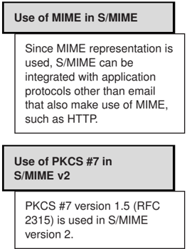

## CMS

CMS stands for Cryptographic Message Syntax.

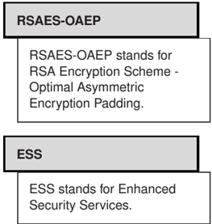

S/MIME version 4 (RFC 8550-8551) was published back in 2019. This version updates the list of supported cryptographic algorithms and also introduces the use of algorithms that combine confidentiality and integrity.

## Algorithms supported by S/MIME version 4

S/MIME version 4 includes the following cryptographic algorithms.

- For symmetric encryption: AES-128 and AES-256 in GCM mode (which allows combining confidentiality and integrity), optionally the algorithm ChaCha20-Poly1305, defined in the RFC 7905 standard (which also combines confidentiality and integrity), and for backward compatibility, AES-128 in CBC mode.
- For message digests (hash): SHA-256 and SHA-512.
- For public key encryption: Elliptic Curve Diffie-Hellman (ECDH), optionally RSAES-OAEP, and RSA for backwards compatibility.

## 2.2.1 The PKCS #7/CMS format

.

PKCS #7 is a format for representing cryptographically protected messages. When the protection is based on public key cryptography, X.509 certificates are used in PKCS #7 to guarantee the authenticity of the keys. As a format, CMS allows the same messages to be represented as PKCS #7. In addition, it supports additional fields that can be used for exchanging keys and for attribute certificates.

Although current versions of S/MIME use the CMS format, the features that we will discuss here can be represented with the syntax commonly used in PKCS #7 and CMS. For historical reasons, we will refer to it as PKCS #7.

The PKCS #7 standard defines data structures to represent each of the fields that are part of a message. When exchanging these data, they must be encoded according to the rules specified by the ASN.1 notation (the same notation which is used to represent X.509 certificates and CRLs).

Below is the general structure of a PKCS #7 message, where 'opt.' means optional and 'rep.' means repeatable:

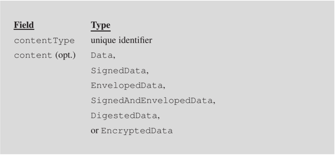

GCM

GCM stands for Galois/Counter Mode.

The contentType fi eld is an identifier indicating which of six possible structures are in the content fi eld. These structures are:

- 1) Data is used to represent literal data, without using any cryptographic protection.
- 2) SignedData represents digitally signed data.
- 3) EnvelopedData represents a message with a digital envelope (that is, a symmetrically encrypted message to which the symmetric key encrypted with the public key of each recipient is added).
- 4) SignedAndEnvelopedData represents data that are signed and sealed in a digital envelope.
- 5) DigestedData represents data to which a digest or hash is added.
- 6) EncryptedData represents data encrypted with a secret key.

The content fi eld is optional, because in certain cases the data of a message may not be inside the message itself, but somewhere else.

Of these six possible content types, the last three are not used in S/MIME: for signed and enveloped data, a combination of SignedData and EnvelopedData is used, and messages containing only hash data or symmetrically encrypted data are never sent using secure email.

Therefore, the PKCS #7 content types that can be in a S/MIME message are Data , SignedData or EnvelopedData .

## 1) The Data type

.

If the type of data contained in a PKCS #7 message is the Data content type, it is not structured in any special way and simply consists of a sequence of bytes. When used in S/MIME, its content must be a MIME message part , with its headers and body in canonical form.

The Data content type never appears alone in a S/MIME message. It is always used in combination with one of the other PKCS #7 types, i.e. SignedData or EnvelopedData .

## Compressed data

Since version 3.1, S/MIME allows the use of another unprotected data type called CompressedData , defined in the CMS standard (RFC 3274). Since the only difference is that the data is compressed, this type is equivalent to type Data type in terms of protection.

## 2) The SignedData type

The SignedData type contains mostly data, recursively represented with another PKCS #7 message, and the signature of these data generated by one or more signers. The structure of the SignedData content type is as follows:

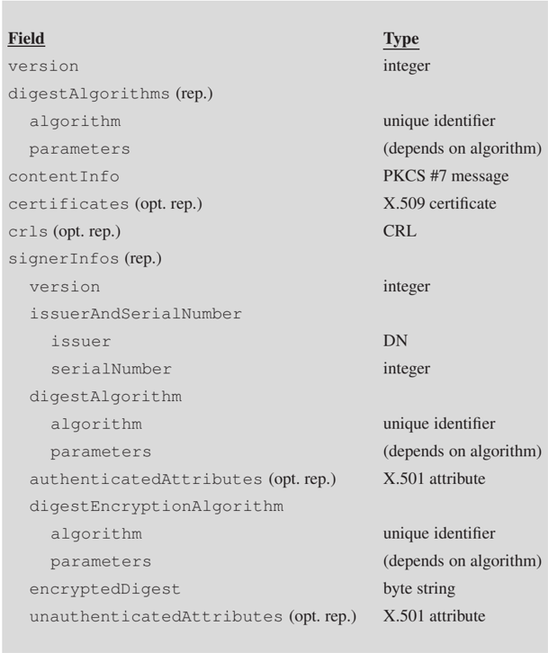

| Field version                         | Type integer           |
|---------------------------------------|------------------------|
| digestAlgorithms (rep.)               |                        |
| algorithm                             | unique identifier      |
| parameters                            | (depends on algorithm) |
| contentInfo                           | PKCS #7 message        |
| certificates (opt. rep.)              | X.509 certificate      |
| crls (opt. rep.)                      | CRL                    |
| signerInfos (rep.)                    |                        |
| version                               | integer                |
| issuerAndSerialNumber                 |                        |
| issuer                                | DN                     |
| serialNumber                          | integer                |
| digestAlgorithm                       |                        |
| algorithm                             | unique identifier      |
| parameters                            | (depends on algorithm) |
| authenticatedAttributes (opt. rep.)   | X.501 attribute        |
| digestEncryptionAlgorithm             |                        |
| algorithm                             | unique identifier      |
| parameters                            | (depends on algorithm) |
| encryptedDigest                       | byte string            |
| unauthenticatedAttributes (opt. rep.) | X.501 attribute        |

## The meaning of each field is as follows:

- The version fi eld indicates the version of the SignedData structure format.
- The digestAlgorithms fi eld is a list of the digest or hash algorithms that the signers used to sign the data.
- The contentInfo fi eld contains the data to be signed, represented in the form of a PKCS #7 message. This message will normally be a Data content type message (to sign literal data) or an EnvelopedData content type message (to sign a confidential message).
- The certificates fi eld contains certificates or certificate chains that can be useful to verify the authenticity of the public keys of the signers.
- The crls fi eld contains a list of CRLs that can be used together with the certificates in the previous field.

## Hash algorithms

The digestAlgorithms field appears before the data to facilitate processing of the SignedData structure in a single step: knowing what the hash algorithms are, digests can be computed as the data is read.

- The signerInfos fi eld contains a structure for each signer, with the following subfields:
- -version indicates the format version of this structure.
- -issuerAndSerialNumber is used to find out what the signer's public key is. Instead of directly specifying the key, the name of a CA and a certificate serial number are given. This data uniquely identifies a certificate (the same CA cannot generate two certificates with the same serial number), and in this certificate, which can be one of those in the certificates fi eld, there must be the signer's public key.
- -digestAlgorithm is the hash algorithm used by this signer (it has to be one of those in the digestAlgorithms fi eld at the beginning).
- -authenticatedAttributes is a set of attributes that are added to the data on which the signature is calculated.
- -digestEncryptionAlgorithm is the algorithm used by the signer to encrypt the hash to calculate the signature.
- -encryptedDigest is the signature, that is, the hash encrypted with the signer's private key.
- -unauthenticatedAttributes is an additional set of attributes that are not involved in the signature.

As we can see, PKCS #7 allows each signer to add attributes to their signature, which can be authenticated or unauthenticated. Each of these attributes follows the structure defined in Recommendation X.501, which is simply made up of an attribute name and one or more values.

## When there are authenticated attributes, one of them must be an attribute named

messageDigest , whose value is the hash of the contentInfo fi eld. In this case, the signature is computed from the hash of the entire authenticatedAttributes subfield. In this way, authenticity of the message data ( contentInfo ) and the other authenticated attributes can be checked.

When there are no authenticated attributes, the signature is simply computed from the hash of the contentInfo fi eld.

## 3) The EnvelopedData content type

The EnvelopedData type contains data encrypted as a digital envelope. The data recursively corresponds to another PKCS #7 message. The structure of the EnvelopedData content type is as follows:

## Public key identification

The method that PKCS #7 uses to identify a public key from a CA name and serial number was defined in this way for compatibility with the PEM secure mail system.

Example of an authenticated attribute

A typical example of an authenticated attribute is the signingTime attribute, which indicates when the signature was generated.

.

## Field

## Type

version

integer

recipientInfos (rep.)

version

integer

issuerAndSerialNumber

issuer

DN

serialNumber

integer

keyEncryptionAlgorithm

algorithm

unique identifier

parameters

(depends on algorithm)

encryptedKey

byte string

encryptedContentInfo

contentType

unique identifier

contentEncryptionAlgorithm

algorithm

unique identifier

parameters

(depends on algorithm)

encryptedContent (opt.)

byte string

## The meaning of each field is as follows:

- The version fi eld indicates the format version of the EnvelopedData structure.
- The recipientInfos fi eld contains a structure for each message recipient, with the following subfields:
- -version indicates the format version of this structure.
- -issuerAndSerialNumber is used to know to which recipient this structure corresponds. Each recipient must search among the elements of the recipientInfos field for the one that has this subfield equal to the CA and the serial number of their certificate.
- -keyEncryptionAlgorithm indicates the public key algorithm used to encrypt the session key.
- -encryptedKey is the session key encrypted with this recipient's public key.
- The encryptedContentInfo fi eld contains information about the encrypted data, with the following subfields:

- -contentType indicates what type of PKCS #7 message is in the encrypted data: this will typically be a Data message (when encrypting literal data) or a SignedData message (when encrypting a signed message).
- -contentEncryptionAlgorithm is the symmetric algorithm used to encrypt the data (using the session key).
- -encryptedContent is the encrypted data (that is, an encrypted PKCS #7 message).

S/MIME version 4 allows a new CMS type called AuthEnvelopedData to be used and is defined in the RFC 5083 standard. Compared to the EnvelopedData content type, the encryption algorithm also provides integrity using the same session key and adds new fields to represent the MAC authentication code of the encrypted data, and optionally authenticated attributes (which are included in the MAC calculation) and unauthenticated attributes.

As we have seen, SignedData and EnvelopedData content types recursively contain other PKCS #7 messages. In a S/MIME message, one of these four combinations can be found:

- SignedData [ Data ] (message with signed data).
- SignedData [ EnvelopedData [ Data ]] (message with encrypted and signed data).
- EnvelopedData [ Data ] (message with encrypted data).
- EnvelopedData [ SignedData [ Data ]] (message with signed and encrypted data).

Therefore, if a message is to be signed and encrypted, both operations can be done in any order, as needed. For example, signing first and encrypting later allows the recipient to save the decrypted message for later verification, possibly by third parties. Encrypting first and signing later allows you to verify message authenticity without having to decrypt the message.

## 2.2.2 S/MIME message format

.

A S/MIME message is a MIME message with the following features:

- Its content type ( Content-Type field of the MIME header) is ' application/pkcs7-mime '.
- There is a PKCS #7 structure in the body of the message encoded according to ASN.1 notation.

There is an alternative representation for S/MIME messages that are only signed called a clear signature , which is discussed later in the section.

## S/MIME backwards compatibility

For content types such as ' pkcs7-mime ' (and some others we will see later), early versions of S/MIME used names beginning with ' x-'.

In the experimental versions of some protocols, a prefix like this one is commonly used to represent values that are not yet standardized. For compatibility with these versions, S/MIME email applications should consider old names equivalent to names without a prefix, such as:

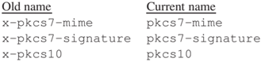

The MIME Content-Type header, in addition to the ' application/pkcs7-mime ' value, must have at least one of these two parameters:

- smime-type indicates the PKCS #7 content type that is in the body of the message.
- name indicates the name of a file associated with the body of the message.

## File associated with a S/MIME message

The name parameter is used to maintain compatibility with earlier versions of S/MIME, in which the smime-type parameter was not defined. In those versions, the specification of the PKCS #7 content type was done with a filename extension. The part of the name that comes before the extension doesn't matter but it's usually ' smime ' by convention.

To specify this filename, the name parameter of the Content-Type header can be used, as well as the filename parameter of the MIME Content-Disposition header (defined in the RFC 2183 specification), with the value of this header set equal to ' attachment '.

Also, since the body of the message is binary data (the ASN.1 representation of a PKCS #7 structure), there will typically be a Content-Transfer-Encoding header with ' base64 ' value to indicate that these data are base64 encoded.

There are three basic S/MIME message formats: digital envelope messages, signed messages, and clear-signed messages.

## 1) S/MIME messages with a digital envelope

A S/MIME message with a digital envelope has the following characteristics:

- The body of the message contains a PKCS #7 structure with EnvelopedData content type.
- The value of the smime-type parameter is ' enveloped-data '.
- If an associated filename is specified, its extension is .p7m (e.g. ' smime.p7m ').

This is an example of a S/MIME message with a digital envelope:

## Signed and encrypted messages

The EnvelopedData content in a digital-envelope S/MIME message may contain a SignedData structure. If it does, then it is a signed and encrypted message.

```
. Date: Mon, 1 Mar 2004 11:46:10 +0100 From: user-1@uoc.edu Subject: Example 1 To: user-2@uoc.edu MIME-Version: 1.0 Content-Type: application/pkcs7-mime; smime-type=enveloped-data; name="smime.p7m" Content-Transfer-Encoding: base64 Content-Disposition: attachment; filename="smime.p7m" MIAGCSqGSIb3DQEHA6CAMIACAQAxgDBzAgEAMC8wKjELMAkGA1UEBhMCRVMxDDAKBg NVBAoTA1VPQzENMAsGA1UEAxMEQ0EtMQIBBjANBgkqhkiG9w0BAQEFAAQuCYHs970a ZmmqKTr3gemZLzHVtB266O/TrIv4shSvos8Ko8mUSQGov0JSIugmeDBzAgEAMC8wKj ELMAkGA1UEBhMCRVMxDDAKBgNVBAoTA1VPQzENMAsGA1UEAxMEQ0EtMQIBBzANBgkq hkiG9w0BAQEFAAQuC14oIhps+mh8Wxp79A81uv2ltG3vt6J9UdJQcrDL92wD/jpw1I KpoR224LT4PQAAMIAGCSqGSIb3DQEHATARBgUrDgMCBwQIZbTj6XqCRkGggARAF8K8 apgPtK7JPS1OaxfHMDXYTdEG92QXfAdTPetAFGuPfxpJrQwX2omWuodVxP7PnWT2N5 KwE1oc6faJY/zG0AAAAAAAAAAAAAA=
```

## 2) Signed S/MIME messages

The format of a signed S/MIME message is analogous to that of digital envelope messages. Its characteristics are as follows:

- The body of the message contains a PKCS #7 structure with SignedData content type.
- The value of the smime-type parameter is ' signed-data '.
- If an associated filename is specified, its extension is the same as in digital envelope messages, i.e. .p7m (e.g. ' smime.p7m ').

This is an example of a signed S/MIME message:

.

Date:

Mon, 1

Mar 2004

From:

user-1@uoc.edu

Subject: Example 2

To:

user-2@uoc.edu

MIME-Version: 1.0

Content-Type: application/pkcs7-mime; smime-type=signed-data;

name="smime.p7m"

Content-Transfer-Encoding: base64

Content-Disposition: attachment; filename="smime.p7m"

MIAGCSqGSIb3DQEHAqCAMIACAQExDjAMBggqhkiG9w0CBQUAMIAGCSqGSIb3DQEHAa

CAJIAEOUNvbnRlbnQtVHlwZTogdGV4dC9wbGFpbg0KDQpFeGVtcGxlIGRlIG1pc3Nh

dGdlIHNpZ25hdC4NCgAAAAAAAKCAMIIBSDCCAQWgAwIBAgIBBjANBgkqhkiG9w0BAQ

QFADAqMQswCQYDVQQGEwJFUzEMMAoGA1UEChMDVU9DMQ0wCwYDVQQDEwRDQS0xMB4X

DTAwMDkwMTAwMDAwMFoXDTEwMDkwMTAwMDAwMFowVTELMAkGA1UEBhMCRVMxDDAKBg

NVBAoTA1VPQzElMCMGCSqGSIb3DQEJARYWdXN1YXJpLTFAY2FtcHVzLnVvYy5lczER

MA8GA1UEAxMIdXN1YXJpLTEwSTANBgkqhkiG9w0BAQEFAAM4ADA1Ai4MNRLOaI30lr

RQjyyznTjQTs/vLveiFadRiGKlVNnsFkGx/EwHdFDy7z4CpbtnAgMBAAEwDQYJKoZI

hvcNAQEEBQADLgACRZrDsL/MJv9VZdbxNMpbjKcwwFPPVG9LTqOZ8sTdAF09UnFsSj

5jE0ABAPEAADGAMIGBAgEBMC8wKjELMAkGA1UEBhMCRVMxDDAKBgNVBAoTA1VPQzEN

MAsGA1UEAxMEQ0EtMQIBBjAMBggqhkiG9w0CBQUAMA0GCSqGSIb3DQEBAQUABC4DMw

I+4fvRqBPhFj/wB7gI+Or7nSYfkqP1fxbjdTqwu9B5jsnxDIs+PUYsboQIAAAAAAAA

AAA=

## 3) Clear-signed S/MIME messages

When a signed message is sent, recipients using an appropriate mail reader will be able to read the message and verify the signature. On many occasions, it is important that the message can be read by everyone, even by those who don't have a reader with support for secure email.

11:47:25 +0100

## Encrypted and signed messages

The SignedData content in a signed S/MIME message may contain an Enveloped structure. If it does, then it is an encrypted and signed message.

.

What is done in these cases is to form a message with two body parts: the first part represents a normal message, which can be read by any email client; the second part contains the signature of the first body part. Such a message is called a clear signed message .

In this way, whoever has a secure mail reader will be able to read the message and verify the signature, and whoever uses a traditional reader will also be able to read the message, although they will not be able to verify the authenticity of the signature.

One of the MIME standard specifications, RFC 1847, defines how to add a signature to a MIME message. The resulting message has the following characteristics:

- The content type of the message (MIME Content-Type header) is ' multipart/ signed '.
- The Content-Type header has three required parameters:
- -boundary indicates, like in all messages of multipart type, the delimiter that is used to separate the body parts.
- -protocol indicates the type of content in the body part of the message that contains the signature.
- -micalg indicates the hash algorithm or algorithms, also called MIC algorithms, used to compute the signature (to facilitate message processing in a single step).
- The body of the message has two MIME body parts.
- -The first body part is the message over which the signature is created. It has the structure of a MIME part, with headers and body. As a particular case, it can be a multipart MIME message if, for example, a message with attached images or documents needs to be signed.
- -The second part contains the signature, computed from the canonical form of the previous part. This second body part must also have the structure of a MIME part, and the value of its Content-Type header must be equal to that of the protocol parameter of the Content-Type header of the main message.

When this MIME technique of clear signatures is applied to S/MIME, the characteristics of the messages are as follows:

- The protocol parameter, and therefore the Content-Type header of the second part of the message, must have the ' application/pkcs7-signature ' value.
- If a filename associated with the signature is specified (that is, with the second body part), its extension is .p7s (e.g. ' smime.p7s ').

## MIC

MIC, which stands for Message Integrity Code, was the nomenclature used by the PEM system to refer to the message authentication method (when public keys are used, this method is a digital signature).

- The second body part of the message contains a PKCS #7 structure with SignedData content type, but without the content fi eld in the contentInfo fi eld.

When sending a clear-signed S/MIME message, the SignedData structure of the second part does not contain the signed data because they are already in the first part of the message. Upon verification of the signature, the receiver must act in the same way as if the data from the first part were in the SignedData structure of the second part.

In this case, the PKCS #7 structure is said to have detached signed data, unlike the other format of signed messages, where the PKCS #7 structure has attached signed data.

This is an example of a clear-signed S/MIME message:

```
. Date: Mon, 1 Mar 2004 11:47:40 +0100 From: user-1@uoc.edu Subject: Example 3 To: user-2@uoc.edu MIME-Version: 1.0 Content-Type: multipart/signed; boundary="20040301104740"; protocol="application/pkcs7-signature"; micalg=md5 --20040301104740 Content-Type: text/plain Example of signed message. --20040301104740 Content-Type: application/pkcs7-signature; name="smime.p7s" Content-Transfer-Encoding: base64 Content-Disposition: attachment; filename="smime.p7s" MIAGCSqGSIb3DQEHAqCAMIACAQExDjAMBggqhkiG9w0CBQUAMIAGCSqGSIb3DQEHA QAAoIAwggFIMIIBBaADAgECAgEGMA0GCSqGSIb3DQEBBAUAMCoxCzAJBgNVBAYTAk VTMQwwCgYDVQQKEwNVT0MxDTALBgNVBAMTBENBLTEwHhcNMDAwOTAxMDAwMDAwWhc NMTAwOTAxMDAwMDAwWjBVMQswCQYDVQQGEwJFUzEMMAoGA1UEChMDVU9DMSUwIwYJ KoZIhvcNAQkBFhZ1c3VhcmktMUBjYW1wdXMudW9jLmVzMREwDwYDVQQDEwh1c3Vhc mktMTBJMA0GCSqGSIb3DQEBAQUAAzgAMDUCLgw1Es5ojfSWtFCPLLOdONBOz+8u96 IVp1GIYqVU2ewWQbH8TAd0UPLvPgKlu2cCAwEAATANBgkqhkiG9w0BAQQFAAMuAAJ FmsOwv8wm/1Vl1vE0yluMpzDAU89Ub0tOo5nyxN0AXT1ScWxKPmMTQAEA8QAAMYAw gYECAQEwLzAqMQswCQYDVQQGEwJFUzEMMAoGA1UEChMDVU9DMQ0wCwYDVQQDEwRDQ S0xAgEGMAwGCCqGSIb3DQIFBQAwDQYJKoZIhvcNAQEBBQAELgMzAj7h+9GoE+EWP/ AHuAj46vudJh+So/V/FuN1OrC70HmOyfEMiz49RixuhAgAAAAAAAAAAA== --20040301104740--
```

## 2.2.3 Key distribution with S/MIME

As has been seen so far, the method used in PKCS #7, and therefore in S/MIME, to identify users and their public keys is via their X.509 certificates.

This means that a user does not need to verify the identities of others because this is already taken care of by the certification authorities. The only thing the user has to do is check if the certificate (or chain of certificates) of their correspondent is signed by a recognized CA and is a valid certificate, that is, it is not expired or revoked.

Ideally, the distribution of user certificates should be possible through the X.500 directory service, but if this service is not available, alternative methods can be used.

S/MIME defines a special type of message used to carry certificates or revocation lists. This S/MIME message has the following characteristics:

## content fi eld not present

Remember that, in a PKCS #7 message, the content field is optional and, therefore, it may not be present. Clear-signed S/MIME messages take advantage of this possibility.

- The body of the message contains a PKCS #7 structure with SignedData content type, but no signed data ( content fi eld of contentInfo element) and no signatures ( signerInfos fi eld with 0 elements). Therefore, the fields with useful information are certificates and crls .
- The value of the smime-type parameter is ' certs-only '.
- If an associated filename is specified, its extension is .p7c (e.g. ' smime.p7c ').

This is an example of a S/MIME message with only certificates:

```
. Date: Mon, 1 Mar 2004 11:48:05 +0100 From: user-1@uoc.edu Subject: My certificate and that of the CA To: user-2@uoc.edu MIME-Version: 1.0 Content-Type: application/pkcs7-mime; smime-type=certs-only; name="smime.p7c" Content-Transfer-Encoding: base64 Content-Disposition: attachment; filename="smime.p7c" MIAGCSqGSIb3DQEHAqCAMIACAQExADALBgkqhkiG9w0BBwGggDCCAUgwggEFoAMCA QICAQYwDQYJKoZIhvcNAQEEBQAwKjELMAkGA1UEBhMCRVMxDDAKBgNVBAoTA1VPQz ENMAsGA1UEAxMEQ0EtMTAeFw0wMDA5MDEwMDAwMDBaFw0xMDA5MDEwMDAwMDBaMFU xCzAJBgNVBAYTAkVTMQwwCgYDVQQKEwNVT0MxJTAjBgkqhkiG9w0BCQEWFnVzdWFy aS0xQGNhbXB1cy51b2MuZXMxETAPBgNVBAMTCHVzdWFyaS0xMEkwDQYJKoZIhvcNA QEBBQADOAAwNQIuDDUSzmiN9Ja0UI8ss5040E7P7y73ohWnUYhipVTZ7BZBsfxMB3 RQ8u8+AqW7ZwIDAQABMA0GCSqGSIb3DQEBBAUAAy4AAkWaw7C/zCb/VWXW8TTKW4y nMMBTz1RvS06jmfLE3QBdPVJxbEo+YxNAAQDxMIIBGzCB2aADAgECAgEBMA0GCSqG SIb3DQEBBAUAMCoxCzAJBgNVBAYTAkVTMQwwCgYDVQQKEwNVT0MxDTALBgNVBAMTB ENBLTEwHhcNMDAwOTAxMDAwMDAwWhcNMTAwOTAxMDAwMDAwWjAqMQswCQYDVQQGEw JFUzEMMAoGA1UEChMDVU9DMQ0wCwYDVQQDEwRDQS0xMEgwDQYJKoZIhvcNAQEBBQA DNwAwNAItDgNwpzTW3wWW7che7zeVoV4DbqznSQfm5hnUe3kkZOelPU4o8DJqMav2 JyxjAgMBAAEwDQYJKoZIhvcNAQEEBQADLgACXnrqZYIk3CY+641wJs99q7mIC4bPK 3O75IskUrvGxs1PvZRtyoj8zZDJtcAAADGAAAAAAAAAAAA=
```

Finally, there is yet another type of S/MIME message to send certification requests to a CA. A certification request is a message that contains the necessary data for the CA to generate a certificate, basically the name of the holder and their public key.

Sometimes an X.500 certificate self-signed by the interested party is used as a certification request. Other times, an expressly defined data structure is used for this purpose, as specified in the PKCS #10 standard.

The S/MIME message type used to send certification requests has the following characteristics:

- The body of the message contains a PKCS #10 structure.
- The value of the Content-Type header is ' application/pkcs10 '.
- If an associated filename is specified, its extension is .p10 (e.g. ' smime.p10 ').

## 2.3 PGP and OpenPGP

PGP (Pretty Good Privacy) is software that provides cryptographic and key management functions. First developed by Philip Zimmermann in 1990, this software can be used to protect any type of data, but it is most commonly used to send encrypted messages and/or signed emails.

One of the distinguishing characteristics of PGP is the method it uses to certify the authenticity of public keys. Instead of going through certificate authorities, as S/MIME does, each user can directly certify keys that they are convinced are authentic. They can also make decisions about an unknown key based on who the users who have certified this key are.

Another characteristic of PGP is its efficiency in message exchange since, whenever possible, the data is compressed before being encrypted and/or after being signed.

Different versions of PGP have been appearing over the years. Some of these have different variants, such as 'international' versions to comply with restrictions on exporting cryptographic software outside the United States, or versions that do not include algorithms subject to patents in certain countries so that they can be distributed free of charge.

- PGP versions up to 2.3 are considered deprecated: the signature format is incompatible with that of later versions.
- Another format change was introduced after version 2.5 due to the terms of use of proprietary algorithms in the United States (specifically, the RSA algorithm).
- Versions 2.6.x and their variants were the most widespread for a long time. The message format, interchangeably called 'version 2' or 'version 3' (V3), was documented in the RFC 1991 specification.
- In the 4.x versions, among other new characteristics, single function keys were introduced: keys only to encrypt or only to sign.
- What started being designed under the name of PGP 3.0 eventually gave rise to the 5.x versions, since there was an agreement back then by which the even version numbers would correspond to commercial versions of the software. PGP 5.x versions use a new format for messages known as version 4 (V4) or OpenPGP. The first version of this format was published in 1998 as the RFC 2440 standard, and nine years later it was revised into the RFC 4880 standard.
- Newer versions (PGP 6 and later) add improvements to the functionality, but maintain compatibility with previous versions.
- Also being developed in parallel as part of the GNU project is the encryption software GnuPG (GNU Privacy Guard). It is based on OpenPGP and fully freely distributed (it does not use proprietary algorithms such as RSA or IDEA).

## Algorithms in PGP 2.6.x

Algorithms supported by PGP versions 2.6.x are: IDEA for symmetric encryption, RSA for public key encryption and MD5 for hashing.

## Algorithms in PGP 5.x

PGP 5.x supports the use of new algorithms, such as Triple DES and CAST-128 for symmetric encryption, DSA and ElGamal for signatures, and SHA-1 and RIPEMD-160 for hashing. If it works only with IDEA, RSA, and MD5, versions 5.x can generate messages that are fully compatible with versions 2.6.x.

## New Algorithms in PGP 5.x

RFC 4880 includes AES and Twofish for symmetric encryption and SHA-224 through SHA-512 for hashing.

## GnuPG

To find information about the GnuPG project, visit www.gnupg.org.

## 2.3.1 PGP message format

The data that PGP processes is encoded with data structures called PGP packets . A PGP message is thus made up of one or more PGP packets.

.

A PGP packet is a sequence of bytes, with a header indicating what type of packet it is and its length, and then data fields that depend on the type of packet.

The V3 format defines ten packet types, while the original V4 format defines fourteen, with RFC 4880 including three more. Next, we look at the main types of PGP packets.

## 1) Literal data packet

It is used to represent data in the clear, without encryption (it is analogous to the Data content in PKCS #7).

Such a packet contains a field that gives the value of the data, and another one that indicates whether this value should be processed as text or as binary data. In the first case, the &lt; CR &gt;&lt; LF &gt; sequences in the text correspond to line breaks and can be converted to the local representation when they have to be displayed or saved to a file, while in the second case they do not have to be modified.

## 2) Compressed data packet

This type of packet is made up of a field that indicates the compression algorithm, and another one that contains a compressed byte sequence. When these bytes are decompressed, the result should be one or more PGP packets.

Typically, what is compressed is a literal data packet, which may be preceded by a signature packet (as discussed below).

## 3) Symmetric-key encrypted data packet

The content of this packet is directly a sequence of bytes encrypted with a symmetric algorithm. The result of decrypting them has to be one or more PGP packets.

Typically, what is encrypted symmetrically are clear data packets or compressed data packets.

Packets of this type are used to send an email message encrypted using a digital envelope, or when the user simply wants to encrypt a file. In the first case, the encrypted symmetric key must be attached to the message in such a way that only the recipient or recipients can decrypt it. This is done with public key encrypted packets (the type of PGP packet we discuss below). In the second case, the key is not saved anywhere, so the user has to remember it when they want to decrypt the file. In reality, the user does not directly give the encryption key but a passphrase, which is then hashed to determine the symmetric key.

## 4) Public-key encrypted data packet

This type of packet contains a field that serves to identify the public key in use, a second one that indicates the encryption algorithm, and a third one with the encrypted data.

## Compression algorithms

The compression algorithm used by PGP is ZIP (RFC 1951), and OpenPGP also uses the ZLIB (RFC 1950) and BZip2 algorithms.

## Symmetric encryption in PGP

PGP uses CFB mode for symmetric encryption. Instead of separately specifying the initialization vector (IV), an IV equal to zero is used, but the data to be encrypted is preceded by a 10-byte string: the first 8 are random, and the other 2 are redundant (equal to the 7 th and 8 th ) and are used by the recipient to check if they have used the correct decryption key.

This packet is typically used to encrypt a session key, which is used to generate a symmetrically encrypted data packet, to send a message with a digital envelope. The public key used in this case is that of each of the recipients of the message.

## 5) Signature packet

Such a packet contains fields with the following information:

- Signature class, which can be:
- -Binary data signature.
- -Canonical text signature.
- -Certificate, i.e. public key association with username.
- -Public key revocation.
- -Certificate revocation.
- -Timestamp.
- Date and time the signature was created.
- Identifier of the key used to create the signature.
- Algorithms used for hashing and asymmetric encryption.
- The signature, which is obtained by applying the algorithms specified on the data to be signed, concatenated with the authenticated fields. In the V3 format, these authenticated fields are the signature class and the creation date. In the V4 format, there is the option of specifying which other fields are authenticated.
- Other fields included in the V4 format, such as:
- -Signature and key expiration date.
- -Comments from the author of the signature.
- -Reason for revocation (in the case of revocation signatures).

The way to know which data corresponds to a signature depends on the context. If it is the signature of an email message, the packet must be in the same message with the data (usually literal data) after the signature. Whether it is a certificate or a revocation, the signature has to come after the corresponding public key and username packets (these two types of PGP packets are discussed below).

It is also possible to sign the content of a file and leave the signature packet in a separate file. This is often done when distributing programs (such as PGP itself) to ensure that a version is authentic and not a 'Trojan horse'. In this case, the association between data and signature can be established by the file names: for example, the file with the signature can be named like the original, but with the extension .sig .

## 6) Public key packet

This type of packet contains the following information related to a public key:

- The date the key was created.
- The algorithm that corresponds to the key.

Other fields in the public key packet

The V3 format includes a field indicating the key's validity period, but all implementations set it to 0, indicating that keys are valid forever. In the V4 format, this information is specified in the signature packets. Moreover, in V4 public key components are provided for algorithms other than RSA.

- The key's component values. If the algorithm is RSA, these values are the module n and the public exponent e .

A user's public key is used to send them encrypted data or to verify the signatures they generate. But the corresponding packets (data encrypted with public key or signature, respectively) do not contain the value of the public key used, but only its key identifier .

A public key identifier is an eight-byte number that can be used to search for the value of the key in a database.

## Repeating PGP key identifiers

Implementations do not have to assume that key identifiers are unique: there could be two different PGP keys with the same identifier. However, the probability of this happening is very low (unless it is done deliberately), because there can be 2 64 ( &gt; 10 19 ) different identifiers.

For example, if a signature is generated with a key that has a certain identifier, and it turns out that there are two keys with this identifier, it is necessary to verify it with each of the keys to check whether it is valid or not.

## 7) Username packet

The content of such a packet is simply a string of characters, which is used to identify the owner of a public key. Therefore, it has the same function as the Subject DN in X.509 certificates, but without any predefined structure.

Although its format is free, the convention of identifying users with RFC 822 email addresses is usually followed, as for example:

.

<!-- formula-not-decoded -->

## 8) Private key packet

This type of packet is used to store the components of a user's private key. There is never any reason to send it to another user, and therefore the exact format of the packet may be implementation dependent.

To guarantee confidentiality, the secret components of the key should be encrypted in the file where this packet is stored, usually with a symmetric key derived from a passphrase. In this way, each time the user wants to decrypt or sign a message with their private key, they must indicate this passphrase to obtain the necessary values.

A user can have multiple keys associated with the same or different names. In the file containing the private key packets, there will be, after each one, the corresponding username packet or packets.

## 9) Trust packet

This type of packet is never sent, either. Instead, it is only stored in each user's own keystore since it only has meaning for the person who generated it. It is used to indicate the degree of reliability of a certifying key. In other words, it is used when associating other keys with usernames.

In the V3 format, another type of packet is used to include comments, but it has been removed in the V4 format because it was not used by any implementation.

## Key identifier value

In V3 keys (which are always RSA keys), the identifier is equal to the least significant 8 bytes of the public module n . In V4 keys, it is equal to the least significant 8 bytes of the fingerprint (PGP fingerprints are discussed later in the module).

The V4 format also uses eight other packet types, including those related to subkeys . A key can have one or more subkeys associated with it. Typically, the primary key is used for signing and the subkeys for encryption.

## 2.3.2 PGP key distribution

As we discussed at the beginning of this section, key certification in PGP does not follow a hierarchical model like that of X.509 certificate authorities, but rather a decentralized model of mutual trust, sometimes called web of trust .

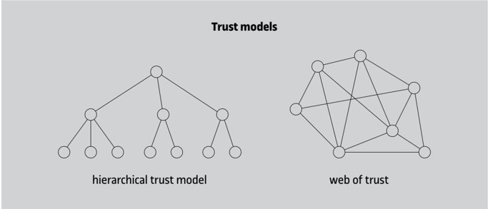

When a user generates their PGP key pair (public and private), they have to first associate a username to the public key, and then self-certify this association, that is, sign the concatenation of the both public key and name with their private key. The public key packet, the username packet, and the signature packet form a key block .

Optionally, the user can associate more than one name to the key (for example, if they have several email addresses). Then, the block will be made up of the public key and as many name-signature pairs as necessary.

In this case, the user can send this block to others with whom they have to exchange correspondence. Each receiver, if they are convinced that the key actually corresponds to the originating user, will certify it by adding another signature packet to the block (or one for each name, if there is more than one and they also consider them authentic). In this way, each user will have a keyring that they can use to encrypt messages and verify signatures of their correspondents.

In addition to public key packets, usernames, and certification signatures, a keyring can also contain revocation signatures to invalidate a key or to revoke a certificate. The revocation must be signed by the key itself (the one to be invalidated or the one that generated the certificate to be revoked) and, once issued, it is irrevocable.

## Further reading

You can find a comparison of the different trust models in the first chapter of this book: petitcolas.net/fabien /publications /gtr1998.pdf

## Self-certified keys

When a new key pair is generated, modern versions of PGP automatically sign the public key and username with their own private key. In older versions, it wasn't done this way; the self-certificate had to be generated manually.

## Revocation keys

OpenPGP also supports keys authorized to revoke other keys.

Another possibility for distribution is through a PGP key server , which manages a global public key store with their certificates (and revocations, if applicable). Several of these servers are synchronized with each other so that updates to the store made in one of them are automatically propagated to all the others.

Any user can send the certificates for their key to a PGP server, or other users' keys so that they are added to the global keyring. In this case, queries can be made to the servers to obtain the key and the certificates associated with a certain username (or names that contain a certain substring if its exact value is not known).

.

It is important to note that PGP servers are not certification authorities. Hence, any public keys sent to them will be added to the keyring without any verification against the owner's identity.

It is the responsibility of each user who wants to use a key from a PGP server to guarantee the authenticity of that key. To do this, it can be taken into account which other users have certified this key.

## 2.3.3 PGP certification process

.

To facilitate key exchange and certification, PGP assigns a fi ngerprint to each public key, which is simply a hash of the key's value.

This fingerprint is used so that a user can verify that the key they have received from another user, or from a key server, is indeed the one they wanted to receive and not a forged key. However, the key identifier is not sufficient, since an intruder could construct a public key of which they know the corresponding private key and which has the same identifier as another public key. In contrast, constructing a key with the same fingerprint as another key is practically impossible.

The use of fingerprints facilitates verification of the authenticity of the key. An alternative option is to check all the bytes one by one, but this could be too cumbersome a task considering that the currently used keys have 1,024 bits (256 hexadecimal digits), and that keys of 2,048 bits are being used more and more.

Suppose, for example, that user A , Alice, needs to certify the key of user B (Bob) because she has to exchange secure messages with him. User A can ask B to send her his public key by traditional email or get it from a key server. Then A has to check that no one has tampered with the response message, getting the following information from B through a channel other than email:

- B 's public key ID.

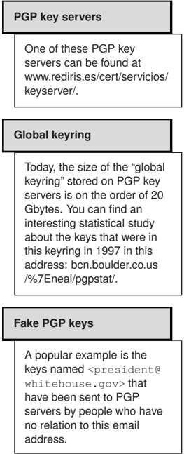

## Key fingerprint calculation

To calculate the fingerprint for V3 keys, the hash function applied is MD5 (16 bytes), while for V4 keys it is SHA-1 (20 bytes).

- This key's fingerprint.
- The key's algorithm and number of bits (the number of bits may be necessary to avoid collisions in the fingerprint).

## Methods for communicating information about a public key

A secure channel to send the above information may be, for example, direct 'face-to-face' communication or via a phone call. Paper can also be used: in certain environments, it is common practice to have the value of the PGP fingerprint printed on the business card.

Another option is to organize a so-called 'key-signing party'.

Although PGP internally works with 8-byte key identifiers, when it has to display their values to the user it only displays the least significant 4 bytes. For example, if a key has the hexadecimal value 657984B8C7A966DD as its identifier, the user only sees the value C7A966DD. This increases user convenience without significantly increasing, in practice, repeatability.

Below is an example of all the information needed to certify a key:

```
. bits /keyID User ID 1024R/C7A966DD Philip R. Zimmermann <prz@acm.org> Key fingerprint = 9E 94 45 13 39 83 5F 70 7B E7 D8 ED C4 BE 5A A6
```

When user A has verified that the values communicated to her by B match those calculated from the public key received electronically, she can now certify that this key corresponds to the username or usernames that identify user B .

## 2.3.4 PGP integration with email

As described previously, a PGP message is made up of a sequence of PGP packets. There can be different combinations:

- If it is an encrypted message with a digital envelope, first there are as many packets as there are recipients, each with the session key encrypted with the public key of the corresponding recipient. Next comes the body of the message, possibly compressed, in a packet symmetrically encrypted with the session key.
- If it is a signed message, we first find the signature packet, and then the body of the message in a literal data packet. Optionally, these two packets can be included within a compressed packet.
- If it is a signed and encrypted message, it is the same structure as that of encrypted messages, except that when the encrypted data packet is decrypted, the result is a signed message, that is, a signature packet followed by a literal data packet or a compressed packet that, when decompressed, contains the previous two packets.

## Fingerprint collisions in PGP V3

Due to the way how V3 key fingerprints are calculated, it is indeed possible to get two keys with the same fingerprint, but with a different number of bits. Therefore, when authenticating a V3 key the number of bits in the key is a crucial piece of information.

## Repeating 4-byte identifiers

If we considered a scenario where as many as half the people on Earth had PGP keys, it would be possible that none of the 4-byte identifiers were repeated.

## Session key encryption in OpenPGP

OpenPGP also supports the possibility of encrypting the session key with symmetric keys, using a new packet type.

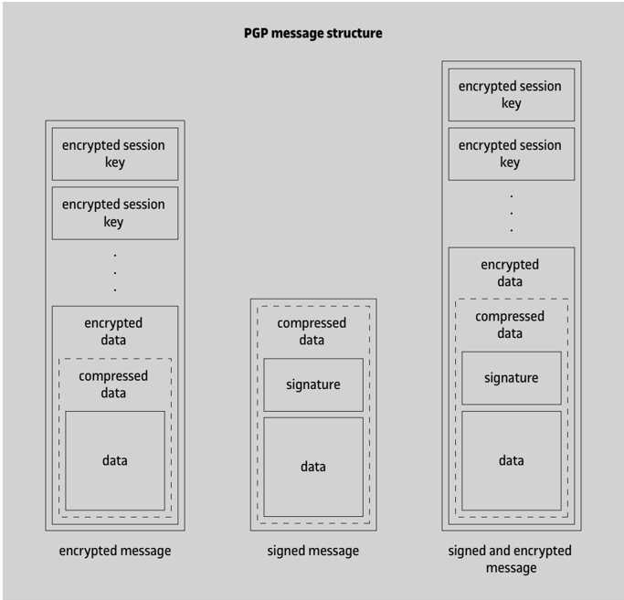

Messages constructed in this way will contain arbitrary binary data. To send them through traditional mail systems, two techniques can be used: RFC 934 encapsulation and MIME (with the method called PGP/MIME). With RFC 934 encapsulation, encrypted and/or signed messages, clear signed messages, or public key blocks can be represented.

## The RFC 934 message encapsulation technique

The RFC 934 specification defines a technique for combining one or more messages into a single message body. This is the technique used by MIME to join different parts in a multipart message.

RFC 934 encapsulation consists in concatenating the messages to be combined, simply placing them one after the other, and using delimiters to indicate where each one begins and where the last one ends.

Text before the first delimiter is considered a 'preamble', and text after the last delimiter is considered an 'epilogue', but neither is part of the encapsulated message.

Lines starting with a hyphen followed by another character that is not a space are used as encapsulation delimiters. If there is a line that begins with a hyphen within the messages to be encapsulated, it is simply preceded by a hyphen and a space character. At the time of unwrapping the message, lines beginning with a hyphen and a space have these two characters removed. Those beginning with a hyphen and another character will be considered delimiters. This allows the recursive encapsulation of compound messages within another compound message.

## 1) Encrypted and/or signed PGP messages

This is an example of a PGP message, encoded with the encapsulation method specified in RFC 934.

```
. Date: Mon, 1 Mar 2004 11:35:40 +0100 From: user-1@uoc.edu Subject: Example 4 To: user-2@uoc.edu -----BEGIN PGP MESSAGE----Version: 2.6.3i iQBDAwUBObNQzFDy7z4CpbtnAQF9aQFrBtyRK8bdaPFlht7KeFzO/N0lJTcnYhbS TvlZsTwr6+iQJqHP5nKnYr0W/Q9mo60AI3QAAAAAAEV4ZW1wbGUgZGUgbWlzc2F0 Z2Ugc2lnbmF0Lg0K =8gbQ -----END PGP MESSAGE-----
```

As shown in the example, the structure of the message is as follows:

- The initial encapsulation delimiter uses the string ' BEGIN PGP MESSAGE ' between two sequences of five hyphens, and the final delimiter is the same as the initial one, but changing ' BEGIN ' to ' END '.
- The initial delimiter can be followed by different headers, with fields such as Version to indicate which version of PGP generated the message, Comment to enter user comments, or Charset to specify the character set used in the message text.
- The headers are followed by a blank line and the PGP packet or packets that make up the message, encoded in base64.
- Following the PGP packets and preceding the final delimiter is a 5-character line: the first is the character '=', and the other four are the base-64 encoding of a 24-bit CRC of all the bytes of the packets. This CRC is used to verify that there have been no changes to the message that could have affected decoding.

In PGP terminology, the sequence of lines from the initial encapsulation delimiter to the final delimiter is called the ASCII armor of the message.

## 2) Clear-signed PGP messages

Like S/MIME, PGP also defines a format for sending clear-signed messages which allows users who do not have PGP to read the content of the message. This is an example:

```
. Date: Mon, 1 Mar 2004 11:35:55 +0100 From: user-1@uoc.edu Subject: Example 5 To: user-2@uoc.edu -----BEGIN PGP SIGNED MESSAGE----Hash: MD5 Example of signed message. -----BEGIN PGP SIGNATURE----Version: 2.6.3i iQBDAwUBObNQzFDy7z4CpbtnAQF9aQFrBtyRK8bdaPFlht7KeFzO/N0lJTcnYhbS TvlZsTwr6+iQJqHP5nKnYr0W/Q9mow== =5TnX -----END PGP SIGNATURE-----
```

In this case, two encapsulated submessages appear, with the following structure:

- The initial delimiter of the first part is the string ' BEGIN PGP SIGNED MESSAGE ', preceded and followed by a sequence of five dashes.

## OpenPGP character set

In OpenPGP, the default character set is Unicode (ISO/IEC 10646), encoded with UTF-8 (RFC 2279).

- Zero or more Hash headers appear in the first submessage, indicating the hash algorithm(s) used to compute the signature (or signatures), followed by a blank line and the body of the message. Specifying the algorithm at the start allows the message to be processed in a single step. In the absence of this field, it is understood by default that the hash function used is MD5.
- After the first submessage, the ASCII armor of one or more signature packets appears, with an initial delimiter consisting of the string ' BEGIN PGP SIGNATURE ', also preceded and followed by five dashes, and with a final delimiter that is the same as the initial one but changing ' BEGIN ' to ' END '.

Signatures are computed from the message body in canonical form, i.e. representing line breaks with &lt; CR &gt;&lt; LF &gt; . Also, PGP always removes any whitespace and tabs before a line break at the time of getting the signatures.

## 3) Public key block messages

There is another PGP armor format that is used to send public key blocks and certificates. The initial delimiter consists of the string ' BEGIN PGP PUBLIC KEY BLOCK ' surrounded by two sequences of five hyphens, and the final delimiter is the same as the initial one, but changing ' BEGIN ' to ' END '. This is an example:

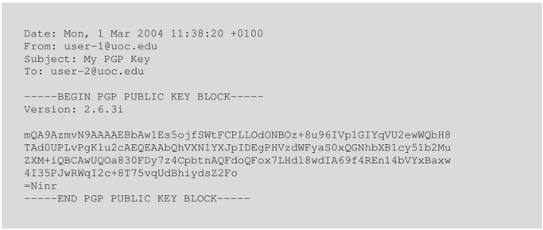

Any of the types of armor we have seen can be used to exchange PGP information with other means of transfer besides email: FTP, HTTP, etc.

## 4) PGP/MIME

The MIME content-type application/pgp was initially defined to embed PGP into MIME. Later, however, this content type was dropped in favour of RFC 1847, which is the same method used by S/MIME for clear-signed messages. In addition to the multipart/ signed content type for signed messages, RFC 1847 also defines the multipart/ encrypted type for encrypted messages.

The technique used for including PGP messages in RFC 1847 MIME messages is called PGP/MIME, which is specified in RFC 2015 (updated to OpenPGP by RFC 3156). PGP/MIMEdefines three content types for MIME parts representing PGP messages: application/ pgp-encrypted , application/pgp-signature and application/pgpkeys .

However, it is now much more common to use ASCII armors to encapsulate PGP messages than the PGP/MIME technique.

## Lines starting with a hyphen

If the first submessage contains lines that start with a hyphen, the sequence ' -' must be added according to RFC 934. The signature, however, is obtained from the original lines.

## 2.4 Protection against other attacks

As we saw at the beginning of this section, email protection techniques such as S/MIME and PGP work on the content of the message, ensuring that no one except the legitimate recipients can read it, or that no one except the legitimate sender can have originated it. There are, however, attacks that are different from reading or modifying the content of the message. Some examples of these attacks are described below.

Attacks against headers. RFC 822 (or RFC 5322) headers can be read during SMTP transmission if it is not protected with TLS (using the STARTTLS request), and also when they are stored in the recipient's mailbox if it is not encrypted. And, even if the body of the message is signed, an attacker can modify the From fi eld to pretend the sender sent the message from an address other than their own, the To or Cc fi elds to pretend other recipients have received the same message, the Data fi eld to pretend the message was sent at a different time, etc.

One way to counter these attacks is to encapsulate the entire RFC 822 message, with headers and body, inside another message and apply protection to the body of this second message. S/MIME supports this technique as of version 3.1: when the mail reader system detects that the Content-Type fi eld of a message is message/rfc822 , it discards the outer headers and presents the encapsulated body as if it were the entire message, with its own headers.

Sending malicious content and spam. An initial protection against this is the human factor, that is, common sense, but there are also automated techniques to counteract these attacks by preventing harmful messages from being seen by the end user, such as:

- Verification of compliance with the standards . A large number of illegitimate messages do not strictly follow the standards (RFC 822, SMTP) because they are generated with low-quality software or do not have access to the functions of a legitimate mail server.
- Rule-based filters . Filters are configured with a set of strings characters, regular expressions, or byte sequences that, if they appear in the content of a message, are indicators that this content is undesirable.
- Statistical or Bayesian content filtering . With this technique, it is the users who, according to their criteria, indicate which content is illegitimate, and the system automatically learns to distinguish between them in future messages.
- DNS-Based Blacklists (DNSBL) . Several organizations make blacklists of IP addresses public. These addresses correspond to SMTP servers that are known to have sent or forwarded spam, at least in a recent period of time. The way to access these lists is through DNS queries. Thus, when one SMTP server connects to another to send an email, the latter can check against a blacklist to decide whether to accept the connection or not. One drawback of this technique is that the listing policy has to be very careful to avoid making the innocent pay for the guilty.

## DKIM mechanism

The DKIM mechanism, which is discussed later, allows the headers to be signed, but at the mail domain level. Therefore, an attacker on the same domain as the victim could forge the victim's message headers without DKIM detecting it.

Domain spoofing. A large number of phishing attacks are based on pretending that the sender belongs to a recognized institution (a bank, an e-commerce platform, etc.) using a source address that corresponds to the mail domain of this institution.

Since its inception, the SMTP protocol allows any agent (whether it's a client or a proxy server) to act as a mail relay sending messages coming from a different domain than their own. This was useful when not all agents had direct access to any Internet node. Today, this server configuration called open relay is to be avoided, because it facilitates spamming and makes traceability difficult. That's why, within the domain of an organization, these measures are normally taken:

- Configure corporate SMTP servers to only accept messages from external domains if the recipients belong to the organization's domain.
- Configure corporate SMTP servers to only send messages to external domains if they come from the local domain, which is checked against the client's IP address.
- Restrict access to TCP port 25 (the one corresponding to the SMTP protocol) so that only the organization's corporate servers can connect to external SMTP servers. If not, it is very easy for any computer on the local network to send fake messages, either intentionally or because the computer has been infected with malicious software.

If connections from the local network to TCP port 25 of any server, internal or external, are completely restricted, clients can connect to the corporate server using the protocol defined in the RFC 6409 standard, which is a variant of SMTP that uses TCP port 587, or TCP port 465 if the connection is protected with TLS.

There are special situations where you have to make exceptions and allow a server to forward mail from a domain other than its own, such as:

- Mailing lists . When a user sends a message to a list, they do not send it to all members of the list (which may be unknown), but, via their local server, to another server that takes care of forwarding it to the members on behalf of the original user. So the list server is sending a message with a source domain that will generally be different from its own.
- Automatic email forwarding . Some mail servers allow the user to set up mail forwarding, so that the messages that arrive at the user's mailbox are forwarded by the server to another address while keeping the domain of the original sender as the source domain.
- External email service provider . Today it is common for small companies to contract the email service for their domain to an external provider. The servers of this provider will send the email using the domain of the company contracting the service as the source domain.

## Example of a 'phishing' message

A typical example of a 'phishing' message prompts the user to access a fake online banking website to renew their password. The website mimics the appearance of the real web and may also belong to a domain that looks a lot like the real one, but its goal is to deceptively obtain user passwords.

- Roaming . A user who is physically outside their organization's domain can continue to use, for example, their laptop to send email from their regular address to addresses in other domains. In this case, the connection to the corporate server to send a message abroad will come from a domain that will also be external (that of a hotel, an airport, a mobile telephony provider, etc.).

As for roaming, the usual solution to allow connections from an external domain is the SMTP extension for client authentication, defined in the RFC 4954 standard. In other cases, techniques such as DKIM or SPF can be used, which are discussed below.

## 2.4.1 DKIM

.

The DomainKeys Identified Mail (DKIM) mechanism allows messages originating from an email domain to be automatically signed with a private key belonging to the domain, whose public key is typically published in a DNS record. The signature includes both the body and the headers of the message.

The first version of the DKIM scheme, which back then was simply called DomainKeys, was developed by Yahoo! Inc. and published in 2004. RFC 4686, from 2006, lists a series of attacks that justify DKIM implementation, and DKIM version 1 was published in 2007. A revision of version 1 was published in 2011 in the RFC 6376 standard.

In a domain that uses DKIM to authenticate its messages, the part of its mail system that is involved in forwarding outgoing messages must have access to a domain authentication private key. There may be one or multiple keys in the domain, for example, one for each department, branch, etc., or there may even be keys for individual people. Another possibility is that the keys are changed periodically. A selector is used to identify each key, represented as a DNS subdomain.

The public key of selector x . y . z of a domain such as example.com is published in a DNS TXT record at the domain name x.y.z. domainkey.example.com . The record value of the DNS record has a structure like this:

.

v=DKIM1; h=sha1:sha256; k=rsa; s=email; p=MEwwDQYJKoZIhvcNAQEBBQADOwAwOAIx AMKf2JwQyisHtRIbs+eUZkBj8ro9rOBrA8VER1EV57Dzwk67c+/C1RU/BxCVu6Qp9QIDAQAB

The v fi eld indicates the version of the record format, the h fi eld indicates the usable hash algorithms, the k fi eld indicates the type of public key, the s fi eld indicates which services the key is applicable to, and the p fi eld corresponds to the public key, encoded in base64. Except for the p fi eld, all others are optional (the default values for the v , h and k fi elds are the ones in the example above), and there may also be a n fi eld to represent notes or comments.

## Use of DNSSEC

In techniques such as DKIM or SPF, which are based on publishing verification information in the DNS system, the use of DNSSEC is highly recommended to counter possible attacks against the DNS.

To generate the signature of a message, the first step is to obtain its canonical form. The DKIM standard supports two canonicalization methods, called simple and relaxed , which can be applied independently to message headers and message bodies. In the simple method, only the basic transformations are done (ASCII encoding and lines ending in &lt; CR &gt;&lt; LF &gt; ) and the blank lines at the end of the body are removed. Relaxed canonicalization applied to the message body is like simple canonicalization, but whitespace is also reduced (each sequence of one or more spaces or tabs is converted to a single space, and spaces at the end of lines are removed), while relaxed canonicalization for headers consists in putting the name of each header in lowercase, joining those headers that have more than one line in a single line and also reducing spaces.

To obtain the DKIM signature, two hashes need to be computed: one over the body of the message and the other over a subset of the headers. The signing system decides which headers make up this subset: the From header must be present, the headers that are considered significant to authenticate the message should also be present (at least Subject , Date , To , Cc , and possibly others), and there should be no headers that could be modified by intermediaries (for example, Return-Path ).

Authentication of the source domain of a message is done by adding a DKIM-Signature header like this one:

```
. h=MIME-Version:Reply-To:From:Subject:To:Content-Type:Date:Message-ID;
```

```
DKIM-Signature: v=1; a=rsa-sha1; q=dns/txt; c=relaxed/simple; s=clau2022; d=example.com; t=1662026400; bh=0cKWvyIakEJCxVg+Hf+gCHREHi4=; b=SZhWdZ3bP960kKZKIWK0fXaMNwzP899sKrqigMQL61Id/OV6fnI7HIs/7xUEpLTR
```

The meaning of each field is as follows:

- 1) v is the version of the DKIM standard.
- 2) a is the algorithm used to generate the signature.
- 3) q is the list of methods to obtain the public key: dns/txt means DNS TXT record query.
- 4) c is the canonicalization method used (the method applied in the headers is indicated first and then the one applied in the body of the message).
- 5) s is the selector of the key used to generate the signature.
- 6) d is the domain on behalf of which the message has been signed, and which is responsible for the signing: this is the domain that has to be used to obtain the public key via DNS.
- 7) t is the signature generation date and time, represented as a Unix time (number of seconds since January 1, 1970).
- 8) h is the list of headers included in the signature.
- 9) bh is the hash of the canonicalized message body.

10) b is the signature value, generated from the hash of the headers indicated in the h fi eld (in the order in which they appear in this field), plus the DKIM-Signature header itself, but with this b fi eld empty.

The above fields are required, except the fields q and c , which are optional and default to dns/txt and simple/simple , respectively. The t fi eld is optional but recommended. Other optional fields are:

- i is the identifier of the user or domain on behalf of which the signature has been generated (by default it is equal to the symbol @ followed by the field d : In the above example the identifier would be @example.com ).
- l is the length of the message body over which the signature has been calculated (in anticipation of intermediary mail systems that may add text to the end of the message, as is the case with some list servers).
- x is the expiration date of the signature, expressed in Unix time.

## Multiple DKIM signatures

There may be more than one DKIM-Signature header in a message, for example, when the message has been sent to a distribution list: both the source domain and the list server domain can add their signature. A DKIM signature can include the DKIM-Signature header from a previous signature.

A receiving mail system that verifies messages signed with DKIM has to obtain the public key of the signing domain via DNS, recalculate the hashes in the same way as were calculated by the source system, and check that the signature is correct. The last step is to check that the From header of the message corresponds to the d fi eld of the DKIM-Signature header. The mail system can record the result of the verification in the same message so that other components of the system (for example, a mail reader) can act accordingly. This can be done by adding an Authentication-Results header to the message, defined in the RFC 8601 standard (an example is later discussed when we look at DMARC).

A negative verification does not necessarily mean that the message is spam: it could be, for example, that a mailing list server has changed the content type of a message that was originally text/html to multipart/mixed to be able to add unsubscribe instructions. Therefore, if no other evidence is available, the action to be taken in the event of an unverifiable message should not be to automatically delete it, but, for example, to clearly mark it as suspicious so that the recipient user takes it into account or save it in a spam folder.

## Message body signature

Since the DKIM-Signature header itself is part of the signed data, and the header includes the hash of the message body in the field bh , the body of the message is also signed.

## 2.4.2 SPF

.

The Sender Policy Framework (SPF) protocol allows the owners of an email domain to express, through DNS records, their authorization for certain external servers to send messages from this domain.

Therefore, the SPF protocol provides a solution for the case of external mail service providers. Version 1 of the protocol was published in 2006, and a revision of this version 1 was published in the RFC 7208 standard in 2014.

When an email domain, for example, uoc.edu , wants to make public which servers can send messages from uoc.edu , it has to add a TXT record to its DNS domain records using a value like this one:

.

```
v=spf1 ip4:213.73.40.0/24 ip4:13.111.22.169 ip4:83.169.91.142 ip4:83.169.91.143 ip4:83.169.91.144 ip4:83.169.91.145 ip4:83.169.91.146 ip4:83.169.91.147 ip4:84.88.0.7 ip4:84.88.0.6 include: spf.google.com include:eevid.com include:amazonses.com include:spf-moodle.isyc.es ∼ all
```

TXT records used in the SPF version 1 protocol have to start with the string v=spf1 . Next, there is a series of tests that have to be verified in order, and the first one that matches will give the result of the verification. A test can start with one of four symbols representing possible outcomes: + , -, ∼ , or ? , and if none of these is present, it is understood that it's as if it started with + . Their meanings are, respectively, authorized (pass), unauthorized (fail), probably unauthorized (softfail) and indeterminate (neutral).

According to the SPF protocol, when a SMTP connection arrives to a mail server to receive a message, it has to take note of the IP address from which the connection was made and the domain of the supposed originator of the message. Since SPF operates at the SMTP level, the source domain considered is not the one that appears in the header From , but the one that the client indicates when the SMTP transmission is initiated (with the HELO or EHLO request) or, alternatively, in the MAIL FROM request of the SMTP protocol (which is normally recorded in the Return-Path header).

Then the server has to make the DNS query on the source domain to obtain the corresponding TXT record and perform the tests indicated in this record, which can be:

- ip4: &lt; IPv4 address or range &gt; or ip6: &lt; IPv6 address or range &gt; matches if the IPv4 or IPv6 address, respectively, from where the connection has been made is the specified one or belongs to the specified range.
- a: &lt; DNS domain &gt; or mx: &lt; DNS domain &gt; matches if the IP address corresponds to any of the records A or AAAA, or to any of the servers given by the MX records, respectively, of the specified domain (or, by default, the message source domain).

## DNS record type used in SPF

The original protocol specification defined a new type of DNS record, called SPF, that could be used as an alternative to TXT, but it was ultimately decided to use only TXT records for the reasons described in RFC 6686.

## SMTP source domain

If there is a discrepancy between the source domain indicated in the SMTP protocol and the domain of the address in the From header, the receiving system should notify the recipient user.

- exists: &lt; DNS domain &gt; matches if any A records exist in the specified domain.
- include: &lt; DNS domain &gt; indicates that a new DNS query has to be done on the specified domain to get the corresponding TXT record; there is a match if any of the tests in these records results in a pass.
- all always matches (this test would therefore have to be the last one on the list).

In the example above, if a SMTP server receives a connection from server 83.169.91.144 (which does not belong to the uoc.edu domain) to transmit a message that claims to come from the uoc.edu domain, this message would have to be accepted as legitimate. In contrast, if the connection comes from a server that does not appear in any of the ip4 tests nor in any of the include recursive tests, the result of the protocol in this case is 'probably unauthorized' (softfail). This means that the receiving server can do other checks to confirm that the sender is not authorized to use the uoc.edu domain as a source.

In any case, it is recommended that the result of the SPF protocol, whether it is positive or not, be recorded in the message. This can be done with a header called Received-SPF , or with the generic Authentication-Results header. In addition to the results explicitly indicated in the tests (pass, fail, softfail, neutral), the result can also be none (no SPF data in domain), temperror (failed to complete DNS query), or permerror (syntax error in SPF data).

## 2.4.3 DMARC

.

The Domain-Based Message Authentication, Reporting, and Conformance (DMARC) mechanism allows an email domain to specify, through DNS records, what policy it wishes to apply regarding the verification of authenticity of its messages. It also allows the domain to specify which verification reports it wishes to receive from receiving mail systems.

DMARC authenticity focuses specifically on the email domain that appears in the From headers of messages. As for the reports, they provide a method for email domain owners to obtain feedback on the use that is being made of their domain and to take action accordingly. The DMARC mechanism specification is published in RFC 7489.

The DMARC policy of a domain indicates how the authenticity verification of the domain must be performed using DKIM and SPF. In each case, verification can be done in strict or relaxed mode. In strict mode, the domain that comes after the @ symbol of the From header of the message has to be identical to the d fi eld of the DKIM-Signature header (in the case of DKIM) or to the SMTP source domain (in the case of SPF). In relaxed mode, it is enough that the domain matches in terms of organization (i.e. the domain name that has been assigned by a DNS domain registrar). For example, if the domain authenticated via DKIM or SPF is uoc.edu , a message with the value user@mail.uoc.edu in its From header will be verified in relaxed mode, but not in strict mode.

## Recursive checks

Note that an -include: &lt; domain &gt; test returns fail if the result of the recursive check inside &lt; domain &gt; is pass.

## SPF macros

DNS domain names specified in tests, particularly in the exists test, may contain 'macros' that are replaced by certain parameters. For example, % { o } is equivalent to the domain of the source address of the message, % { i } is equivalent the IP address of the server that made the connection, etc.

An email domain such as example.com publishes its DMARC policy in a DNS TXT record corresponding to the domain name dmarc.example.com . The value of this record has a structure like this:

.

```
v=DMARC1; p=none; sp=quarantine; adkim=r; aspf=r; rua=mailto:dmarc@example.com; ruf=mailto:dmarc@example.com
```

The meaning of each field is as follows:

- v is the DMARC version that corresponds to the record format.
- p is the policy the domain owners want to be applied to messages supposedly coming from this domain, which can be none (no special action), quarantine (treat unverified messages as suspicious) or reject (do not admit unverified messages).
- sp is the policy that must be applied to messages that have their From header in a subdomain of the main domain.
- adkim and aspf are the DKIM and SPF verification modes to be applied, respectively: s stands for strict and r stands for relaxed.
- ruf is the address where reports on messages that failed verification should be sent.
- rua is the address where aggregated reports with data on the verifications carried out on the messages coming from the domain must be sent periodically.

The v and p fi elds are required, and the rest are optional. The default value for the sp fi eld is whatever is in the p fi eld, and for the adkim and aspf fi elds, this value is r (relaxed mode). If there is no ruf or rua fi eld, it means that the corresponding reports do not have to be sent. Other optional fields that can be specified are:

- fo are the options that indicate when to send reports to the address of the ruf fi eld: with option 0 (the default value) they are sent if all verifications fail (DKIM and SPF), with option 1 they are sent if at least one of the checks fails, with option d they are sent if DKIM fails, and with option s they are sent if SPF fails.
- ri is the interval in seconds (by default 86400, that is, one day) in which the aggregated reports must be sent to the address in the rua fi eld.
- pct is the percentage of messages (default 100) to which the DMARC policy has to be applied: if it is less than 100, the messages to be checked are randomly selected.

If the receiving system decides not to reject a DMARC-evaluated message, it is recommended that an Authentication-Results header is added indicating the result of the verification. Below is an example of an Authentication-Results header:

## Quarantine

The action for the quarantine policy can be, for example, to mark unverified messages as suspicious or to put them in a spam folder.

## Report format

The format of DMARC authentication failure reports is based on the RFC 6591 standard, and the format of aggregate reports is based on the RFC 5965 standard.

```
. Authentication-Results: smtp.uoc.edu 1; spf/1=pass (sender IP is 93.184.216.34) smtp.mailfrom=example.com; dkim/1=pass reason="good signature" header.d=example.com header.s=clau2022; dmarc/1=pass (p=none sp=quarantine) header.from=user@example.com
```

The first element of the value of this header is the authentication service identifier (it is normally the name of the domain or server where the authentication has been done), optionally followed by the header format version (default 1). Next is information about authentications. For each of them there is the method optionally with its version number (by default, 1), the result of the verification, optionally the reason for this result (with the prefix reason= ) and the evaluated properties that have produced the result, each with its name and its value. The name of the properties has a prefix, which can be smtp , header , body or policy , depending on which element of the mail service it belongs to. Any text inside parentheses is considered a comment.

## 2.4.4 ARC

.

The Authenticated Received Chain (ARC) protocol makes it possible to keep a record of the authentication results obtained by the different servers that process an email message.

In the ARC protocol, the servers through which a message passes insert headers related to authentication. This allows, for example, in the event that a legitimate message is not authenticated, that the point in the chain at which the content of the message has been altered can be detected. The ARC protocol specification is published in RFC 8617.

Each mail server that processes a message can insert a set of three headers called ARC set . The ARC sets form an ordered list called authentication chain , and each set has a corresponding instance number . The first server that adds an ARC set to a message assigns it the instance number 1, and subsequent servers assign consecutive numbers 2, 3, etc. to their ARC sets. This is an example of an ARC set:

```
. ARC-Seal: i=1; a=rsa-sha1; t=1662026400; cv=pass; d=uoc.edu; s=clau-arc-2022; b=etiI+xdSZOPqZhYzIny9XV3SFJux6yzhZZONI6BubAHwBtQYCRkzZoRTGNBmycHt ARC-Message-Signature: i=1; a=rsa-sha1; c=relaxed/relaxed; d=uoc.edu; s=clau-arc-2022; h=MIME-Version:Reply-To:From:Subject:To:Content-Type:Date: Message-ID:DKIM-Signature; bh=0cKWvyIakEJCxVg+Hf+gCHREHi4=; b=uBccNaLyk1uPoVKP+rWPEW25dzy6BTANQ+GaWX9yp+g7A//eO9mLp0trfWmIv7Lg ARC-Authentication-Results: i=1; smtp.uoc.edu 1; spf/1=pass (sender IP is 93.184.216.34) smtp.mailfrom=example.com; dkim/1=pass reason="good signature" header.d=example.com header.s=clau2022; dmarc/1=pass (p=none sp=quarantine) header.from=user@example.com
```

- The header ARC-Authentication-Results is used to record the result of the authenticity evaluation made by the mail server. It has the same format as the Authentication-Results header, with the addition of a new field, i , which is used to indicate the ARC set instance number.
- The ARC-Message-Signature header is used by the mail server to authenticate the message, including any changes it may have made. It has the same format as a DKIM-Signature header, except that the v fi eld is not included, and the i fi eld represents the ARC set instance number.

To verify the integrity of the message, the signature should include any DKIM-Signature headers that are already present. In contrast, it doesn't have to include the Authentication-Results headers because they can be substituted by servers down the chain. It doesn't have to include any ARC header either, nor the ARC-Message-Signature header itself, because it is already signed with the ARC-Seal header.

- Indeed, the ARC-Seal header is used expressly to sign (or seal) the headers of ARC sets. It also has the same format as DKIM-Signature , but with more restrictions. In addition to the i fi eld, which represents the instance number of the ARC set, there can only be the a , s , d , t and b fi elds, plus an additional field called cv that represents the result of the chain check ( none , pass , or fail ).

This header does not have a bh fi eld because the message body is not included in the seal (it is included indirectly with the ARC-Message-Signature header), it does not have a c fi eld because the body is not canonicalized, and headers are always canonicalized using the relaxed method. Also, it doesn't have an h fi eld because the sealed headers are always those of the ARC sets, in order of instance number (including the current ARC set), and in the following order within each set: ARC-Authentication-Results , ARC-Message-Signature and ARC-Seal . However, when a server detects an incorrect chain ( cv=fail ), it only has to sign its own ARC set.

## Summary

In this module, we have discussed two examples of how security mechanisms in communications are used in the application layer.

The first of these applications is Secure Shell ( SSH ), which allows to establish an encrypted connection with a server. SSH defines its own protocol to authenticate the server and the connecting user, as well as to determine the keys for symmetric encryption and MAC codes, much like SSL/TLS does.

Once secure communication is established, SSH protocol allows the use of other functions, such as sending data protected through a channel, TCP port forwarding from the client or from the server, etc.

The other application discussed in this module is secure email . Because it is desirable in this application to protect the messages sent more than the communication in itself, mechanisms are defined to introduce confidentiality and authentication in the body of email messages. This allows leveraging existing mail agent infrastructure while maintaining compatibility with traditional mail systems.

To guarantee confidentiality, the digital envelope technique is normally employed. It consists in encrypting the message with a symmetric session key and adding this session key encrypted with the public key of each recipient. In this way, the same message can be sent to multiple recipients, as is done with regular email. Digital signatures are employed to guarantee authentication, which also provide a non-repudiation service.

One of the leading secure email systems currently in use is S/MIME . This system incorporates PKCS #7 data structures to mail messages using MIME technology. The PKCS #7 standard specifies how encrypted messages must be represented with a digital envelope and/or signed, applying public key cryptography and on a X.509 certificate infrastructure.

PGP is another system for the exchange of protected data and, in particular, email messages. This system uses its own format, published in specifications such as the old 'PGP version 3' or the more modern 'OpenPGP', to represent encrypted and/or signed data. It does not use an infrastructure of X.509 certificates for public keys, and instead, certification is decentralized: each user can certify the public keys they believe to be authentic so that the relationships between public keys of users who trust other users form a 'web of trust'.

Finally, we have also seen that there exist several mechanisms to prevent fraud known as electronic phishing, which can be used separately or together. Most are based on publishing certain authentication parameters by legitimate email domains, generally through the DNS domain system. Thus, with SPF the list of servers authorized to send messages on behalf of a domain is published, while DKIM allows to obtain the public key of a domain that can be used to verify the signature of a message, including both the message body and the most sensitive headers. Furthermore, DMARC allows to define a policy related to the verification of messages of a domain, based on DKIM and SPF, and ARC allows the different mail servers through which a message has passed to keep a record of the results of the verifications.

## Glossary

ASCII armor: representation of a PGP message suitable for being included in the body of an email message, without the risk of being modified by mail agents making the PGP message unrecoverable.

Attached (signed data): see Signature with signed data included .

Base64: encoding that allows arbitrary binary data to be represented as lines of ASCII characters, using one character for every 6 bits.

Canonical encoding: representation of email messages used for transfer. The goal is that all systems can convert this canonical form, if necessary, to the local representation used by each system.

Clear signature: signature (with data not included) that is added as the second body part of a signed message, with the first part containing the signed data. It allows the message to be read even if the necessary software is not available to verify the firm.

CMS:

see Cryptographic Message Standard .

CRC:

see Cyclic Redundancy Code .

Cryptographic Message Standard (CMS): version of the PKCS #7 format standardized by the IETF (Internet Engineering Task Force).

Cyclic Redundancy Code (CRC): value calculated from a sequence of bits to confirm that, within a margin of probability, a transmission error has not occurred when this sequence reaches the recipient.

Detached (signed data):

see Signature with signed data not included .

Envelope encryption: technique to provide confidentiality, consisting in encrypting the data with a symmetric session key and adding to the message this session key encrypted with each recipient's public key.

Fingerprint: digest value of a PGP public key obtained with a hash function that is used instead of the full key when it is to be compared with a supposedly authentic value.

HMAC: technique for computing message authentication codes (MAC) based on hash functions.

Keyring PGP:

MIME:

database that contains a set of PGP keys.

see Multipurpose Internet Mail Extensions .

Multipart MIME message: MIME message whose body is structured in different parts, each with its own content, which can be text, graphics, data, etc. or another MIME message (which, in turn, can be a multipart message).

Multipurpose Internet Mail Extensions (MIME): standard for including information other than simple lines of text in the body of email messages in such a way that is compatible with the RFC 822 standard.

OpenPGP: version of the PGP message format standardized by the IETF (Internet Engineering Task Force).

PEM:

see Privacy Enhanced Mail .

PGP:

see Pretty Good Privacy .

PGP key identifier: number used to identify a public key within a PGP packet, so that the entire value of the key does not have to be included, and which is internally represented with 8 bytes, although the user is normally only shown the last 4.

PGP packet: data structure used to represent the different types of information in a PGPprotected message.

PGP public key block: set consisting of a PGP public key, the associated username(s) and the certificates confirming that the relationship between the key and each name is authentic.

PGP subkey: PGP key associated with a primary key so that normally the primary key is used for signing, and its subkeys for encryption (subkeys are only defined in OpenPGP, not in the original PGP system).

PKCS #7: see Public Key Cryptographic Standard #7 .

PKCS #10:

see Public Key Cryptographic Standard #10 .

Pretty Good Privacy (PGP): application used to protect data with confidentiality (digital envelope) and/or authenticity (digital signature) which uses public keys authenticated according to a decentralized scheme, and which is typically used to protect email.

Privacy Enhanced Mail (PEM): one of the first secure email systems to be developed directly compatible with the RFC 822 format.

Public Key Cryptographic Standard #7: standard for representing protected messages cryptographically (usually with a digital envelope and/or digital signature) from public keys authenticated with X.509 certificates.

Public Key Cryptographic Standard #10: standard to represent certification requests which are sent to a CA so that it generates a certificate from the request data.

Remote Shell: application that was built into the BSD Unix system (under the name rsh ). Currently available on almost all versions of Unix, it allows users of a system to run commands on another remote system.

RFC 822: standard for the representation of email messages structured as a set of header lines, message body, and a blank line separating the headers from the body.

RFC 934 encapsulation: technique for combining multiple email messages into a single RFC 822 message body.

S/MIME: see Secure MIME

.

Secure MIME (S/MIME): Secure email system that uses MIME to include PKCS #7 or CMSdata in messages and hence provides confidentiality (digital envelope) and/or authenticity (digital signature) from public keys authenticated with X.509 certificates.

Secure Shell: application that provides a service analogous to the Remote Shell program on Unix systems, but with communication protected by authentication and encryption, and with added functionality, such as TCP port forwarding over secure connections, etc. It is also the name given to the protocol used by this application for secure communication.

Signature with signed data included (attached): data structure that represents a signature and that includes the signed data.

Signature with signed data not included (detached): data structure representing a signature but that does not include the signed data, which are found somewhere else (for example, in another part of the message).

Simple Mail Transfer Protocol (SMTP): protocol used on the Internet for the transmission of email messages, specified in the RFC 821 standard.

SMTP:

see Simple Mail Transfer Protocol .

SSH: see Secure Shell

.

SSH authentication agent: application that, through SSH connections with other applications, allows these applications to perform SSH protocol client authentication using the corresponding private keys, and without these keys having to be transferred outside the system where the agent is running on.

SSH channel: each of the different information streams that can be transmitted over a SSH connection (a channel can be an interactive session, a connection to an X window server, a forwarded TCP connection or a connection to an authentication agent).

Transfer encoding: representation of the message content of emails which may be required for compatibility with all possible mail agents that have to process the messages (for example, base64 encoding).

Web of trust: model of mutual trust used in systems like PGP, where public keys can be authenticated using certificates generated by any user, rather than using a hierarchical structure of certificate authorities.

## Bibliography

[1] Barrett, D.J.; Silverman, R.E.; Byrnes, R. G. (2005). SSH, The Secure Shell: The Definitive Guide, 2 nd ed. Sebastopol: O'Reilly.

[2] Stallings, W. (2020). Cryptography and Network Security, Principles and Practice, 8 th ed. London: Pearson.