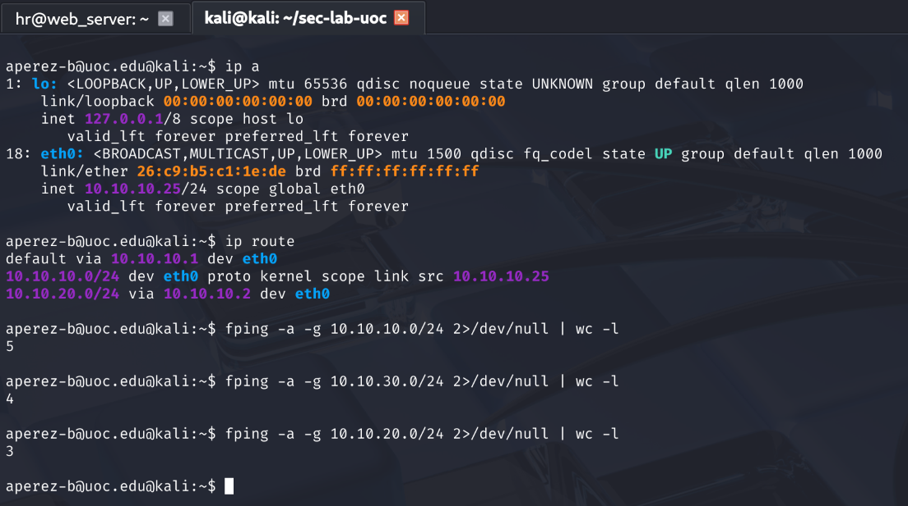
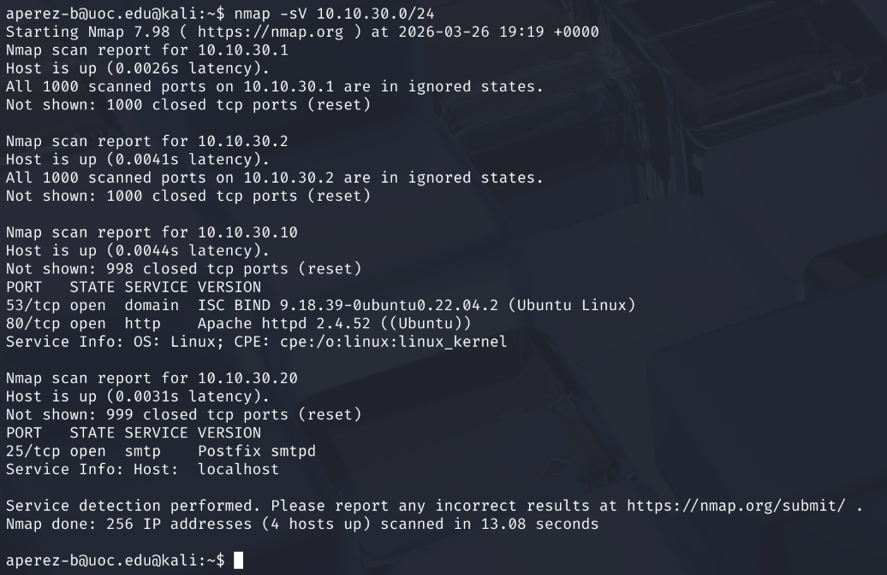
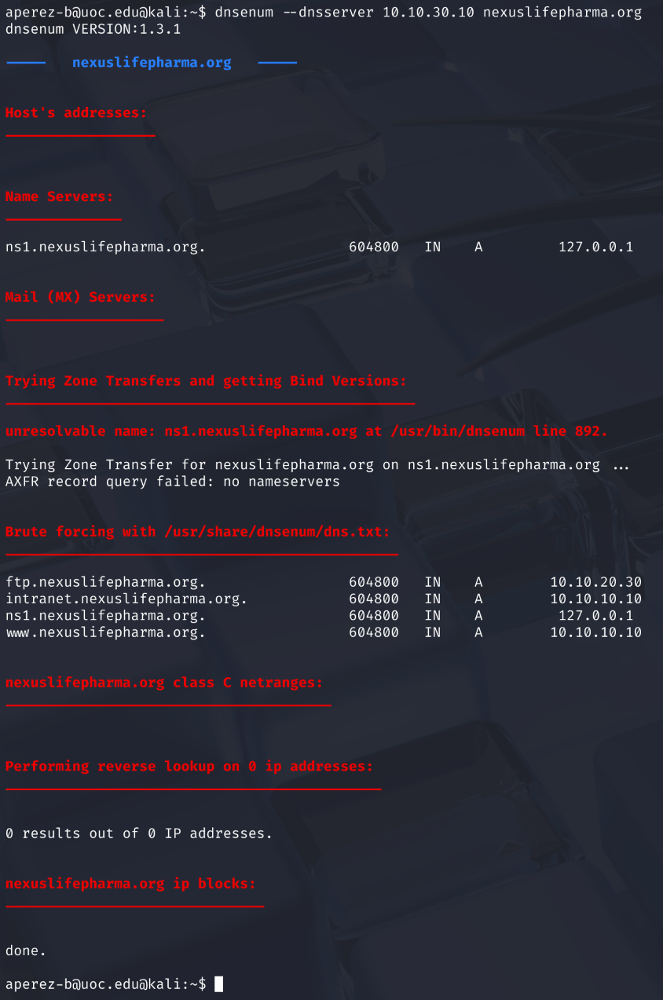
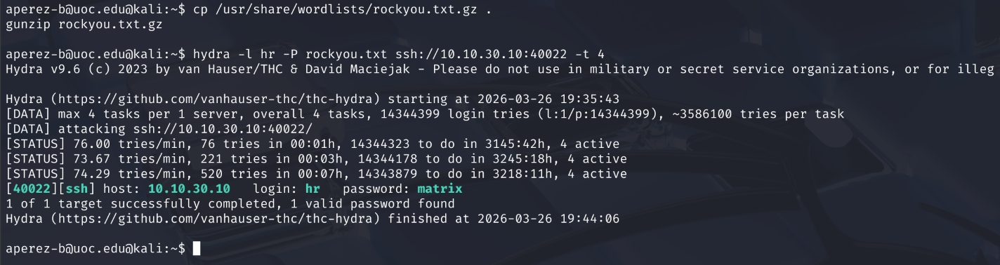
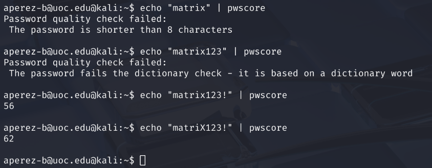
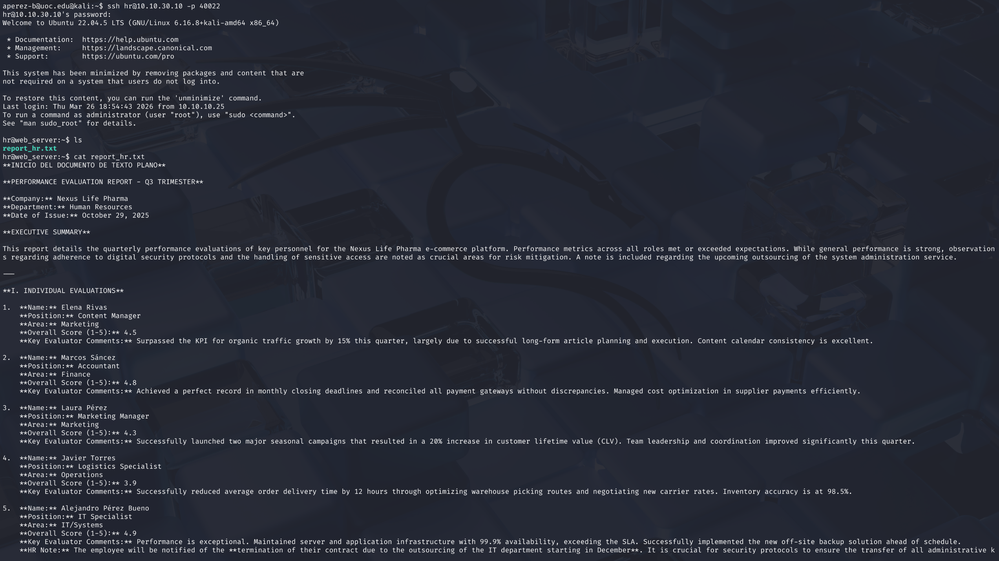
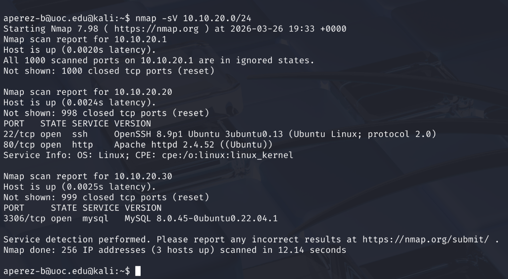

# PR 1: Screenshots of the solutions
Alejandro Pérez Bueno
Mar 26, 2026

- [Task 2](#task-2)
- [Task 3](#task-3)
- [Task 4](#task-4)
- [Task 5](#task-5)
- [Task 6](#task-6)
- [Task 7](#task-7)
- [Task 8](#task-8)
- [Task 9](#task-9)



> [!NOTE]
>
> Below are screenshots demonstrating the command results for tasks
> requiring them.

## Task 2

## Task 3

## Task 4

> [!TIP]
>
> Answer can be inferred from [task 3](#task-3).

## Task 5

## Task 6

## Task 7

## Task 8

## Task 9

